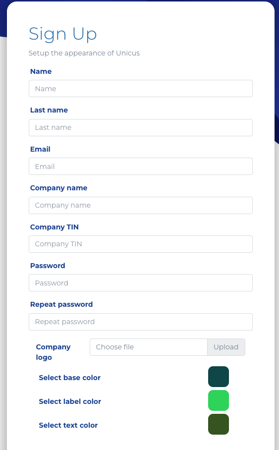

# Registro

Para crear una cuenta en el portal administrativo, ingresa a la URL: [Panel de administración de Unicus](https://dev-app.idunicus.com/#/sign-up). Allí ingresarás los datos personales de quien crea la cuenta y de la empresa que estás registrando.

<figure><figcaption></figcaption></figure>

Una vez que los datos se validen automáticamente, aparecerá un recuadro en la pantalla para continuar el proceso e ingresar a la plataforma.
