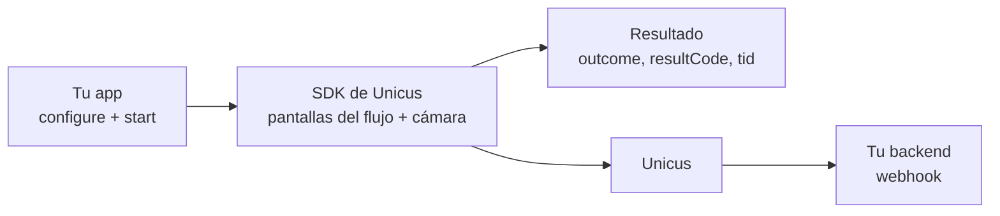

# Integración Android


**Próximamente.** Los SDK móviles de Unicus aún no están disponibles en
producción. Hoy solo está disponible el ambiente **DEV**; STAGING y PRODUCTION
responden `environment_not_available`. Tekbees anunciará el lanzamiento en
producción. Mientras tanto, solicita a Tekbees el paquete del SDK y un Customer
Token de DEV para prepararte.


El SDK Android de Unicus ejecuta una verificación de identidad completa dentro
de tu app Android nativa. Tu app entrega el documento del usuario y tu Customer
Token; el SDK crea la transacción, aplica la marca de tu empresa, ejecuta el
flujo asignado en el portal administrativo (consentimiento, formularios, pasos
de cámara, firma, OTP…) y devuelve un objeto de resultado con el id de la
transacción (`tid`). El motor biométrico viene embebido: tu app nunca importa
APIs del motor, nunca reenvía `onActivityResult` y nunca gestiona el permiso de
cámara. Tu backend confirma el resultado con el
[webhook](../sdk-web-v5/webhooks.md) o con
[Consultar el estado de una transacción](../sdk-web-v5/transaction-status.md).

## Páginas de esta sección

| Página | Qué encuentras |
| --- | --- |
| [Inicio rápido](android/quick-start.md) | Dependencia, configuración, inicio y resultado en pocas líneas. |
| [Instalación](android/installation.md) | Contenido del paquete, configuración de Gradle, permisos, R8. |
| [Configuración](android/configuration.md) | Todas las opciones de `UnicusSdkConfig`, ambientes, logs, marca. |
| [Iniciar una verificación](android/start-a-verification.md) | Documento, selección de país, transacción existente, ubicación, cancelación, hilos. |
| [Resultados y eventos](android/results-and-events.md) | Campos del resultado, manejo de cada outcome, eventos de progreso, logs del API. |
| [Pasos de UI personalizados](android/custom-ui-steps.md) | Tus propias pantallas para consentimiento, formulario, firma, OTP y firma de documentos. |
| [Textos e idiomas](android/texts-and-languages.md) | Llaves de texto `Unicus_*` y el idioma de cada pantalla. |
| [Lista de salida a producción](android/release-checklist.md) | Qué revisar antes de salir a producción. |

Comunes a todos los SDK móviles: [Descripción general](overview.md),
[Flujos y pasos de UI](flows-and-ui-steps.md),
[Resultados y reanudación](results-and-resuming.md),
[Códigos de resultado](result-codes.md),
[Errores y solución de problemas](errors-and-troubleshooting.md),
[Compatibilidad y seguridad](compatibility-and-security.md),
[Versiones](versioning.md) y [Soporte](support.md).

## Requisitos

| Elemento | Requisito |
| --- | --- |
| Android | `minSdk 21` o superior. |
| Compilación | `compileSdk 34` o superior, Android Gradle Plugin 8.x o 9.x, toolchain Java 17, AndroidX. |
| Lenguaje | Kotlin (Kotlin Gradle plugin 2.0 o superior) o solo Java. Variantes con corrutinas para Kotlin, callbacks para ambos. |
| Pantallas del flujo (modo WebView) | Android System WebView (Chromium) 90 o superior. |
| Dispositivo | Dispositivo físico con cámara para las pruebas de punta a punta. |
| Permisos | `CAMERA` e `INTERNET`, los agrega el SDK. La ubicación es opcional. |
| Credenciales | El [Customer Token](../sdk-web-v5/customer-token.md) de tu empresa para el ambiente. Nada más: el SDK trae sus propias llaves. |
| Portal | Un flujo asignado a tu empresa (si no, `transaction_refused` con `2002`). |

Distribución actual: un paquete ZIP entregado por Tekbees con un repositorio
Maven local. Un repositorio Maven alojado estará disponible próximamente.
