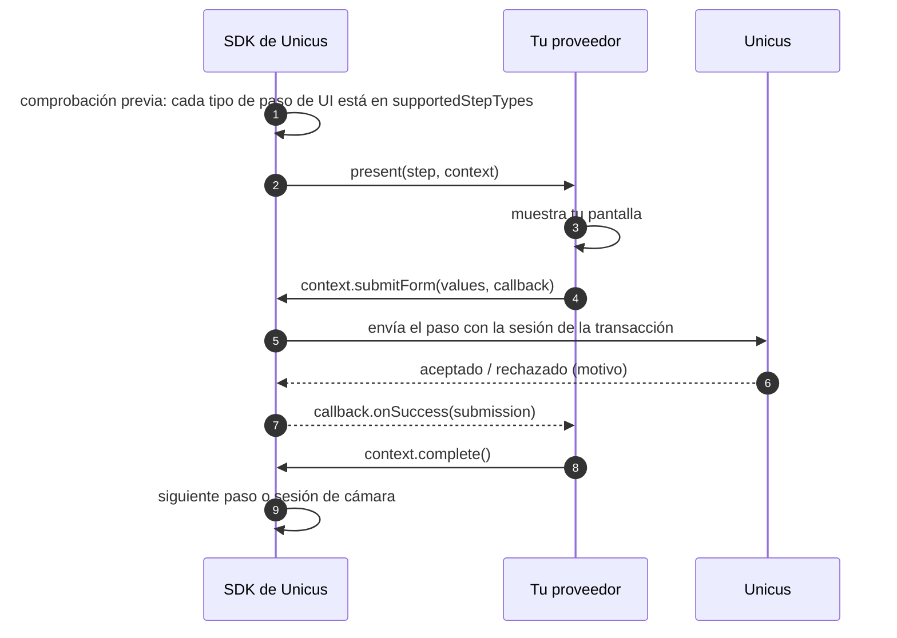
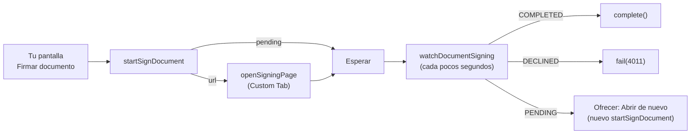

# Pasos de UI personalizados

Por defecto el SDK muestra los pasos no biométricos del flujo (consentimiento,
información, formulario, firma manuscrita, OTP, firma de documentos) con las
pantallas del flujo de Unicus en un WebView protegido. Con
`UnicusUiStepMode.Custom` tu app los muestra con sus propias pantallas y el SDK
sigue haciendo todas las llamadas a Unicus. Los pasos de cámara (liveness,
documento, face match) siempre se ejecutan en el SDK.

Usa el modo Custom cuando tu política de seguridad no permite un WebView,
cuando necesitas certificate pinning en todas las pantallas o cuando los pasos
deben verse exactamente como el resto de tu app. En otro caso, mantén el modo
WebView por defecto: así los tipos de paso nuevos y los cambios de textos no
requieren publicar tu app. Consulta [Flujos y pasos de UI](../flows-and-ui-steps.md).



## Actívalo




```kotlin
UnicusSdk.shared.configure(
    UnicusSdkConfig(apiKey = "<CUSTOMER_TOKEN>", environment = UnicusEnvironment.DEV)
        .copy(uiStepMode = UnicusUiStepMode.Custom(MyStepProvider(stepScreens)))
)
```





```java
UnicusSdk.getShared().configure(
    new UnicusSdkConfig.Builder("<CUSTOMER_TOKEN>", UnicusEnvironment.DEV)
        .uiStepMode(new UnicusUiStepMode.Custom(new MyStepProvider(stepScreens)))
        .build());
```




El proveedor vive tanto como la configuración. No guardes una `Activity` en
él: abre tus pantallas a través de tu propia capa de navegación (`stepScreens`
en los ejemplos) desde la actividad que esté en primer plano.

Antes de mostrar nada, el SDK comprueba que cada paso de UI del flujo esté en
`supportedStepTypes`. Si alguno no está, `start` falla con `flow_not_supported`
(`9020`) y la transacción se cierra: nada falla a mitad del flujo.

## El proveedor


```kotlin
import com.tekbees.unicus.sdk.*
import com.tekbees.unicus.sdk.model.*

class MyStepProvider(private val screens: StepScreens) : UnicusUiStepProvider {

    override val supportedStepTypes = setOf(
        UnicusFlowStepType.CONSENT,
        UnicusFlowStepType.INFO,
        UnicusFlowStepType.FORM,
        UnicusFlowStepType.SIGNATURE,
        UnicusFlowStepType.OTP,
        UnicusFlowStepType.SIGN_DOCUMENT
    )

    override fun present(step: UnicusFlowStep, context: UnicusStepContext) {
        when (step.type) {
            UnicusFlowStepType.CONSENT -> presentConsent(step, context)
            UnicusFlowStepType.INFO -> presentInfo(step, context)
            UnicusFlowStepType.FORM -> presentForm(step, context)
            UnicusFlowStepType.SIGNATURE -> presentSignature(step, context)
            UnicusFlowStepType.OTP -> presentOtp(step, context)
            UnicusFlowStepType.SIGN_DOCUMENT -> presentSignDocument(step, context)
        }
    }

    // La app llamó a cancelActiveSession mientras este paso estaba en pantalla: cierra tu pantalla.
    override fun dismiss(step: UnicusFlowStep) = screens.close()

    private fun text(value: Any?, context: UnicusStepContext): String? =
        UnicusLocalizedText.from(value)?.resolve(context.language)
}
```


Qué recibe el proveedor:

| Miembro | Descripción |
| --- | --- |
| `step.id`, `step.type` | Id del paso en el flujo y su tipo (`UnicusFlowStepType`). |
| `step.title`, `step.description` | Textos escritos en el portal (`UnicusLocalizedText`, resuélvelos con `context.language`). |
| `step.required` | `false` permite que el flujo continúe cuando el paso falla. |
| `step.config` | Configuración del paso desde el portal (mapa sin tipar, llaves abajo). |
| `context.tid`, `context.flowId` | Transacción y flujo. |
| `context.language` | `es` o `en`, según el idioma del dispositivo. |
| `context.theme` | Colores de la empresa (`windowColor`, `buttonColor`, `textColor`, `backgroundColor`). |

Llaves de configuración por tipo de paso (tal como se componen en el portal):

| Tipo | Llaves de `step.config` |
| --- | --- |
| `consent` | `text` (localizado), `privacyUrl` |
| `info` | `items` (lista de textos localizados) |
| `form` | `fields`: lista de `name`, `label` (localizado), `type` (`text`, `email`, `tel`, `number`, `date`, `select`), `required`, `options`, `pattern` |
| `signature` | `agreementText` (localizado), `minStrokes`, `documentUrl` |
| `otp` | `channel` (`sms`, `whatsapp`, `email`), `length`, `destinationMasked`, `askDestination`, `resendAfterSeconds` |
| `sign_document` | Tipado en `step.signDocumentConfig`: `templateName`, `lockData`, `signer`, `fields` |

## Reglas

* `present` se llama en el hilo principal, una vez por paso, en el orden del
  flujo.
* Termina cada paso con **exactamente uno** de:
  * `context.complete()`: el paso terminó, el SDK continúa.
  * `context.fail(resultCode)`: el paso falló. Un paso obligatorio termina el
    flujo con ese código; uno opcional se omite.
  * `context.cancel()`: el usuario salió. No es una cancelación: `start`
    termina con `2003` `RESUMABLE` y la transacción se puede retomar.
* Todos los callbacks del contexto se ejecutan en el hilo principal.
  `onSuccess` con `accepted == false` es un **rechazo** de Unicus con un
  `rejection` tipado: deja que el usuario corrija y envíe de nuevo. `onError`
  significa que la llamada misma falló (red, sesión): ofrece reintentar.
* Después de `cancelActiveSession`, el SDK llama a `dismiss(step)` e ignora las
  llamadas posteriores sobre ese contexto.
* El SDK envía los datos con la sesión de la transacción. Nunca llamas a Unicus
  directamente ni manejas tokens.

## Consentimiento

Envía el **texto exacto que vio el usuario**, en `context.language`:


```kotlin
private fun presentConsent(step: UnicusFlowStep, context: UnicusStepContext) {
    val consentText = text(step.config["text"], context) ?: screens.defaultConsentText(context.language)
    val privacyUrl = step.config["privacyUrl"] as? String
    screens.showConsent(consentText, privacyUrl,
        onAccept = {
            context.recordConsent(consentText, privacyUrl, unicusCallback(
                onError = { screens.showRetry(it) },
                onSuccess = { if (it.accepted) context.complete() else screens.showRejection(it.rejection) }
            ))
        },
        onLeave = { context.cancel() })
}
```


## Información


```kotlin
private fun presentInfo(step: UnicusFlowStep, context: UnicusStepContext) {
    val items = (step.config["items"] as? List<*>).orEmpty().mapNotNull { text(it, context) }
    screens.showInfo(step.title?.resolve(context.language), items, onContinue = {
        context.recordInfo(unicusCallback(
            onError = { screens.showRetry(it) },
            onSuccess = { if (it.accepted) context.complete() else screens.showRejection(it.rejection) }
        ))
    })
}
```


## Formulario

Los valores se envían por el `name` de cada campo. Un rechazo `FORM_INVALID`
indica los campos que hay que corregir (`nombre del campo → REQUIRED`,
`INVALID_TYPE`…):


```kotlin
private fun presentForm(step: UnicusFlowStep, context: UnicusStepContext) {
    val fields = (step.config["fields"] as? List<*>).orEmpty().filterIsInstance<Map<*, *>>()
    screens.showForm(fields, context.language, onSubmit = { values: Map<String, String> ->
        context.submitForm(values, unicusCallback(
            onError = { screens.showRetry(it) },
            onSuccess = { answer ->
                when {
                    answer.accepted -> context.complete()
                    answer.rejection?.kind == UnicusStepRejectionKind.FORM_INVALID ->
                        screens.showFieldErrors(answer.rejection!!.fields)
                    else -> screens.showRejection(answer.rejection)
                }
            }
        ))
    })
}
```


## Firma manuscrita

Envía un PNG de máximo 1 MB, el número de trazos y el texto del acuerdo tal
como se mostró:


```kotlin
private fun presentSignature(step: UnicusFlowStep, context: UnicusStepContext) {
    val agreement = text(step.config["agreementText"], context)
    screens.showSignaturePad(agreement, onDone = { png: ByteArray, strokes: Int ->
        context.submitSignature(png, strokes, agreement, unicusCallback(
            onError = { screens.showRetry(it) },
            onSuccess = { answer ->
                // SIGNATURE_INVALID: answer.rejection?.field indica qué corregir (por ejemplo "strokes")
                if (answer.accepted) context.complete() else screens.showRejection(answer.rejection)
            }
        ))
    })
}
```


## OTP

Pide el teléfono o el correo solo cuando `askDestination` es `true`. Los
códigos nunca se reenvían ni se verifican de nuevo automáticamente:


```kotlin
private fun presentOtp(step: UnicusFlowStep, context: UnicusStepContext) {
    val askDestination = step.config["askDestination"] == true
    screens.showOtp(askDestination,
        onSend = { destination: String? ->
            context.sendOtp(if (askDestination) destination else null, unicusCallback(
                onError = { screens.showRetry(it) },
                onSuccess = { sent ->
                    when {
                        sent.alreadyVerified -> context.complete()
                        sent.sent -> screens.showCodeInput(sent.destinationMasked)
                        // OTP_RESEND_TOO_SOON: sent.rejection.seconds de espera
                        else -> screens.showRejection(sent.rejection)
                    }
                }
            ))
        },
        onCode = { code: String ->
            context.verifyOtp(code, unicusCallback(
                onError = { screens.showRetry(it) },
                onSuccess = { answer ->
                    when {
                        answer.accepted -> context.complete()
                        // 4001 intentos agotados, paso fuera de orden...: termina el paso
                        answer.isTerminal ->
                            context.fail(answer.resultCode ?: UnicusResultCode.ATTEMPTS_EXHAUSTED)
                        else -> screens.showWrongCode(answer.attemptsLeft)   // OTP_INVALID_CODE
                    }
                }
            ))
        },
        onLeave = { context.cancel() })
}
```


## Firma de documentos (`sign_document`)

El documento se firma en la página de Unicus Sign, abierta en el navegador del
sistema (Custom Tabs, nunca un WebView). Unicus lee el resultado desde Unicus
Sign; tu pantalla solo abre la página y vigila el estado.




```kotlin
private var signWatch: UnicusSignWatch? = null

private fun presentSignDocument(step: UnicusFlowStep, context: UnicusStepContext) {
    val config = step.signDocumentConfig
    screens.showSignDocument(config?.templateName,
        onSign = { activity -> openSigning(activity, context) },   // también "Abrir de nuevo"
        onForeground = { signWatch?.checkNow() },
        onDestroy = { signWatch?.stop() },
        onLeave = { signWatch?.stop(); context.cancel() })

    signWatch = context.watchDocumentSigning(object : UnicusSignWatchListener {
        override fun onStatus(check: UnicusSignStatusCheck) {
            when (check.status) {
                UnicusSignStatus.COMPLETED -> context.complete()          // Unicus ya lo registró
                UnicusSignStatus.DECLINED -> context.fail(UnicusResultCode.SIGN_DECLINED)
                UnicusSignStatus.PENDING -> screens.showOpenAgain()
                UnicusSignStatus.NOT_STARTED -> Unit
                null -> check.rejection?.let {                             // por ejemplo STEP_OUT_OF_ORDER
                    context.fail(check.resultCode ?: UnicusResultCode.STEP_REJECTED)
                }
            }
        }
        override fun onError(error: UnicusSdkException) { /* red: la vigilancia sigue consultando */ }
    })
}

private fun openSigning(activity: Activity, context: UnicusStepContext) {
    context.startSignDocument(unicusCallback(
        onError = { screens.showRetry(it) },
        onSuccess = { start ->
            val url = start.url
            when {
                start.started && url != null -> context.openSigningPage(activity, url)
                start.pending -> screens.showWaitingForSignature()          // ya firmó
                // SIGN_EMAIL_MISSING, SIGN_NOT_CONNECTED, STEP_NOT_AVAILABLE: configuración de la empresa
                // SIGN_SERVICE_UNAVAILABLE (4014): temporal, ofrece reintentar
                else -> screens.showSignProblem(start.rejection?.kind)
            }
        }
    ))
}
```


* El enlace de firma es de un solo uso y de vida corta. Para abrir la página de
  nuevo, llama otra vez a `startSignDocument`; nunca reutilices una `url`
  anterior.
* `openSigningPage` solo abre enlaces `https` y devuelve `false` cuando ninguna
  app puede abrirlos.
* Llama a `checkNow()` cuando tu pantalla vuelve al primer plano (el usuario
  regresa del navegador) y a `stop()` cuando se destruye.
* `signDocumentStatus(callback)` hace una sola consulta del estado, si
  prefieres consultar tú mismo; una llamada rechazada por Unicus llega como
  `onError` con código `sign_status_rejected`: termina el paso con `fail(...)`.
* Cada respuesta emite también el evento `stepProgress` (consulta
  [Resultados y eventos](results-and-events.md#eventos)).

## Java

La misma API está disponible desde Java:


```java
public class MyStepProvider implements UnicusUiStepProvider {
    private final StepScreens screens;

    public MyStepProvider(StepScreens screens) { this.screens = screens; }

    @Override public Set<String> getSupportedStepTypes() {
        return new HashSet<>(Arrays.asList(UnicusFlowStepType.CONSENT, UnicusFlowStepType.FORM));
    }

    @Override public void present(UnicusFlowStep step, UnicusStepContext context) {
        if (UnicusFlowStepType.FORM.equals(step.getType())) {
            screens.showForm(step, values -> context.submitForm(values,
                new UnicusCallback<UnicusStepSubmission>() {
                    @Override public void onSuccess(UnicusStepSubmission answer) {
                        if (answer.getAccepted()) context.complete();
                        else screens.showRejection(answer.getRejection());
                    }
                    @Override public void onError(UnicusSdkException error) { screens.showRetry(error); }
                }));
        } else {
            screens.showConsent(step, context);
        }
    }

    @Override public void dismiss(UnicusFlowStep step) { screens.close(); }
}
```


## Motivos de rechazo

Valores de `UnicusStepRejection.kind` que verás con más frecuencia:

| Tipo | Paso | Datos extra | Qué hacer |
| --- | --- | --- | --- |
| `FORM_INVALID` | form | `fields` (nombre → `REQUIRED`, `INVALID_TYPE`…) | Marca los campos y deja que el usuario envíe de nuevo. |
| `SIGNATURE_INVALID` | signature | `field` | Pide firmar de nuevo. |
| `OTP_RESEND_TOO_SOON` | otp | `seconds` | Espera antes de permitir "reenviar". |
| `OTP_INVALID_CODE` | otp | `attemptsLeft` en la respuesta | Deja que el usuario escriba de nuevo. |
| `OTP_EXPIRED`, `OTP_NOT_SENT` | otp | — | Ofrece enviar un código nuevo. |
| `OTP_DESTINATION_REQUIRED`, `OTP_DESTINATION_INVALID` | otp | — | Pide un teléfono o correo válido. |
| `OTP_ATTEMPTS_EXHAUSTED` | otp | `resultCode` 4001 | `fail(4001)`. |
| `STEP_OUT_OF_ORDER`, `STEP_NOT_IN_FLOW`, `STEP_TYPE_MISMATCH`, `NO_FLOW` | cualquiera | `stepIds` | Terminal: `fail(resultCode)`. |
| `SIGN_EMAIL_MISSING`, `SIGN_NOT_CONNECTED`, `STEP_NOT_AVAILABLE` | sign_document | — | Configuración de la empresa: `fail(resultCode)` y contacta a Tekbees. |
| `SIGN_SERVICE_UNAVAILABLE` | sign_document | — | Temporal: ofrece reintentar. |

`UnicusStepSubmission.isTerminal` es `true` cuando el paso no se puede
reintentar. La lista completa de códigos está en
[Códigos de resultado](../result-codes.md).

Siguiente: [Textos e idiomas](texts-and-languages.md).
