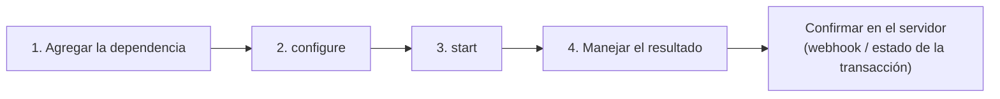

# Inicio rápido


**Próximamente.** Los SDK móviles de Unicus aún no están disponibles en
producción. Hoy solo está disponible el ambiente **DEV**; STAGING y PRODUCTION
responden `environment_not_available`. Tekbees anunciará el lanzamiento en
producción. Mientras tanto, solicita a Tekbees el paquete del SDK y un Customer
Token de DEV para prepararte.




## 1. Agrega la dependencia

Copia la carpeta `sdk/repo` del paquete entregado por Tekbees en tu proyecto
(por ejemplo `vendor/unicus/repo`) y regístrala:


```kotlin
// settings.gradle.kts
dependencyResolutionManagement {
    repositories {
        google()
        mavenCentral()
        maven { url = uri(rootDir.resolve("vendor/unicus/repo")) }
    }
}
```



```kotlin
// app/build.gradle.kts
dependencies {
    implementation("com.tekbees.unicus:unicus-sdk:0.1.0")
}
```


`CAMERA` e `INTERNET` se incorporan desde el manifiesto del SDK. La ubicación
es opcional (consulta [Instalación](installation.md#permisos)).

## 2. Configura

Llama a `configure` una sola vez, por ejemplo en `Application.onCreate`, con tu
[Customer Token](../../sdk-web-v5/customer-token.md) y el ambiente:


```kotlin
UnicusSdk.shared.configure(
    UnicusSdkConfig(apiKey = "<CUSTOMER_TOKEN>", environment = UnicusEnvironment.DEV)
)
```


## 3. Inicia y maneja el resultado




```kotlin
import com.tekbees.unicus.sdk.UnicusSdk
import com.tekbees.unicus.sdk.unicusCallback
import com.tekbees.unicus.sdk.model.*

val request = UnicusVerificationRequest.enrollmentVerify(
    UnicusDocument(UnicusDocumentType.ID, "123456789")
)

UnicusSdk.shared.start(activity, request, unicusCallback<UnicusVerificationResult>(
    onError = { error -> mostrarError(error.code, error.message) },   // error técnico, ver Errores
    onSuccess = { result ->
        when (result.outcome) {
            UnicusVerificationOutcome.SUCCESS,
            UnicusVerificationOutcome.WARNING -> verificado(result.tid)   // confirma en tu backend
            UnicusVerificationOutcome.RESUMABLE -> pendiente(result.tid)  // 2003: start de nuevo para continuar
            else -> noVerificado(result.resultCode, result.rejectionReason)
        }
    }
))
```





```kotlin
import com.tekbees.unicus.sdk.UnicusSdk
import com.tekbees.unicus.sdk.start
import com.tekbees.unicus.sdk.model.*

lifecycleScope.launch {
    try {
        val result = UnicusSdk.shared.start(activity, request)
        manejar(result)
    } catch (error: UnicusSdkException) {
        mostrarError(error.code, error.message)
    }
}
```


Cancelar la corrutina cancela la verificación que inició.




```java
import com.tekbees.unicus.sdk.*;
import com.tekbees.unicus.sdk.model.*;

UnicusSdk.getShared().configure(new UnicusSdkConfig("<CUSTOMER_TOKEN>", UnicusEnvironment.DEV));

UnicusSdk.getShared().start(
    this,
    UnicusVerificationRequest.enrollmentVerify(new UnicusDocument(UnicusDocumentType.ID, "123456789")),
    new UnicusCallback<UnicusVerificationResult>() {
        @Override public void onSuccess(UnicusVerificationResult result) {
            switch (result.getOutcome()) {
                case SUCCESS:
                case WARNING: verificado(result.getTid()); break;
                case RESUMABLE: pendiente(result.getTid()); break;
                default: noVerificado(result.getResultCode(), result.getRejectionReason());
            }
        }
        @Override public void onError(UnicusSdkException error) {
            mostrarError(error.getCode(), error.getMessage());
        }
    });
```




El SDK muestra todas las pantallas: las del flujo configurado en el portal y la
cámara. Los callbacks siempre llegan en el hilo principal.

## 4. Qué significa cada outcome

| `outcome` | Código típico | Qué hacer |
| --- | --- | --- |
| `SUCCESS` | `2000` | Verificado. Envía el `tid` a tu backend y confirma con el webhook. |
| `WARNING` | `2013` | Completado con advertencia (revisión). Trátalo según tus reglas. |
| `RESUMABLE` | `2003` | El usuario salió antes de terminar. Si vuelves a llamar a `start` con el mismo documento, continúa donde quedó. |
| `FAILED` | `2052`, `6xxx`, `9010`… | No verificado. `rejectionReason` trae el motivo legible por máquina. |
| `CANCELED` | `2041`, `2051`, `2061`, `4001` | Cancelado, caducado o sin intentos. Ofrece empezar de nuevo. |
| `ERROR` | `2054`, `4014`, códigos `9xxx` técnicos | Falla técnica. Si `isRetryable` es `true`, basta con reintentar. |


El resultado en la app es para la pantalla del usuario. **Otorga el acceso
desde tu backend**, con el [webhook](../../sdk-web-v5/webhooks.md) o con
[Consultar el estado de una transacción](../../sdk-web-v5/transaction-status.md)
usando el `tid`.


## Siguientes pasos

* [Instalación](installation.md): contenido del paquete, permisos, R8.
* [Configuración](configuration.md): todas las opciones.
* [Resultados y eventos](results-and-events.md) y
  [Códigos de resultado](../result-codes.md).
* [Errores y solución de problemas](../errors-and-troubleshooting.md).
* [Lista de salida a producción](release-checklist.md).
