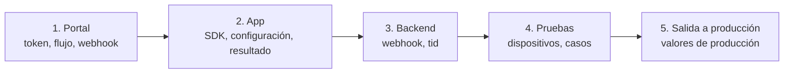

# Lista de salida a producción

Sigue los pasos en orden. Haz primero las pruebas en DEV.

## 1. En el portal administrativo

- [ ] Solicita a Tekbees una empresa de DEV, su
      [Customer Token](../../sdk-web-v5/customer-token.md) y el paquete del SDK.
- [ ] Asigna un **flujo** habilitado para móvil. Comprueba que se ejecuta con
      tu modo de pasos de UI (ningún paso de documento sin cámara, un face
      match solo después de un liveness). Consulta
      [Flujos y pasos de UI](../flows-and-ui-steps.md).
- [ ] Revisa la marca (colores) y agrega tu logo como drawable de la app
      (`setAndroidLogoResourceName`).
- [ ] Registra la URL de tu [webhook](../../sdk-web-v5/webhooks.md) y guarda el
      secreto de firma en tu backend.

## 2. En tu app

- [ ] La dependencia se resuelve desde el repositorio de Unicus; `minSdk` ≥ 21,
      `compileSdk` ≥ 34. Consulta [Instalación](installation.md).
- [ ] `configure` se ejecuta una vez, antes de `start`, con el token inyectado
      por tipo de build (no escrito en el código bajo control de versiones).
- [ ] Ubicación: declarada solo si la necesitas e informada en el formulario
      *Seguridad de los datos* de Play Console.
- [ ] `start` se llama una vez por acción del usuario, nunca de nuevo al
      recrear la actividad; una segunda llamada mientras otra corre da
      `session_active`.
- [ ] Cada `outcome` tiene una pantalla, incluidos `RESUMABLE` (`2003`) y los
      errores con `isRetryable`. Consulta
      [Resultados y eventos](results-and-events.md).
- [ ] Cada `onError` muestra un mensaje y guarda `error.code` en tus logs.
      Consulta [Errores y solución de problemas](../errors-and-troubleshooting.md).
- [ ] El `tid` se envía a tu backend; el acceso **lo otorga el backend**, no el
      callback de la app.
- [ ] `clearResumeData(context)` se llama al cerrar sesión.
- [ ] `secureScreens = true` si tu política prohíbe capturas de pantalla.
- [ ] `enableApiLogging` está desactivado en los builds de release e
      `includeSensitiveApiLogData` nunca está activo.
- [ ] Solo modo Custom: cada tipo de paso del flujo está en
      `supportedStepTypes`, cada paso termina con exactamente uno de
      `complete`, `fail` o `cancel`, y `dismiss` cierra tu pantalla. Consulta
      [Pasos de UI personalizados](custom-ui-steps.md).
- [ ] El build de release (con R8) completa una verificación.

## 3. En tu backend

- [ ] Guarda el `tid` con tu usuario o caso.
- [ ] Verifica la firma del webhook, deduplica por id de evento y decide según
      el resultado del webhook. Consulta [Webhooks](../../sdk-web-v5/webhooks.md).
- [ ] Opcional: concilia las transacciones sin webhook con
      [Consultar el estado de una transacción](../../sdk-web-v5/transaction-status.md).

## 4. Pruebas en dispositivos

Usa dispositivos físicos: al menos uno con la versión de Android más antigua
que soportes y uno reciente.

| # | Caso | Esperado |
| --- | --- | --- |
| 1 | Completa el flujo con un documento válido. | `SUCCESS` (`2000`); webhook aprobado. |
| 2 | Niega el permiso de cámara. | El SDK explica cómo permitirlo; el resultado suele ser `ERROR` (`9996`). |
| 3 | Cierra una pantalla del flujo y confirma la salida. | `RESUMABLE` (`2003`). |
| 4 | Después del caso 3, llama a `start` de nuevo con el mismo documento. | El flujo continúa donde estaba; `result.resumed` es `true`. |
| 5 | Cancela dentro de la cámara. | `CANCELED` (`2041`) (o `2003` si Unicus mantiene el flujo abierto). |
| 6 | Llama a `cancelActiveSession` durante el flujo. | Las pantallas se cierran; `start` termina con `2041` o `2003`. |
| 7 | Rota el dispositivo y envía la app a segundo plano durante una pantalla del flujo. | El flujo continúa donde estaba el usuario. |
| 8 | Activa el modo avión durante una pantalla del flujo. | La pantalla ofrece "reintentar"; evento `pageError`. |
| 9 | Usa un dispositivo con Android System WebView desactualizado (modo WebView). | `webview_unavailable`; actualiza WebView desde Play Store. |
| 10 | Quita la asignación del flujo en el portal. | `onError` con `transaction_refused` y `resultCode` `2002`. |
| 11 | Configura `PRODUCTION` antes de que se anuncie. | `environment_not_available`. |
| 12 | Dispositivos corporativos: ejecuta el caso 1 bajo tu MDM / VPN / RASP. | Igual que el caso 1. Consulta [Compatibilidad y seguridad](../compatibility-and-security.md). |

## 5. Salida a producción

PRODUCTION aún no está disponible. Cuando Tekbees lo anuncie:

- [ ] Actualiza el SDK a la versión que habilita PRODUCTION (los ambientes
      vienen embebidos en cada versión del SDK). Consulta
      [Versiones](../versioning.md).
- [ ] Usa `UnicusEnvironment.PRODUCTION` y el Customer Token, la URL del
      webhook y el secreto de producción.
- [ ] Asigna el o los flujos en la empresa de producción.
- [ ] Ejecuta el caso 1 en producción con un documento real.
- [ ] Ten a mano el contacto de [Soporte](../support.md): envía el `tid`, la
      plataforma, `UnicusSdk.shared.version` y logs sanitizados.
