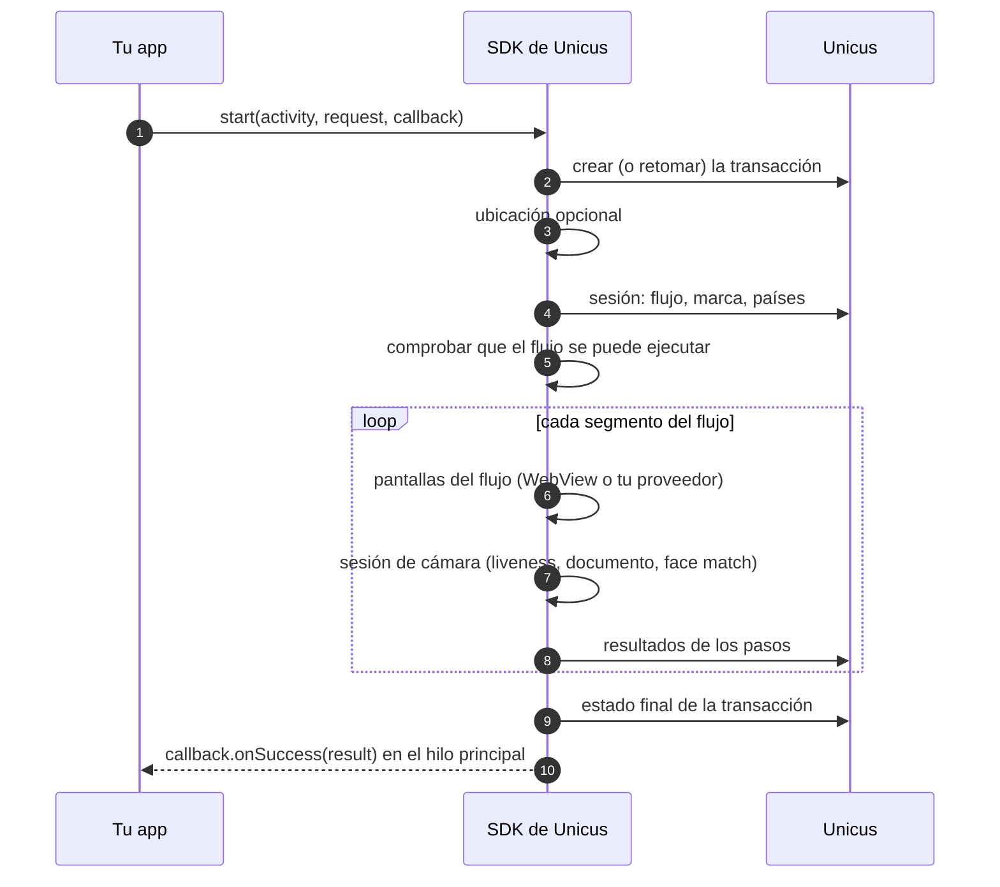

# Iniciar una verificación

## Con el documento del usuario

`enrollmentVerify` es el inicio recomendado. Tu app solo entrega el tipo y el
número de documento: Unicus enrola a la persona si no la conoce y la verifica
si ya la conoce.


```kotlin
val request = UnicusVerificationRequest.enrollmentVerify(
    UnicusDocument(UnicusDocumentType.ID, "123456789")
)
UnicusSdk.shared.start(activity, request, callback)
```


| `UnicusDocumentType` | Código | Documento |
| --- | --- | --- |
| `ID` | `ID` | Documento nacional de identidad. |
| `FOREIGN_DOCUMENT` | `FD` | Documento de identidad de extranjero. |
| `PASSPORT` | `PP` | Pasaporte. |
| `DRIVER_LICENSE` | `DL` | Licencia de conducción. |

Qué pasa después de `start`:



Antes de mostrar nada, el SDK comprueba que cada paso pendiente se puede
ejecutar con tu [modo de pasos de UI](configuration.md#opciones). Si no,
`start` falla con `flow_not_supported` y la transacción se cierra. Consulta
[Flujos y pasos de UI](../flows-and-ui-steps.md).

## Elegir el país primero

Cuando tu empresa tiene más de un país activo, prepara la transacción, deja que
el usuario elija el país y luego inicia. Con un solo país activo el SDK lo
selecciona y `requiresCountrySelection` es `false`.




```kotlin
import com.tekbees.unicus.sdk.prepareEnrollmentVerify
import com.tekbees.unicus.sdk.start

lifecycleScope.launch {
    try {
        val prepared = UnicusSdk.shared.prepareEnrollmentVerify(activity, document)
        val country = if (prepared.requiresCountrySelection) {
            elegirPais(prepared.countries.map { it.code })   // códigos ISO-2: "CO", "MX", ...
        } else {
            prepared.country
        }
        val result = UnicusSdk.shared.start(activity, prepared.toRequest(country))
        manejar(result)
    } catch (error: UnicusSdkException) {
        mostrarError(error)
    }
}
```





```java
UnicusSdk.getShared().prepareEnrollmentVerify(activity, document,
    new UnicusCallback<UnicusPreparedVerification>() {
        @Override public void onSuccess(UnicusPreparedVerification prepared) {
            String country = prepared.getRequiresCountrySelection()
                    ? elegirPais(prepared.getCountries())
                    : prepared.getCountry();
            UnicusSdk.getShared().start(activity, prepared.toRequest(country), resultCallback);
        }
        @Override public void onError(UnicusSdkException error) { mostrarError(error); }
    });
```




`prepared.tid` es el id de la transacción; `prepared.resumed` es `true` cuando
Unicus continuó una transacción abierta de la misma persona.

## Sobre una transacción existente

Para continuar una transacción cuyo `tid` ya tienes (por ejemplo un resultado
`RESUMABLE` que guardó tu app), iníciala con `existingTransaction`:


```kotlin
UnicusSdk.shared.start(activity, UnicusVerificationRequest.existingTransaction(tid), callback)
```


El SDK continúa en el primer paso pendiente. Una transacción que ya no existe o
que caducó falla con `transaction_expired` (`2051`).

## Reanudación automática

Con `resumeOpenTransactions = true` (valor por defecto) no necesitas guardar el
`tid`. Cuando el usuario sale y tu app vuelve a llamar a `start` con el **mismo
documento**, el SDK continúa la transacción abierta donde quedó, siempre que no
haya caducado (unos 20 minutos sin actividad). El resultado trae
`resumed = true` y se emite el evento `transactionResumed`.

La llave de reanudación se guarda cifrada en el almacenamiento privado de tu
app. Llama a `UnicusSdk.shared.clearResumeData(context)` cuando el usuario
cierre sesión. Consulta [Resultados y reanudación](../results-and-resuming.md).

## Ubicación

La ubicación es un metadato opcional de la transacción (consulta
[Instalación](installation.md#permisos)). Puedes cambiar la configuración en
cada solicitud:


```kotlin
UnicusVerificationRequest.enrollmentVerify(document, collectLocation = false)
```


El SDK espera la ubicación un tiempo limitado y luego continúa sin ella. Los
eventos `locationCollected` o `locationSkipped` te dicen qué pasó.

## Cancelar

Tu app puede cancelar la verificación en curso, por ejemplo cuando el usuario
cierra sesión o vence un temporizador tuyo:




```kotlin
UnicusSdk.shared.cancelActiveSession("El usuario cerró sesión")

// o, en una corrutina, esperar a que Unicus responda
// (import com.tekbees.unicus.sdk.awaitCancelActiveSession):
UnicusSdk.shared.awaitCancelActiveSession("El usuario cerró sesión")
```





```java
UnicusSdk.getShared().cancelActiveSession("El usuario cerró sesión");
```




El SDK cierra sus pantallas, no ejecuta nada más, avisa a Unicus y el callback
de `start` recibe el resultado: `2041` `CANCELED`, o `2003` `RESUMABLE` cuando
Unicus mantiene abierto un flujo que ya pasó su sesión de cámara. El callback
de `cancelActiveSession` se ejecuta después de ese resultado y nunca falla. Si
lo llamas mientras `start` todavía se prepara, `start` termina igual, sin
mostrar nada.

Cancelar la corrutina que llamó al `start` `suspend` también cancela la
verificación.

Salir no es cancelar:

| Qué pasa | Resultado de `start` |
| --- | --- |
| El usuario cierra una pantalla del flujo (y confirma), presiona atrás en ella, descarta la app de recientes, o tu proveedor personalizado llama a `cancel()`. | `2003` `RESUMABLE`: la transacción sigue abierta y se puede retomar. |
| El usuario cancela dentro de la cámara. | `2041` `CANCELED` (o `2003` si Unicus mantiene el flujo abierto). |
| Tu app llama a `cancelActiveSession`. | Igual que cancelar en la cámara. |

## Reglas de hilos y ciclo de vida

* Todos los callbacks y listeners se ejecutan en el **hilo principal**. Llama
  también al SDK desde el hilo principal (por ejemplo desde un evento de clic).
* Solo corre **una** verificación a la vez. Un segundo `start` mientras otra
  está activa falla con `session_active`. `UnicusSdk.shared.isSessionActive`
  te dice si hay una en curso.
* Pasa una `Activity` viva a `start`. El SDK abre sus propias actividades
  encima; no reenvías `onActivityResult` ni resultados de permisos.
* No vuelvas a llamar a `start` cuando tu actividad se recrea (rotación,
  restauración del proceso): comprueba `savedInstanceState == null` como hace
  la app de ejemplo. El SDK sobrevive a la recreación de sus propias pantallas
  y continúa donde estaba el usuario.
* El botón atrás de Android en una pantalla del flujo pide al usuario confirmar
  la salida; salir da `2003` `RESUMABLE`.

Siguiente: [Resultados y eventos](results-and-events.md).
