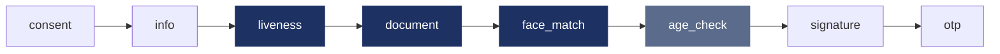

# Flujos y pasos de UI

## Flujos del portal

La verificación es un **flujo**: una lista ordenada de pasos que tu empresa
compone en el portal administrativo de Unicus. Los SDK móviles ejecutan los
mismos flujos que [Web SDK 5.0](../sdk-web-v5/flows-and-handoff.md). Un cambio
en el portal aplica a la siguiente transacción sin publicar una nueva versión de
tu app.

*Flujo de ejemplo. Los pasos oscuros corren en una sola sesión de cámara nativa;
el paso gris lo responde Unicus; los demás son pasos de UI.*

En móvil todo el flujo corre en el dispositivo. No hay traspaso a otro
dispositivo.

## Tipos de paso

| Tipo de paso | Qué hace el usuario | Clase |
| --- | --- | --- |
| `consent` | Lee qué se va a capturar y para qué, y acepta. | UI |
| `info` | Lee instrucciones (buena luz, documento a la mano). | UI |
| `liveness` | Selfie en video que demuestra que hay una persona viva. | Cámara |
| `document` | Fotografía el frente y el reverso del documento. Validaciones en el servidor configuradas por flujo (clasificador, coincidencia del número de documento, registro oficial, material del documento). | Cámara |
| `face_match` | La selfie se compara con la foto del documento, o con el rostro enrolado antes. | Cámara |
| `age_check` | Sin pantalla: Unicus compara la edad estimada en la selfie con el umbral del flujo. | Servidor |
| `form` | Diligencia un formulario de datos definido en el portal. | UI |
| `signature` | Dibuja una firma en pantalla después de leer el documento que se muestra. | UI |
| `otp` | Recibe un código de un solo uso por SMS, WhatsApp o correo electrónico y lo digita. | UI |
| `sign_document` | Firma un documento en Unicus Sign. La página de firma se abre en la hoja del navegador del sistema (Custom Tabs en Android, vista de Safari en iOS) y el flujo continúa cuando la firma se completa o se rechaza. Requiere Unicus Sign habilitado para tu empresa. | UI |

Los tipos de paso de UI que se agreguen después al portal corren en modo WebView
sin actualizar el SDK.

## Segmentos

El SDK agrupa los pasos pendientes en **segmentos** y los ejecuta en orden:

* los pasos de cámara consecutivos forman **una sola sesión de cámara**, así el
  usuario abre la cámara una vez;
* los pasos de UI consecutivos abren las pantallas del flujo una vez;
* un `age_check` lo responde Unicus con la sesión de cámara anterior.

Después de cada segmento el SDK le pregunta a Unicus qué pasos siguen
pendientes. El avance vive en Unicus, nunca en el dispositivo: no se puede saltar
un paso ni enviarlo fuera de orden. Cuando no queda ningún paso pendiente,
Unicus entrega el resultado final.

## Modos de los pasos de UI

La opción de configuración `uiStepMode` decide cómo se muestran los pasos de UI.
Los pasos de cámara siempre corren en las pantallas de cámara nativas.

| Modo | Pasos de UI | Plataformas |
| --- | --- | --- |
| **WebView** (por defecto) | Las pantallas del flujo de Unicus, en un WebView restringido propiedad del SDK, con una barra superior nativa con el logo de tu empresa y un botón de cerrar. | Android, iOS, Flutter |
| **Custom** | Tus propias pantallas nativas. El SDK te dice qué paso mostrar y hace por ti las llamadas al API de Unicus. | Solo Android e iOS |
| **Disabled** | Ninguno. Solo pueden correr pasos de cámara y de servidor; un flujo con algún paso de UI falla antes de mostrar nada. | Android, iOS, Flutter |

### Modo WebView

Las pantallas del flujo usan el logo y los colores de tu empresa y los textos
configurados por flujo en el portal. El WebView carga solo el dominio de la flow
app de Unicus de tu ambiente, no conserva datos al cerrarse y recibe la sesión
de la transacción por un canal privado con el SDK, nunca en una URL.

El botón de cerrar y el botón atrás de Android le piden confirmación al usuario.
Salir no es cancelar: la transacción sigue abierta y se puede retomar (consulta
[Resultados y reanudación](results-and-resuming.md)).

### Modo Custom

Úsalo cuando tu política de seguridad prohíbe los WebView, exige certificate
pinning en todas las pantallas, o cuando quieres que los pasos de UI se vean
exactamente como tu app. Tu app declara los tipos de paso que sabe mostrar; el
SDK compara el flujo con esa lista antes de mostrar nada. Para cada paso tu app
muestra su pantalla y llama al SDK (registrar el consentimiento, enviar el
formulario, enviar y verificar el OTP, iniciar la firma del documento) y luego
completa, falla o abandona el paso.

* [Android: pasos de UI propios](android/custom-ui-steps.md)
* [iOS: pasos de UI propios](ios/custom-ui-steps.md)
* Las apps Flutter usan el modo WebView o Disabled; consulta
  [Flutter: pasos de UI](flutter/ui-steps.md).

### Modo Disabled

Para apps que solo ejecutan flujos biométricos (por ejemplo prueba de vida más
documento con comparación facial). Cualquier paso de UI en el flujo asignado
hace que `start` falle con `flow_not_supported`.

## Consentimiento

El paso de consentimiento corre cuando el flujo lo incluye. Las transacciones
móviles no lo exigen por defecto. Para mostrar siempre primero una pantalla de
consentimiento, aunque el flujo no la tenga, pon la opción de configuración
`prependConsent` en `true`: el SDK agrega un paso de consentimiento al inicio del
flujo (lo muestran las pantallas del flujo, o tu proveedor Custom, que en ese
caso debe soportar `consent`).

## Reglas de flujo en móvil

El SDK revisa todo el flujo pendiente **antes de mostrar nada**. Cuando el flujo
no puede correr, `start` falla con el error `flow_not_supported`, Unicus cierra
la transacción con el código de resultado `9020`, y no se consume ningún
intento.

| Regla | Por qué |
| --- | --- |
| Un `face_match` necesita un paso `liveness` en el mismo grupo de cámara o antes en el flujo. | La comparación se hace contra el rostro capturado en esa prueba de vida. |
| Un paso `document` no puede estar solo en un grupo de cámara: combínalo con `liveness`, o con `face_match` después de una prueba de vida anterior. | Un escaneo solo de documento no completa ningún paso. |
| `liveness`, `document` y `face_match` siempre son obligatorios. | Lo exige Unicus, aunque el flujo los marque opcionales: un paso de cámara fallido termina el flujo. |
| Todo paso de UI debe estar soportado por el `uiStepMode` configurado (y por tu proveedor Custom). | Si no, el flujo podría detenerse a mitad de camino. |
| El flujo debe estar publicado para el canal **móvil**. | En el portal un flujo se puede publicar para web, móvil o ambos (`flowChannels`). Un flujo solo web falla en móvil. |
| Esta versión del SDK debe poder leer el formato del flujo. | Un formato de flujo más nuevo requiere actualizar el SDK. |

`9020` y `flow_not_supported` significan lo mismo: corrige el flujo en el portal
o el `uiStepMode` de tu app, y luego inicia una nueva verificación.

## Eventos de avance

El SDK reporta el avance del flujo por su listener de eventos: inicio de segmento
(UI, cámara o servidor), inicio de paso, paso completado, paso fallido, y errores
recuperables que muestra una pantalla del flujo. Los eventos traen el `stepId` y
el tipo de paso, así tu app puede mostrar el avance de los pasos que existen en
tu flujo. Consulta la página de resultados y eventos de tu plataforma:
[Android](android/results-and-events.md), [iOS](ios/results-and-events.md),
[Flutter](flutter/results-and-events.md).
