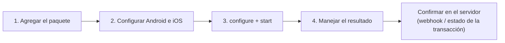

# Inicio rápido


**Próximamente.** Los SDK móviles de Unicus aún no están disponibles en
producción. Hoy solo está disponible el ambiente **DEV**; `staging` y
`production` responden `environment_not_available`. Tekbees anunciará el
lanzamiento en producción.




## 1. Agrega el paquete

Copia la carpeta `sdk/unicus_sdk_flutter` del paquete que te entregó Tekbees
en tu repositorio (por ejemplo `vendor/unicus_sdk_flutter`) y referénciala en
`pubspec.yaml`:


```yaml
dependencies:
  unicus_sdk_flutter:
    path: vendor/unicus_sdk_flutter
```


Ejecuta `flutter pub get`. No hay URL ni llaves que buscar: el SDK las trae
según el ambiente.

## 2. Configura Android e iOS

* **Android:** `minSdk` 21, `compileSdk` 34 o superior, Android Gradle Plugin
  8.x o 9.x y Kotlin Gradle Plugin 2.0 o superior (Flutter 3.47 por sí mismo
  exige AGP 8.11.1 y Kotlin 2.2.20). El plugin agrega los permisos de cámara e
  internet.
* **iOS:** deployment target 15.0 y una descripción de uso de la cámara en
  `ios/Runner/Info.plist`:


```xml
<key>NSCameraUsageDescription</key>
<string>Usamos la cámara para verificar tu identidad.</string>
```


Para ejecutar builds Debug en un iPhone físico, agrega el helper del Podfile
descrito en [Instalación](installation.md).

## 3. Configura e inicia


```dart
import 'package:unicus_sdk_flutter/unicus_sdk_flutter.dart';

final unicus = UnicusSdkFlutter();

Future<void> verify() async {
  await unicus.configure(const UnicusSdkConfig(
    apiKey: '<CUSTOMER_TOKEN>',
    environment: UnicusEnvironment.dev,
  ));
  try {
    final result = await unicus.start(const UnicusVerificationRequest.enrollmentVerify(
      document: UnicusDocument(type: UnicusDocumentType.id, externalDatabaseRefId: '123456789'),
    ));
    if (result.isResumable) {
      // 2003: el usuario salió; llamar start de nuevo con el mismo documento continúa.
    } else if (result.success) {
      // Verificado. Envía result.tid a tu backend y confirma allí.
    } else {
      // No verificado: result.outcome, result.resultCode, result.rejectionReason.
    }
  } on UnicusSdkException catch (e) {
    showError(e.code); // la verificación no pudo ejecutarse (ver Errores y solución de problemas)
  }
}
```


`enrollmentVerify` enrola a la persona si Unicus aún no la conoce y la
verifica si ya la conoce. Tu app pide solo el tipo y el número de documento.

## 4. Maneja el resultado

| `result.outcome` | Código | Qué hacer |
| --- | --- | --- |
| `success` | 2000 | Verificado. Valida el `tid` en tu backend. |
| `warning` | 2013 | Verificado con advertencia (posible duplicado). |
| `resumable` | 2003 | El usuario salió o faltan pasos. Llama `start` de nuevo con el mismo documento. |
| `failed` | 2052, 4011, 6xxx… | No verificado. En 2052, `rejectionReason` dice por qué. |
| `canceled` | 2041, 2051… | Cancelado, caducado o sin intentos. Permite empezar de nuevo. |
| `error` | 2054, 4014, 9xxx | Falla técnica. Si `isRetryable` es `true`, basta con reintentar. |

**Retomar.** Si el usuario sale, el siguiente `start` con el mismo documento
continúa donde quedó (hasta 20 minutos sin actividad): `result.resumed` es
`true`. Llama `unicus.clearResumeData()` cuando el usuario cierre sesión.
Consulta [Resultados y reanudación](../results-and-resuming.md).

El resultado en la app es para la experiencia del usuario. Otorga el acceso
desde tu backend, con el [webhook](../../sdk-web-v5/webhooks.md) o
[Consultar el estado de una transacción](../../sdk-web-v5/transaction-status.md).

## Ejecuta el ejemplo

El paquete incluye la integración mínima en un solo archivo:


```bash
cd example
flutter pub get
flutter run -t lib/quick_start.dart --dart-define=UNICUS_API_KEY=<CUSTOMER_TOKEN>
```


## Siguientes pasos

* [Instalación](installation.md): configuración completa de Android e iOS.
* [Configuración](configuration.md): todas las opciones.
* [Resultados y eventos](results-and-events.md) y
  [Errores y solución de problemas](../errors-and-troubleshooting.md).
