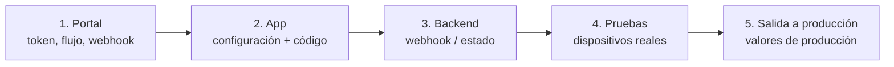

# Lista de salida a producción

Sigue los pasos en orden. Ejecuta las pruebas en dispositivos físicos: las
pantallas de cámara no funcionan en emuladores ni simuladores.

## 1. En el portal administrativo

- [ ] Copia el [Customer Token](../../sdk-web-v5/customer-token.md) de cada
      ambiente.
- [ ] Asigna un **flujo** al tipo de transacción `enrollment-verify` y
      habilítalo para móvil. Sin él, `start` lanza `transaction_refused`
      (2002) o `flow_not_supported` (9020). Consulta
      [Flujos y pasos de interfaz](../flows-and-ui-steps.md).
- [ ] Revisa la marca (logo y colores) y los textos del flujo en español e
      inglés.
- [ ] Registra tu **URL de webhook** y guarda el secreto de firma en tu
      backend. Consulta [Webhooks](../../sdk-web-v5/webhooks.md).

## 2. En tu app

- [ ] `unicus_sdk_flutter` del paquete de la versión que vas a publicar
      (dependencia `path:` versionada o en tu repositorio de artefactos).
- [ ] Android: `minSdk` 21+, `compileSdk` 34+, AGP y Kotlin Gradle Plugin en
      las versiones que exige tu Flutter (Flutter 3.47: AGP 8.11.1+, Kotlin
      2.2.20+). Consulta [Instalación](installation.md).
- [ ] Android: permisos de ubicación declarados solo si quieres ubicación, e
      informados en *Seguridad de los datos* de Play Console.
- [ ] iOS: `platform :ios, '15.0'`, `NSCameraUsageDescription` (y
      `NSLocationWhenInUseUsageDescription` si quieres ubicación), helper del
      Podfile para builds Debug en dispositivo.
- [ ] iOS: si la app usa `WKAppBoundDomains`, el dominio de las pantallas del
      flujo está incluido.
- [ ] El Customer Token no está escrito en el código del control de versiones
      y se puede rotar.
- [ ] `configure` se ejecuta antes de `start`, con `environment` definido; una
      sola instancia de `UnicusSdkFlutter`.
- [ ] Se maneja cada `outcome`, incluido `resumable` (2003); `isRetryable`
      ofrece reintentar. Consulta [Resultados y eventos](results-and-events.md).
- [ ] Se captura `UnicusSdkException` y se muestra con tu propio mensaje (no
      `e.message`). Consulta
      [Errores y solución de problemas](../errors-and-troubleshooting.md).
- [ ] El `tid` se envía a tu backend; el acceso no se otorga solo con el
      resultado de la app.
- [ ] Se llama `clearResumeData()` al cerrar sesión.
- [ ] `enableApiLogging` e `includeSensitiveApiLogData` están desactivados en
      los builds de release; `secureScreens` decidido.
- [ ] Textos de cámara (`verificationTextOverrides`) en los idiomas de tu app.

## 3. En tu backend

- [ ] El endpoint del webhook verifica la firma y elimina entregas duplicadas.
- [ ] La decisión usa el resultado del webhook (o
      [Consultar el estado de una transacción](../../sdk-web-v5/transaction-status.md))
      para el `tid` que envió tu app.

## 4. Prueba en dispositivos reales

Prueba en al menos un teléfono Android y un iPhone, con builds firmados (no
`--no-codesign`), en Debug y en Release.

| # | Caso | Resultado esperado |
| --- | --- | --- |
| 1 | Completa el flujo con un documento válido. | `success` (2000); webhook aprobado; la transacción aparece en el portal. |
| 2 | El mismo documento una segunda vez. | La verificación (no el enrolamiento) es exitosa. |
| 3 | Sal de una pantalla del flujo (atrás) a mitad de camino. | `resumable` (2003) con `resumeReason` `userLeft`. |
| 4 | Inicia de nuevo con el mismo documento antes de 20 minutos. | `result.resumed` es `true`; continúa desde el paso pendiente. |
| 5 | Cancela dentro de la cámara. | `canceled` (2041). |
| 6 | `cancelActiveSession()` desde tu app. | `canceled` (2041), o `resumable` (2003) después de la sesión de cámara. |
| 7 | Niega el permiso de cámara. | La verificación no es exitosa; tu app explica cómo permitir la cámara. |
| 8 | Niega la ubicación (si está declarada). | La verificación continúa sin ubicación. |
| 9 | Modo avión antes de `start`. | `UnicusSdkException` `network_error`. |
| 10 | Varios países activos (si aplica). | Tu selector aparece antes de la cámara. |
| 11 | Dispositivo en español y en inglés. | Pantallas del flujo y textos de cámara en el idioma esperado. |
| 12 | Android con un WebView desactualizado (si soportas dispositivos antiguos). | `webview_unavailable`, manejado con tu mensaje. |
| 13 | Build de release (R8 en Android, Release en iOS). | Igual que el caso 1. |

## 5. Salida a producción

- [ ] Actualiza a la versión del SDK que Tekbees anuncie para producción y
      cambia a `UnicusEnvironment.production` con el Customer Token de
      producción.
- [ ] URL y secreto del webhook de producción configurados.
- [ ] Ejecuta el caso 1 una vez en producción con un documento real.
- [ ] Ten a mano [Errores y solución de problemas](../errors-and-troubleshooting.md)
      y [Soporte](../support.md).
