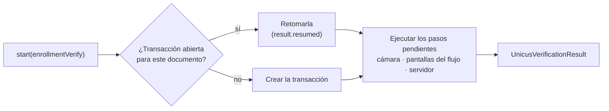

# Iniciar una verificación



## Con un documento (recomendado)


```dart
final result = await unicus.start(
  const UnicusVerificationRequest.enrollmentVerify(
    document: UnicusDocument(
      type: UnicusDocumentType.id,
      externalDatabaseRefId: '123456789',
    ),
  ),
);
```


`enrollmentVerify` crea una transacción `ENROLLMENT-VERIFY`: Unicus enrola a
la persona si no la conoce y la verifica si ya la conoce, y ejecuta el flujo
asignado a tu compañía en el portal. Pide al usuario solo el tipo y el número
de documento.

| `UnicusDocumentType` | Código | Documento |
| --- | --- | --- |
| `id` | `ID` | Documento nacional de identidad |
| `foreignDocument` | `FD` | Documento extranjero |
| `passport` | `PP` | Pasaporte |
| `driverLicense` | `DL` | Licencia de conducción |

`start` termina cuando termina la verificación, con un
[resultado](results-and-events.md). Lanza `UnicusSdkException` solo cuando la
verificación no pudo ejecutarse (configuración, red, flujo no soportado…).

## Selección de país

Si tu compañía tiene un solo país activo, el SDK lo selecciona. Si tiene
varios, prepara primero la transacción y deja que el usuario elija:


```dart
final prepared = await unicus.prepareEnrollmentVerify(
  document: const UnicusDocument(
    type: UnicusDocumentType.id,
    externalDatabaseRefId: '123456789',
  ),
);

final country = prepared.requiresCountrySelection
    ? await showCountryPicker(prepared.countries) // tu propio selector
    : prepared.country;

final result = await unicus.start(prepared.toRequest(country: country));
```


* `prepared.countries` lista los países activos (`UnicusCompanyCountry`;
  `code` es ISO 3166-1 alfa-2: `CO`, `MX`, `US`…). `prepared.defaultCountry`
  es una preselección razonable.
* `prepared.tid` es el id de la transacción; `prepared.resumed` es `true`
  cuando se continuó una transacción abierta del mismo documento.
* `unicus.getCompanyCountries(tid: tid)` carga los países activos de
  cualquier transacción.

## Transacción existente

Continúa una transacción por su `tid`, por ejemplo una que creó tu backend o
una que terminó como `resumable`:


```dart
final result = await unicus.start(
  UnicusVerificationRequest.existingTransaction(tid: tid),
);
```


Con `resumeOpenTransactions` activado (por defecto) no necesitas el `tid` para
retomar: llamar `start` de nuevo con el mismo documento continúa la
transacción abierta (hasta 20 minutos sin actividad). Llama
`unicus.clearResumeData()` cuando el usuario cierre sesión, para que el
siguiente usuario del dispositivo no continúe la transacción de otra persona.
Consulta [Resultados y reanudación](../results-and-resuming.md).

## Ubicación

La ubicación es un metadato opcional de la transacción. Por defecto
(`collectLocationOnStart: true`) el SDK la pide antes de iniciar, solo si tu
app declara el permiso (manifiesto de Android,
`NSLocationWhenInUseUsageDescription` en iOS). Si falta el permiso, el usuario
lo niega o los servicios de ubicación están apagados, la verificación continúa
sin ella.

* Por solicitud, `collectLocation: false` (o `true`) reemplaza la
  configuración.
* Si tu app ya tiene la ubicación, pásala en `location` (texto JSON con
  `latitude`, `longitude`, `accuracy` y `timestamp`) junto con
  `collectLocation: false`.


```dart
final request = UnicusVerificationRequest.enrollmentVerify(
  document: document,
  collectLocation: false,
  location: jsonEncode({'latitude': 4.711, 'longitude': -74.072, 'accuracy': 20, 'timestamp': millis}),
);
```


Los demás campos de `UnicusVerificationRequest` (`flow`, `minMatchLevel`,
`enableSearch1N`, `transactionComponentId`, `state`, `clientIp`,
`extraProcessRequestFields`) son avanzados: conserva los valores por defecto
salvo que Tekbees indique otra cosa. `UnicusVerificationRequest.processTransaction`
y el constructor sin nombre están obsoletos: usa `enrollmentVerify`.

## Cancelar

Salir no es cancelar. Cuando el usuario sale de una pantalla del flujo, la
transacción sigue abierta y `start` devuelve 2003 (`resumable`). Solo una
cancelación dentro de la cámara, o la cancelación explícita de tu app,
termina la transacción:


```dart
await unicus.cancelActiveSession();
```


* Cierra las pantallas del SDK donde esté el usuario (cámara, pantallas del
  flujo, entre pasos, o mientras `start` aún prepara: entonces no se muestra
  nada).
* Cancela la transacción en Unicus y espera la respuesta (10 segundos como
  máximo).
* El `start` pendiente termina con **2041** (`canceled`), o con **2003**
  (`resumable`) cuando Unicus conserva la transacción porque el flujo ya pasó
  su sesión de cámara.
* El future de `cancelActiveSession` termina después de ese resultado de
  `start`. Sin una verificación en curso no hace nada.

Una cancelación del usuario dentro de la cámara sigue la misma regla. Para
cancelar automáticamente, por ejemplo tras un tiempo límite tuyo, llámalo
desde un temporizador:


```dart
final timer = Timer(const Duration(minutes: 5), () => unicus.cancelActiveSession());
try {
  final result = await unicus.start(request);
  // maneja el resultado
} finally {
  timer.cancel();
}
```


## Reglas de hilos y ciclo de vida

* Todos los métodos son asíncronos: llámalos desde el isolate de tu interfaz
  y espera (`await`) su resultado. El SDK trabaja en hilos nativos; tu
  interfaz nunca se bloquea.
* **Una verificación a la vez.** Un segundo `start` mientras otro está en
  curso lanza `session_active`.
* Llama `start` con tu app en primer plano: el SDK presenta sus pantallas
  sobre la Activity (Android) o el view controller (iOS) actual. Si no, lanza
  `no_activity` / `host_activity_lost` (Android) o `no_view_controller` (iOS).
* `configure` se verifica por instancia de `UnicusSdkFlutter`: usa una sola
  instancia (por ejemplo en tu inyección de dependencias) y configúrala antes
  de `start`, `prepareEnrollmentVerify` y `getCompanyCountries`.
  `clearResumeData` y `cancelActiveSession` no necesitan `configure`.
* El SDK nativo es compartido por todo el proceso. Las apps con varios motores
  de Flutter (add-to-app, motores en segundo plano de plugins de mensajería o
  de tareas) son compatibles: los eventos y logs llegan a cada motor activo.

Siguiente: [Resultados y eventos](results-and-events.md).
