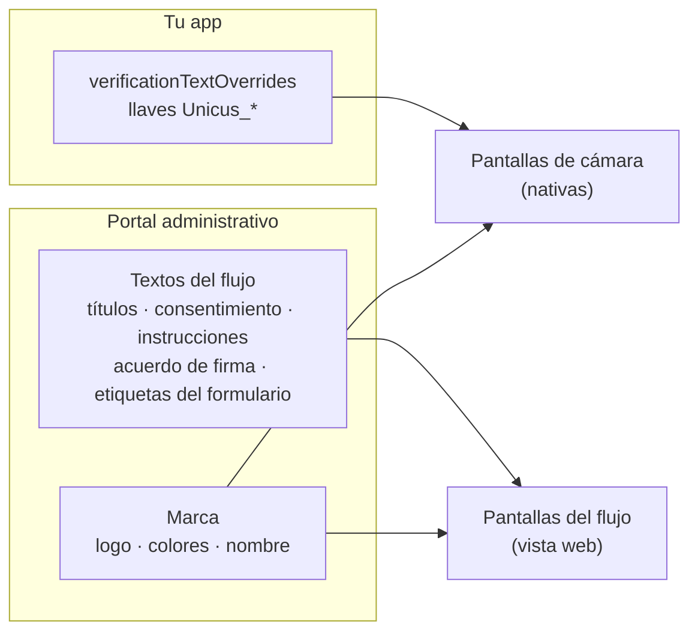

# Textos e idiomas

Una verificación muestra dos tipos de pantallas, y sus textos vienen de
lugares distintos:



| Pantallas | Textos | Idioma |
| --- | --- | --- |
| Pantallas de cámara (prueba de vida, documento, comparación facial) | Textos incluidos en inglés, reemplazados por tu `verificationTextOverrides`. | El del mapa que pases. |
| Pantallas del flujo (consentimiento, información, formulario, firma, OTP, resultados de los pasos de interfaz) | Textos fijos que mantiene Unicus, más los textos del flujo que escribes en el portal. | El idioma del dispositivo: español si está en español, inglés en otro caso. |

## Pantallas de cámara: personalización de textos

Pasa en `configure` un mapa de llaves `Unicus_*` con su texto. Las llaves que
no incluyas conservan el texto incluido; `<br/>` se convierte en un salto de
línea.


```dart
const myUnicusTexts = <String, String>{
  UnicusVerificationTextKey.actionImReady: 'ESTOY LISTO',
  UnicusVerificationTextKey.actionTryAgain: 'INTENTAR DE NUEVO',
  UnicusVerificationTextKey.cameraPermissionHeader: 'Habilitar cámara',
  UnicusVerificationTextKey.retryHeader: 'Intentémoslo de nuevo',
  'Unicus_idscan_type_selection_header': 'Prepárate para escanear<br/>tu documento',
};

await unicus.configure(const UnicusSdkConfig(
  apiKey: '<CUSTOMER_TOKEN>',
  environment: UnicusEnvironment.dev,
  verificationTextOverrides: myUnicusTexts,
));
```


* `UnicusVerificationTextKey` tiene constantes para las llaves públicas
  (botones, permiso de cámara, indicaciones para encuadrar el rostro, captura
  y revisión del documento, mensajes de carga y resultado, pantalla de
  reintento, etiquetas de accesibilidad). También puedes escribir la llave
  como texto.
* Usa solo llaves con el prefijo `Unicus_`: son el contrato público y
  funcionan igual en Android e iOS.
* La app de ejemplo del paquete tiene mapas completos en inglés y en español
  en `example/lib/sample_unicus_texts.dart` (`sampleUnicusEnglishTexts`,
  `sampleUnicusSpanishTexts`). Copia ese archivo en tu app como punto de
  partida y mantén tus textos en tu código fuente.

### Sigue el idioma de tu app

Los textos de cámara no siguen solos el idioma del dispositivo. Elige el mapa
antes de configurar, por ejemplo según el locale de tu app:


```dart
final language = Localizations.localeOf(context).languageCode;
await unicus.configure(UnicusSdkConfig(
  apiKey: customerToken,
  environment: UnicusEnvironment.dev,
  verificationTextOverrides: language == 'es' ? spanishUnicusTexts : englishUnicusTexts,
));
```


### Confirmación de datos del documento

Las etiquetas de la pantalla en la que el usuario confirma los datos leídos
del documento se definen con `verificationOcrLocalization`. Coordina ese
diccionario con soporte de Tekbees.

## Pantallas del flujo

Las pantallas del flujo toman el idioma del dispositivo (español si el
dispositivo está en español, inglés en otro caso) y usan:

* Textos fijos (botones, errores, resultados) que Unicus mantiene en español e
  inglés.
* Los textos de tu flujo (títulos y descripciones de los pasos, texto de
  consentimiento y enlace de privacidad, instrucciones, acuerdo de firma,
  etiquetas del formulario), escritos en el editor de flujos del portal en
  español e inglés. Un texto llenado en un solo idioma se muestra tal cual en
  ambos.
* El nombre, el logo y los colores de tu compañía.

`verificationTextOverrides` no cambia las pantallas del flujo. Consulta
[Textos e idiomas del Web SDK](../../sdk-web-v5/texts-and-languages.md) para
la lista completa de textos del flujo, que se comparten con la web.
