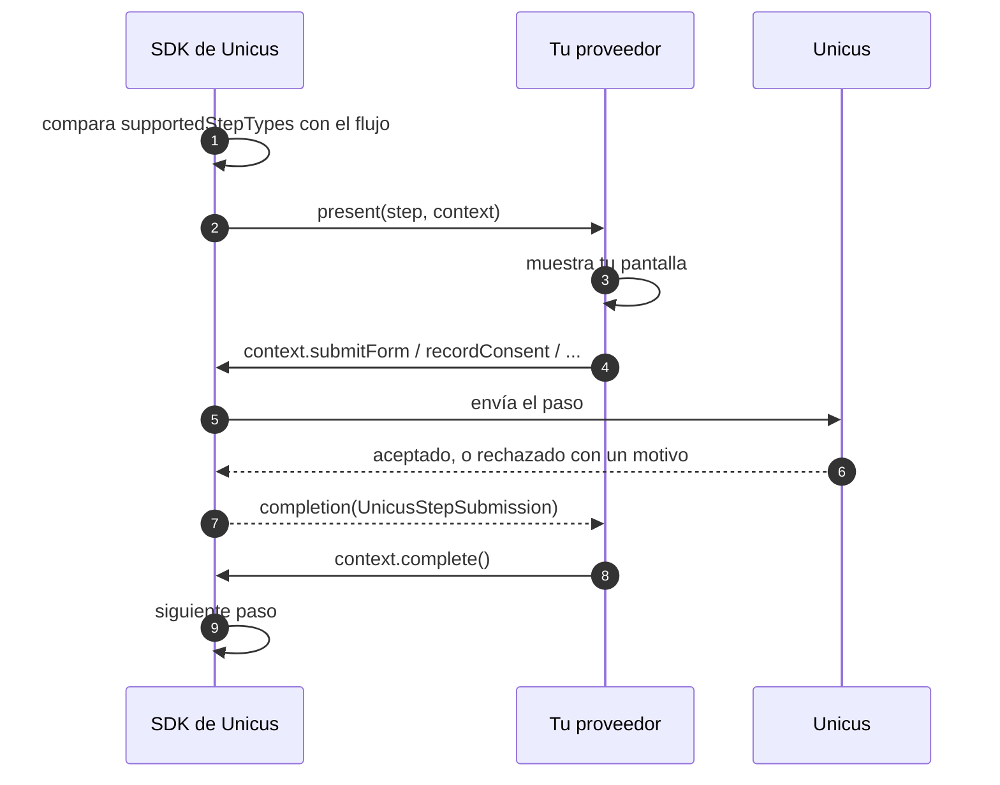

# Pasos de interfaz propios

Por defecto (`uiStepMode: .webView`) el SDK muestra él mismo las pantallas del
flujo (consentimiento, información, formulario, firma, OTP, `sign_document`). Con
`.custom(provider)` tu app dibuja esas pantallas y el SDK hace todas las
llamadas a la API. Los pasos de cámara (prueba de vida, documento, comparación
facial) siempre se ejecutan en las pantallas nativas de cámara del SDK, en todos
los modos. Conceptos y cuándo elegir cada modo:
[Flujos y pasos de UI](../flows-and-ui-steps.md).


Elige `.custom` cuando tu empresa prohíbe los WebViews o exige certificate
pinning en todas las pantallas. Si no, conserva `.webView`: los nuevos tipos de
paso que se diseñen en el portal funcionan sin actualizar la app.


## Cómo funciona



1. Antes de mostrar nada, el SDK verifica que tu proveedor declare todos los
   tipos de paso de UI del flujo. Si falta uno, `start` falla con
   `flow_not_supported` y no se muestra nada.
2. Para cada paso de UI, el SDK llama a `present(step:context:)` en la cola
   principal, un paso a la vez, en el orden del flujo.
3. Tu pantalla envía los datos mediante `context`. Un paso **rechazado** por
   Unicus es un `.success` con `accepted == false` y un `rejection` tipado;
   `.failure` significa que la llamada misma falló (red, sesión).
4. Termina cada paso exactamente una vez: `complete()`, `fail(resultCode:)` o
   `cancel()`.

## Configura


```swift
let provider = MyStepProvider()          // conserva una referencia fuerte mientras haya verificaciones
var config = UnicusSdkConfig(apiKey: "<CUSTOMER_TOKEN>", environment: .dev)
config.uiStepMode = .custom(provider)
UnicusSdk.shared.configure(config)
```


## El proveedor


```swift
import UIKit
import SafariServices
import UnicusSDK

final class MyStepProvider: UnicusUiStepProvider {
    let supportedStepTypes: Set<String> = [
        UnicusStepType.consent, UnicusStepType.info, UnicusStepType.form,
        UnicusStepType.signature, UnicusStepType.otp, UnicusStepType.signDocument
    ]
    var pollTimer: Timer?   // consulta periódica del estado de sign_document

    func present(step: UnicusFlowStep, context: UnicusStepContext) {
        switch step.type {
        case UnicusStepType.consent:      showConsent(step, context)
        case UnicusStepType.info:         showInfo(step, context)
        case UnicusStepType.form:         showForm(step, context)
        case UnicusStepType.signature:    showSignature(step, context)
        case UnicusStepType.otp:          showOtp(step, context)
        case UnicusStepType.signDocument: showSignDocument(step, context)
        default:                          context.cancel()
        }
    }

    // Opcional: la app llamó a cancelActiveSession() mientras se mostraba `step`.
    func dismiss(step: UnicusFlowStep) {
        // Retira tu pantalla. El contexto ya no acepta llamadas.
    }
}
```


`UnicusFlowStep` entrega `id`, `type`, `required`, `title` y `description`
(`UnicusLocalizedText`: usa `localized(context.language)`), `config` (la
configuración del paso en el portal) y `signDocumentConfig` para
`sign_document`. `UnicusStepContext` entrega `tid`, `flowId`, `step`, `language`
(`es` o `en`), `theme` (colores y logo de la empresa) y
`presentingViewController`.

## Terminar un paso

| Llamada | Efecto |
| --- | --- |
| `context.complete()` | El paso terminó; el SDK sigue con el siguiente. |
| `context.fail(resultCode:)` | Un paso obligatorio termina el flujo con ese código; uno opcional se omite. |
| `context.cancel()` | La persona salió. **No** es una cancelación: la transacción sigue abierta y `start` termina con 2003 `.resumable`. |

## Consentimiento

Envía exactamente el texto que mostraste.


```swift
func showConsent(_ step: UnicusFlowStep, _ context: UnicusStepContext) {
    let text = step.description?.localized(context.language) ?? "<tu texto de consentimiento>"
    // ... muestra `text`; cuando la persona acepta:
    context.recordConsent(text: text, privacyUrl: "https://example.com/privacy") { [self] result in
        switch result {
        case .success(let submission) where submission.accepted: context.complete()
        case .success(let submission): showRejection(submission.rejection)
        case .failure(let error): showNetworkError(error)
        }
    }
}
```


## Información


```swift
func showInfo(_ step: UnicusFlowStep, _ context: UnicusStepContext) {
    // ... muestra las instrucciones; cuando la persona continúa:
    context.recordInfo { result in
        if case .success(let submission) = result, submission.accepted { context.complete() }
    }
}
```


## Formulario


```swift
func showForm(_ step: UnicusFlowStep, _ context: UnicusStepContext) {
    // Construye los campos desde step.config; al enviar:
    context.submitForm(values: ["email": "ana@example.com"]) { [self] result in
        switch result {
        case .success(let submission) where submission.accepted:
            context.complete()
        case .success(let submission):
            // FORM_INVALID: nombre del campo -> REQUIRED, INVALID_TYPE, PATTERN_MISMATCH, UNKNOWN_FIELD, TOO_LONG
            showFieldErrors(submission.rejection?.fields ?? [:])
        case .failure(let error):
            showNetworkError(error)
        }
    }
}
```


## Firma

Envía la firma manuscrita como PNG (máximo 1 MB) con el número de trazos.


```swift
func showSignature(_ step: UnicusFlowStep, _ context: UnicusStepContext) {
    // ... captura el trazo; al aceptar:
    context.submitSignature(png: pngData, strokes: strokeCount, agreementText: agreementShown) { [self] result in
        switch result {
        case .success(let submission) where submission.accepted: context.complete()
        case .success(let submission): showRejection(submission.rejection)   // SIGNATURE_INVALID, .field
        case .failure(let error): showNetworkError(error)
        }
    }
}
```


## OTP


```swift
func showOtp(_ step: UnicusFlowStep, _ context: UnicusStepContext) {
    // destination solo cuando el paso se lo pide a la persona
    context.sendOtp(destination: nil) { [self] result in
        switch result {
        case .success(let sent) where sent.alreadyVerified:
            context.complete()
        case .success(let sent) where sent.sent:
            showCodeEntry(maskedDestination: sent.destinationMasked, validFor: sent.expiresInSeconds)
        case .success(let sent):
            showRejection(sent.rejection)            // OTP_RESEND_TOO_SOON: rejection.seconds
        case .failure(let error):
            showNetworkError(error)
        }
    }
}

func verify(code: String, _ context: UnicusStepContext) {
    context.verifyOtp(code: code) { [self] result in       // nunca se reintenta automáticamente
        switch result {
        case .success(let submission) where submission.accepted:
            context.complete()
        case .success(let submission) where submission.isTerminal:
            context.fail(resultCode: submission.resultCode ?? UnicusResultCode.attemptsExhausted)  // 4001
        case .success(let submission):
            showWrongCode(attemptsLeft: submission.attemptsLeft)
        case .failure(let error):
            showNetworkError(error)
        }
    }
}
```


## Firma de documentos (`sign_document`)

La persona firma una plantilla de documento en el servicio de firma. Unicus
llena el documento y registra él mismo el resultado del paso: tu proveedor solo
abre la página de firma y consulta el estado.

* Abre la URL en `SFSafariViewController`, **nunca** en un WebView (el servicio
  de firma no permite marcos).
* Los enlaces son de un solo uso y vencen en 5 minutos: llama de nuevo a
  `startSignDocument` para "Abrir de nuevo"; nunca reutilices una URL.
* `pending` sin `url` significa que la persona ya firmó: solo consulta el estado.
* Consulta cada `UnicusSignDocument.pollInterval` (4 s) y cuando tu app vuelve
  al primer plano.


```swift
func showSignDocument(_ step: UnicusFlowStep, _ context: UnicusStepContext) {
    let title = step.signDocumentConfig?.templateName ?? "Documento"
    // Estado actual: .notStarted -> muestra "Firmar documento"; .pending -> espera + "Abrir de nuevo".
    context.signDocumentStatus { [self] result in
        guard case .success(let status) = result else { return }
        switch status.state {
        case .notStarted: showSignButton(title)
        case .pending:    showWaiting(title); startPolling(context)
        case .completed:  context.complete()
        case .declined:   context.fail(resultCode: UnicusResultCode.signDeclined)   // 4011
        @unknown default: break
        }
    }
}

// Al tocar "Firmar documento" o "Abrir de nuevo":
func openSigningPage(_ context: UnicusStepContext) {
    context.startSignDocument { [self] result in
        switch result {
        case .success(let start) where start.accepted:
            if let url = start.url {
                context.presentingViewController?.present(SFSafariViewController(url: url), animated: true)
            }
            startPolling(context)
        case .success(let start):
            // 4012 SIGN_EMAIL_MISSING, 4013 SIGN_NOT_CONNECTED, 4014 SIGN_SERVICE_UNAVAILABLE (reintentar), 2052
            showRejection(start.rejection)
        case .failure(let error):
            showNetworkError(error)
        }
    }
}

func startPolling(_ context: UnicusStepContext) {
    pollTimer?.invalidate()
    pollTimer = Timer.scheduledTimer(withTimeInterval: UnicusSignDocument.pollInterval, repeats: true) { [self] _ in
        context.signDocumentStatus { [self] result in
            guard case .success(let status) = result else { return }
            switch status.state {
            case .completed: pollTimer?.invalidate(); context.complete()     // nunca lo envíes con submitForm
            case .declined:  pollTimer?.invalidate(); context.fail(resultCode: UnicusResultCode.signDeclined)
            default: break
            }
        }
    }
}
```


`step.signDocumentConfig` (`UnicusSignDocumentConfig`) tiene `templateId`,
`templateName`, `signerRoleId`, `lockData`, `signer` y `fields`. Los cambios de
estado también se emiten como eventos `stepProgress`.

## Rechazos

`submission.rejection` (`UnicusStepRejection`) tiene un `kind` y sus datos:

| `kind` | Datos | Qué hacer |
| --- | --- | --- |
| `.formInvalid` | `fields` (campo → error) | Muestra los errores junto a los campos. |
| `.signatureInvalid` | `field` | Pide firmar de nuevo. |
| `.otpInvalidCode`, `.otpExpired` | `attemptsLeft` en el submission | Pide el código de nuevo / envía uno nuevo. |
| `.otpResendTooSoon` | `seconds` | Espera antes de reenviar. |
| `.otpAttemptsExhausted` (4001) | — | `fail(resultCode:)`. |
| `.stepOutOfOrder`, `.stepNotInFlow`, `.stepTypeMismatch`, `.stepNotAvailable`, `.noFlow` | `stepIds` | Problema de configuración: `fail(resultCode:)` y contacta a soporte. |
| `.signEmailMissing`, `.signNotConnected` | — | Configuración del paso de firma. |
| `.signServiceUnavailable` | — | Temporal: ofrece reintentar. |

`submission.isTerminal` es `true` cuando no tiene sentido reintentar el mismo paso.

## Hilos

`present` y `dismiss` se invocan en la cola principal, y cada completion de
`context` se ejecuta en la cola principal. Un contexto deja de aceptar llamadas
cuando su paso terminó (`step_inactive`). En el modo de lenguaje Swift 6,
importa el SDK con `@preconcurrency import UnicusSDK`; cuando el compilador pida
aislamiento de main actor alrededor de llamadas de UIKit en tu proveedor,
envuélvelas en `MainActor.assumeIsolated { ... }`.
