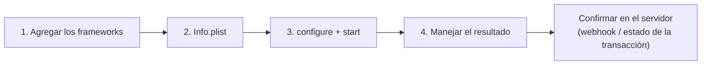

# Inicio rápido


**Próximamente.** Los SDK móviles aún no están disponibles en producción. Hoy
solo está disponible el ambiente DEV; Tekbees anunciará el lanzamiento en
producción. Solicita a Tekbees un Customer Token de DEV para preparar tu
integración.




## 1. Agrega la dependencia

Tekbees entrega el SDK como un paquete ZIP. Copia su carpeta `sdk` en tu
repositorio (por ejemplo `Vendor/Unicus`) y elige una opción:

* **Xcode**: arrastra `UnicusSDK.xcframework` y el framework del motor de
  verificación desde `sdk/Frameworks` a tu target con **Embed & Sign**. No
  agregues el framework cuyo nombre termina en `ForDevelopment`.
* **CocoaPods**: `pod 'UnicusSDK', :path => 'Vendor/Unicus'`
* **Swift Package Manager**: *File > Add Package Dependencies… > Add Local…*,
  elige `Vendor/Unicus` y vincula el producto `UnicusSDK`.

Las compilaciones Debug en un iPhone físico necesitan una fase de compilación
adicional. Consulta [Instalación](installation.md), sección *Compilaciones Debug
en un iPhone físico*.

## 2. Agrega los permisos a Info.plist


```xml
<key>NSCameraUsageDescription</key>
<string>Usamos la cámara para verificar tu identidad.</string>
<!-- Opcional: ubicación como metadato de la transacción. Sin ella la verificación continúa. -->
<key>NSLocationWhenInUseUsageDescription</key>
<string>Registramos dónde inicia la verificación.</string>
```


## 3. Configura e inicia


```swift
import UnicusSDK

// Una vez, por ejemplo al iniciar la app.
UnicusSdk.shared.configure(UnicusSdkConfig(apiKey: "<CUSTOMER_TOKEN>", environment: .dev))

// Cuando la persona toca "Verificar mi identidad".
let document = UnicusDocument(type: .id, externalDatabaseRefId: "123456789")
UnicusSdk.shared.start(.enrollmentVerify(document: document), from: self) { result in
    switch result {
    case .success(let verification) where verification.isResumable:
        showPending()                       // 2003: inicia de nuevo con el mismo documento para continuar
    case .success(let verification) where verification.success:
        approve(tid: verification.tid)      // confirma el tid en tu backend
    case .success(let verification):
        showRejected(code: verification.resultCode)
    case .failure(let error):
        showError(error.code)               // no se pudo ejecutar: configuración, red...
    }
}
```


Con `async/await`:


```swift
do {
    let verification = try await UnicusSdk.shared.start(.enrollmentVerify(document: document), from: self)
    handle(verification)
} catch let error as UnicusSdkError {
    showError(error.code)
}
```


* `apiKey` es el [Customer Token](../../sdk-web-v5/customer-token.md) de tu
  empresa para ese ambiente. Es el único valor que entregas: las URL y las
  llaves vienen con el SDK.
* `environment`: `.dev` por ahora. `.staging` y `.production` responden
  `environment_not_available` hasta que Tekbees los publique.
* `from:` es el view controller que presenta la verificación. Si lo omites, el
  SDK usa el view controller superior.
* Los completion handlers siempre llegan en la cola principal (main queue).

## 4. Maneja el resultado

`start` termina en `.success(UnicusVerificationResult)` siempre que la
verificación se ejecutó, también cuando la persona no quedó verificada. Decide
según `result.outcome`:

| `outcome` | Significado | Qué hacer |
| --- | --- | --- |
| `.success` | Identidad verificada (2000). | Continuar. Confirma el `tid` en tu backend. |
| `.resumable` | Transacción aún abierta (2003): la persona salió o faltan pasos. | Llama de nuevo a `start` con el mismo documento: continúa donde quedó. |
| `.warning` | Verificada con advertencia (2013). | Revisar según tus reglas. |
| `.failed` | No verificada (rostro, documento, paso rechazado, firma rechazada). | Mensaje de negocio; permitir un nuevo intento. |
| `.canceled` | Cancelada (2041), expirada (2051) o reintentos agotados. | Permitir iniciar de nuevo. |
| `.error` | Falla técnica. `isRetryable` (2054, 4014) indica que puedes intentar de nuevo. | Reintentar o contactar a soporte. |

`.failure(UnicusSdkError)` significa que la verificación no se pudo ejecutar;
`error.code` es estable (`not_configured`, `environment_not_available`,
`network_error`, `flow_not_supported`…). Consulta
[Errores y solución de problemas](../errors-and-troubleshooting.md).


El resultado en la app es para mostrar. Decide el acceso en tu backend con el
[webhook](../../sdk-web-v5/webhooks.md) o con
[Consultar el estado de una transacción](../../sdk-web-v5/transaction-status.md),
usando el `tid`.


Si la persona sale antes de terminar, el siguiente `start` con el mismo
documento continúa la transacción abierta (hasta 20 minutos sin actividad).
Llama a `UnicusSdk.shared.clearResumeData()` al cerrar sesión. Consulta
[Resultados y reanudación](../results-and-resuming.md).

## Siguientes pasos

* [Instalación](installation.md): contenido del paquete, CocoaPods, SPM, la
  fase de compilación Debug.
* [Configuración](configuration.md): todas las opciones.
* [Resultados y eventos](results-and-events.md): campos del resultado y eventos
  de progreso.
* [Lista de salida a producción](release-checklist.md).
