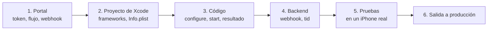

# Lista de salida a producción

Sigue los pasos en orden. Hazlos primero en DEV; repite la configuración en cada
ambiente que Tekbees habilite para ti.

## 1. Portal administrativo

- [ ] Copia el [Customer Token](../../sdk-web-v5/customer-token.md) del ambiente.
- [ ] Crea un **flujo** y asígnalo al tipo de transacción de enrolamiento /
      verificación. Sin él `start` falla con `transaction_refused`
      (`resultCode` 2002).
- [ ] Verifica que el flujo esté publicado para el canal **móvil** y que cumpla
      las reglas de los flujos (una comparación facial necesita una prueba de
      vida antes; ningún paso de documento solo). De lo contrario `start` falla
      con `flow_not_supported`. Consulta
      [Flujos y pasos de UI](../flows-and-ui-steps.md).
- [ ] Revisa la marca (logo y colores) y los textos de los pasos en español y en
      inglés.
- [ ] Registra la URL de tu **webhook** y guarda su secreto de firma en tu
      backend. Consulta [Webhooks](../../sdk-web-v5/webhooks.md).

## 2. Proyecto de Xcode

- [ ] `UnicusSDK.xcframework` y el framework del motor de verificación incluidos
      con **Embed & Sign** (o mediante CocoaPods / SPM). El framework
      `ForDevelopment` **no** se incluye. Consulta [Instalación](installation.md).
- [ ] Fase *Run Script* para compilaciones Debug en dispositivo, después de
      *Embed Frameworks*.
- [ ] `NSCameraUsageDescription` en `Info.plist` (y
      `NSLocationWhenInUseUsageDescription` si quieres ubicación), con textos en
      los idiomas de tu app.
- [ ] Si `Info.plist` declara `WKAppBoundDomains`: el dominio de la app de
      flujos está incluido.
- [ ] Deployment target iOS 15.0 o superior.
- [ ] Customer Token y ambiente por configuración de compilación; ningún valor
      de DEV en la compilación Release.

## 3. Código

- [ ] `configure` se ejecuta una vez antes del primer `start`.
- [ ] `start` usa `.enrollmentVerify(document:)` con el tipo y número de
      documento reales de la persona.
- [ ] Se manejan todos los resultados, incluidos `.resumable` (ofrecer
      continuar) y `@unknown default`. Consulta
      [Resultados y eventos](results-and-events.md).
- [ ] `.failure` muestra un mensaje según `error.code`, nunca `error.message`.
- [ ] El `tid` se envía a tu backend y se guarda con tu usuario o caso.
- [ ] El acceso **no** se otorga solo con el resultado de la app.
- [ ] `clearResumeData()` al cerrar sesión.
- [ ] `enableApiLogging` e `includeSensitiveApiLogData` en `false` en Release.
- [ ] Con el modo `.custom`: el proveedor declara todos los tipos de paso de UI
      de tus flujos e implementa `dismiss(step:)`. Consulta
      [Pasos de interfaz propios](custom-ui-steps.md).

## 4. Backend

- [ ] El endpoint del webhook verifica la firma, elimina eventos duplicados y
      decide según el resultado. Consulta [Webhooks](../../sdk-web-v5/webhooks.md).
- [ ] Opcional: conciliación con
      [Consultar el estado de una transacción](../../sdk-web-v5/transaction-status.md)
      para las transacciones sin webhook.

## 5. Pruebas en un iPhone físico

| # | Caso | Esperado |
| --- | --- | --- |
| 1 | Completar el flujo con un documento válido. | `.success`, 2000; webhook aprobado. |
| 2 | El mismo documento otra vez (ya enrolado). | Verificación en lugar de enrolamiento; `.success`. |
| 3 | Cancelar dentro de la cámara. | `.canceled`, 2041. |
| 4 | Salir de una pantalla del flujo (cerrarla). | `.resumable`, 2003. Llamar a `start` con el mismo documento continúa donde quedó (evento `transactionResumed`). |
| 5 | Negar el permiso de cámara. | La pantalla de cámara explica cómo activarlo; al cerrarla `start` termina con un resultado, sin cierres inesperados. |
| 6 | Negar el permiso de ubicación. | La verificación continúa (`locationSkipped`). |
| 7 | Modo avión antes de `start`. | `.failure` con `network_error`. |
| 8 | Llamar a `start` dos veces seguidas. | La segunda falla con `session_active`. |
| 9 | Quitar la asignación del flujo en el portal. | `.failure`, `transaction_refused`, `resultCode` 2002. |
| 10 | Dispositivo en español y en inglés. | Las pantallas del flujo siguen el idioma del dispositivo; los textos de cámara coinciden con tus reemplazos. |
| 11 | Compilación Release en un dispositivo. | Se ejecuta con el binario de producción del motor (sin el reemplazo Debug). |

## 6. Salida a producción

- [ ] Actualiza a la versión del SDK que Tekbees indique para producción y cambia
      a `environment: .production` con el Customer Token de producción cuando
      Tekbees lo anuncie.
- [ ] Asigna el flujo y el webhook en la empresa de producción.
- [ ] Ejecuta el caso 1 una vez en producción con un documento real.
- [ ] Ten a mano [Errores y solución de problemas](../errors-and-troubleshooting.md)
      y [Soporte](../support.md); envía el `tid`, la versión de iOS y
      `UnicusSdk.shared.version` en cada solicitud de soporte.
