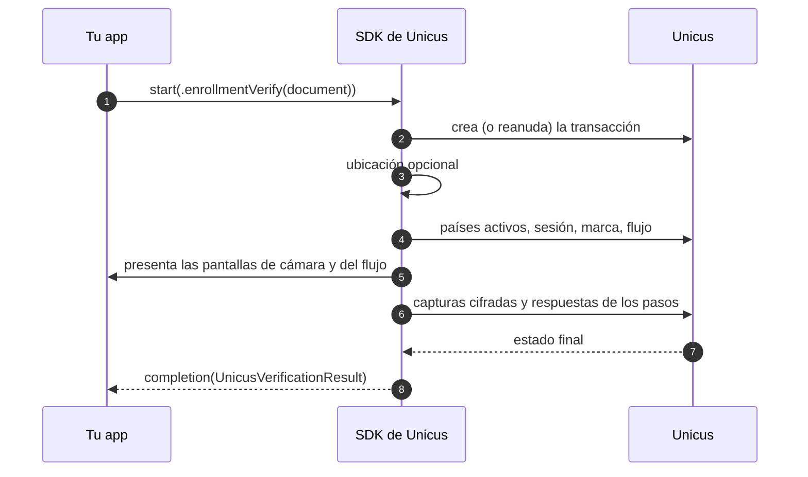

# Iniciar una verificación

## Con un documento (recomendado)

`enrollmentVerify` enrola a la persona si Unicus aún no la conoce y la verifica
si ya la conoce. Tu app solo entrega el tipo y el número de documento.




```swift
let document = UnicusDocument(type: .id, externalDatabaseRefId: "123456789")

UnicusSdk.shared.start(.enrollmentVerify(document: document), from: self) { result in
    switch result {
    case .success(let verification): handle(verification)
    case .failure(let error): showError(error.code)
    }
}
```





```swift
let document = UnicusDocument(type: .id, externalDatabaseRefId: "123456789")

do {
    let verification = try await UnicusSdk.shared.start(.enrollmentVerify(document: document), from: self)
    handle(verification)
} catch let error as UnicusSdkError {
    showError(error.code)
}
```




| `UnicusDocumentType` | Código | Documento |
| --- | --- | --- |
| `.id` | `ID` | Documento nacional de identidad |
| `.foreignDocument` | `FD` | Documento de extranjería |
| `.passport` | `PP` | Pasaporte |
| `.driverLicense` | `DL` | Licencia de conducción |

Qué hace el SDK después de `start`:



Parámetros opcionales de `enrollmentVerify`: `country` (ISO-2, por ejemplo
`"CO"`), `location` (consulta *Ubicación* más abajo) y `collectLocation`
(reemplaza `collectLocationOnStart` para esta solicitud).

## Con selección de país

Si tu empresa tiene un solo país activo, `start` lo selecciona. Si tiene varios
y la persona debe elegir, prepara primero la transacción:




```swift
let prepared = try await UnicusSdk.shared.prepareEnrollmentVerify(document: document)
let country = prepared.requiresCountrySelection
    ? await showCountryPicker(prepared.countries)      // tu UI, devuelve un código ISO-2
    : prepared.country
let verification = try await UnicusSdk.shared.start(prepared.toRequest(country: country), from: self)
```





```swift
UnicusSdk.shared.prepareEnrollmentVerify(document: document) { prepared in
    switch prepared {
    case .success(let prepared):
        // Muestra tu selector cuando prepared.requiresCountrySelection, y luego:
        let country = prepared.country ?? prepared.countries.first?.code
        UnicusSdk.shared.start(prepared.toRequest(country: country), from: self) { result in
            // manejar el resultado
        }
    case .failure(let error):
        showError(error.code)
    }
}
```




`UnicusPreparedVerification` tiene `tid`, `country`, `location`, `countries`
(`UnicusCompanyCountry`, `code` es ISO-2), `requiresCountrySelection`,
`defaultCountry` y `resumed` (`true` cuando se continuó la transacción abierta
del mismo documento). `getCompanyCountries(tid:)` vuelve a cargar los países de
una transacción.

## Continuar una transacción existente

Una transacción que terminó como `.resumable` (2003) sigue abierta durante 20
minutos sin actividad. Hay dos formas de continuarla:

* **Automática** (por defecto): llama de nuevo a `start` con el **mismo
  documento**. El SDK guarda una llave de reanudación en el Keychain y continúa
  la transacción abierta (evento `transactionResumed`, `result.resumed == true`).
* **Por `tid`**: si guardaste el `tid`:


```swift
let verification = try await UnicusSdk.shared.start(.existingTransaction(tid: savedTid), from: self)
```


El flujo continúa en el primer paso pendiente. Llama a
`UnicusSdk.shared.clearResumeData()` cuando el usuario cierre sesión. Consulta
[Resultados y reanudación](../results-and-resuming.md).

## Ubicación

Por defecto el SDK pide la ubicación del dispositivo antes de la sesión y la
adjunta a la transacción (la primera vez, iOS muestra la solicitud de permiso).
Continúa sin ubicación cuando el usuario niega el permiso, los servicios de
ubicación están apagados o tu `Info.plist` no tiene
`NSLocationWhenInUseUsageDescription`. Los eventos `locationCollected` /
`locationSkipped` indican qué pasó.

* Desactivarla para todas las verificaciones: `collectLocationOnStart = false`.
* Desactivarla para una solicitud: `.enrollmentVerify(document: document, collectLocation: false)`.
* Si ya la tienes: pasa `location:` como un texto JSON con `latitude`,
  `longitude`, `accuracy` y `timestamp` (ISO 8601).

## Cancelar la verificación activa


```swift
UnicusSdk.shared.cancelActiveSession()

// o, para saber cuándo se reportó la cancelación:
UnicusSdk.shared.cancelActiveSession(message: "User logged out") { result in
    if case .failure(let error) = result { print(error.code) }
}
```


Desde código `async` se usa la variante async:
`try await UnicusSdk.shared.cancelActiveSession()`.

`cancelActiveSession` termina la verificación donde esté (cámara, pantallas del
flujo, paso personalizado, entre pasos o mientras `start` se prepara), cancela
la transacción en Unicus y espera la respuesta (máximo 10 segundos). El
completion de `start` recibe entonces 2041 (`.canceled`), o 2003 (`.resumable`)
cuando el flujo ya había pasado sus pasos de cámara y Unicus lo mantiene
abierto. El completion de `cancelActiveSession` se ejecuta después del de
`start`.

Qué cancela y qué no:

| Evento | Transacción | Resultado |
| --- | --- | --- |
| La persona toca cancelar dentro de la cámara | Cancelada | 2041 `.canceled` (o 2003 `.resumable`, ver arriba) |
| Tu app llama a `cancelActiveSession()` | Cancelada | Igual que arriba |
| La persona sale de una pantalla del flujo (la cierra) | Sigue abierta | 2003 `.resumable` |
| Un proveedor personalizado llama a `context.cancel()` | Sigue abierta | 2003 `.resumable` |

## Hilos y presentación

* Llama al SDK desde cualquier hilo: los métodos pasan a la cola principal y las
  variantes `async` se ejecutan en el main actor.
* Los completion handlers y los handlers siempre se invocan en la cola principal.
* Una sola verificación a la vez: un segundo `start` falla con `session_active`.
  Revisa `UnicusSdk.shared.isSessionActive` o espera el completion.
* `from:` debe ser un view controller que esté en una ventana. Si lo omites (o no
  está en una ventana), el SDK presenta desde el view controller superior. Si
  nada puede presentar, o la pantalla no aparece, `start` falla con
  `no_view_controller` en lugar de quedarse esperando.
* El SDK controla sus pantallas hasta que se ejecuta el completion. No las
  cierres tú; usa `cancelActiveSession()`.
