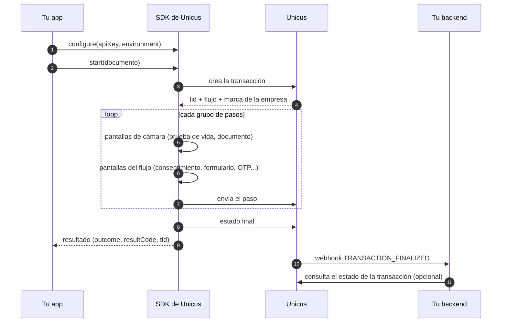

# Descripción general


**Próximamente.** Los SDK móviles de Unicus aún no están disponibles en
producción. Hoy solo está disponible el ambiente **DEV**; Tekbees anunciará el
lanzamiento en producción. Mientras tanto, solicita a Tekbees el paquete del SDK
y un Customer Token de DEV para preparar tu integración.


Los SDK móviles de Unicus ejecutan la verificación de identidad dentro de tu app
nativa o Flutter. Tu app entrega el documento del usuario y recibe un resultado.
Todo lo intermedio lo gestionan el SDK y Unicus: la creación de la transacción,
la marca de tu empresa, la cámara, las pantallas del flujo, el cifrado y las
llamadas al API de Unicus.

Tu app integra **solo Unicus**. El motor biométrico viene empaquetado dentro del
SDK: no agregues otras librerías biométricas o de captura de documentos, y no
reenvíes al SDK resultados de actividades ni de permisos.

## Cómo funciona una verificación

1. Tu app configura el SDK una vez con su **Customer Token** (`apiKey`) y el
   ambiente.
2. Tu app llama a `start` con el tipo y el número de documento del usuario.
3. El SDK crea la transacción en Unicus y recibe el **flujo** que tu empresa
   asignó en el portal administrativo, con el logo y los colores de tu empresa.
4. El SDK ejecuta el flujo en el dispositivo. Los pasos de cámara (prueba de
   vida, documento, comparación facial) corren en pantallas de cámara nativas.
   Las pantallas sin cámara (consentimiento, instrucciones, formulario, firma,
   OTP) corren en las pantallas del flujo de Unicus que muestra el SDK, o en tus
   propias pantallas en Android e iOS. Consulta
   [Flujos y pasos de UI](flows-and-ui-steps.md).
5. El SDK entrega un resultado a tu app: un outcome, un código de resultado y el
   id de la transacción (`tid`). Consulta
   [Resultados y reanudación](results-and-resuming.md).
6. Tu backend recibe el resultado autoritativo por medio de tu
   [webhook](../sdk-web-v5/webhooks.md) o consultando
   [el estado de una transacción](../sdk-web-v5/transaction-status.md) con el
   `tid`.


El resultado que recibe tu app guía la experiencia del usuario. Las decisiones
de negocio (abrir una cuenta, aprobar un crédito) corresponden a tu backend, con
el webhook o el estado de la transacción: cualquier cosa que reporte un
dispositivo puede ser manipulada.


## Qué SDK elegir

| Tu app | SDK | Empieza aquí |
| --- | --- | --- |
| Android nativa (Kotlin o Java) | SDK de Unicus para Android | [Integración Android](android-integration.md) |
| iOS nativa (Swift u Objective-C) | SDK de Unicus para iOS | [Integración iOS](ios-integration.md) |
| Flutter (Android e iOS) | SDK de Unicus para Flutter, un plugin sobre los dos SDK nativos | [Integración Flutter](flutter-integration.md) |

Los tres SDK comparten el mismo comportamiento, los mismos códigos de resultado y
los mismos códigos de error. Una diferencia: tus propias pantallas para los
pasos sin cámara (modo Custom) solo están disponibles en los SDK nativos.

## Resumen de requisitos

| | Android | iOS | Flutter |
| --- | --- | --- | --- |
| Sistema operativo mínimo | Android 5.0 (`minSdk 21`) | iOS 15.0 | Igual que Android e iOS |
| Herramientas | `compileSdk 34+`, Android Gradle Plugin 8.x o 9.x, Kotlin 2.0+ o solo Java, Java 17 | Xcode 16+, Swift 5.9 | Flutter 3.19+, Dart 3.3+ |
| Dependencia | Repositorio Maven incluido en el paquete | XCFrameworks o CocoaPods | Dependencia `path:` + CocoaPods en iOS |
| Permisos | Cámara (la agrega el SDK); ubicación opcional | `NSCameraUsageDescription`; ubicación opcional | Como en Android e iOS |
| Dispositivo | Dispositivo físico con cámara | Dispositivo físico con cámara | Dispositivo físico con cámara |

Detalle por plataforma: [Compatibilidad y seguridad](compatibility-and-security.md).

## Qué necesitas de Unicus

| Valor | Dónde va | Descripción |
| --- | --- | --- |
| Paquete del SDK | Tu proyecto | ZIP entregado por Tekbees con el SDK, un inicio rápido y una app de ejemplo. Los repositorios alojados de Maven, Swift Package Manager y CocoaPods llegarán próximamente. |
| [Customer Token](../sdk-web-v5/customer-token.md) | `apiKey` en la configuración del SDK | Token de tu empresa, en el portal administrativo (Compañía → Configuración). Uno por ambiente. Es el único valor que entrega tu app: el SDK trae todo lo demás. |
| Ambiente | `environment` en la configuración del SDK | `DEV` hoy. `STAGING` y `PRODUCTION` se habilitarán en una versión posterior del SDK; mientras tanto el SDK responde `environment_not_available`. |
| Flujo | Portal administrativo | Al menos un flujo asignado a tu empresa y publicado para móvil. Sin él, la transacción se rechaza (código de resultado `2002`). |

## Orden de lectura

1. El inicio rápido de tu plataforma:
   [Android](android/quick-start.md), [iOS](ios/quick-start.md) o
   [Flutter](flutter/quick-start.md).
2. [Flujos y pasos de UI](flows-and-ui-steps.md): qué corre en el dispositivo y
   cómo se muestran las pantallas sin cámara.
3. [Resultados y reanudación](results-and-resuming.md): outcomes, salir frente a
   cancelar, y cómo retomar una transacción abierta.
4. [Códigos de resultado](result-codes.md) y
   [Errores y solución de problemas](errors-and-troubleshooting.md).
5. [Webhooks](../sdk-web-v5/webhooks.md) y
   [Consultar el estado de una transacción](../sdk-web-v5/transaction-status.md):
   el resultado autoritativo para tu backend.
6. [Compatibilidad y seguridad](compatibility-and-security.md) y la lista de
   verificación de lanzamiento de tu plataforma antes de salir a producción.
7. [Versiones](versioning.md) y [Soporte](support.md).
