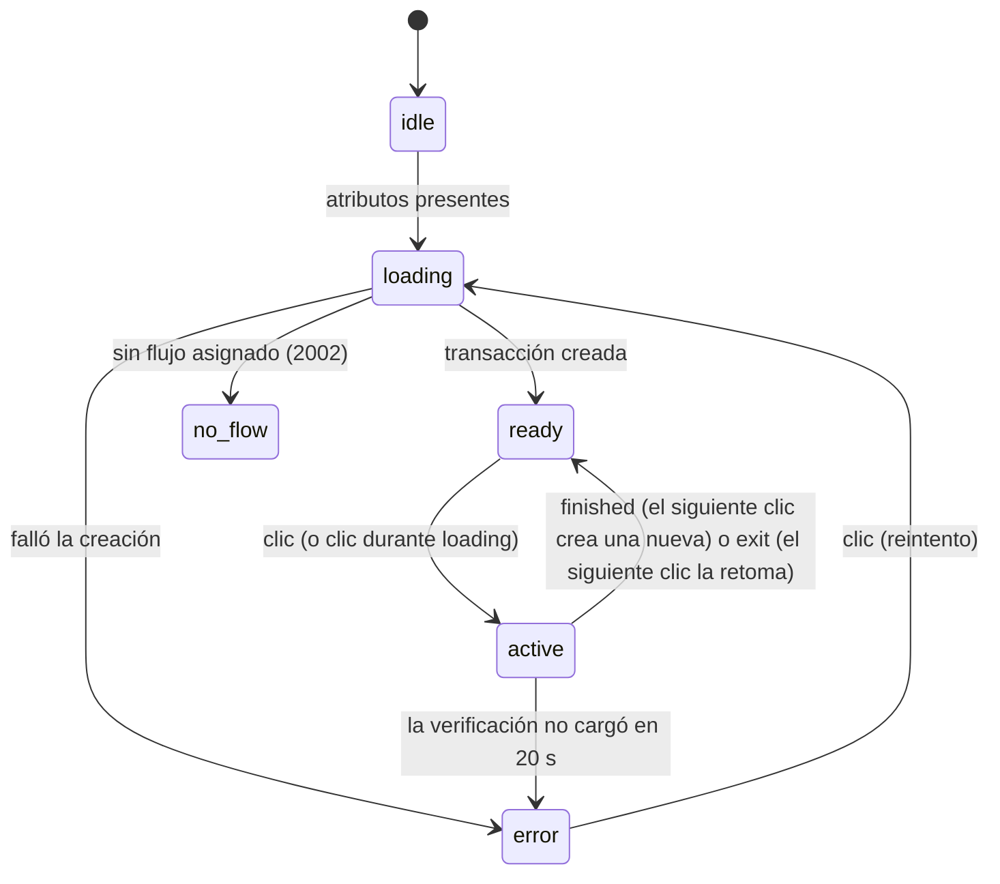
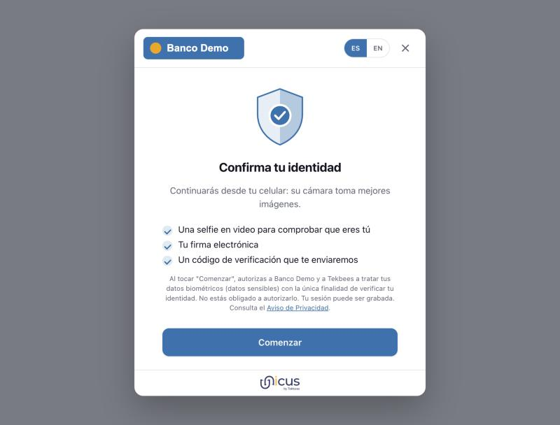
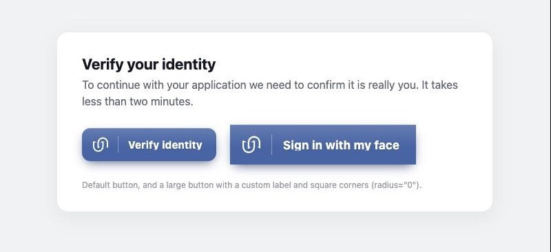

# Referencia del botón

## Atributos

| Atributo | Obligatorio | Valores | Descripción |
| --- | --- | --- | --- |
| `customerid` | Sí | Customer Token | Token público de la empresa (Compañía → Configuraciones en el portal administrativo). Se envía como el header `X-Customer-ID` cuando se crea la transacción. |
| `transactiontype` | Sí | `enrollment-verify`, `liveness` | `enrollment-verify` enrola a una persona que Unicus no conoce y verifica a una que ya conoce; la decisión la toma Unicus. `liveness` ejecuta un flujo solo de prueba de vida. El portal asigna un flujo a cada tipo de transacción. |
| `clientid` | Para `enrollment-verify` | `TYPE:NUMBER` | Tipo y número de documento, por ejemplo `ID:123456789`. Tipos: `ID` documento nacional de identidad, `FD` documento extranjero, `PP` pasaporte, `DL` licencia de conducir. Se envía como `documentType` y `externalDatabaseRefID`. El botón solo valida que haya un número después de `:`; el tipo lo valida Unicus. Se ignora para `liveness`. |
| `language` | No | `es`, `en` | Idioma del texto del botón y de las pantallas de verificación. Se aceptan variantes regionales (`en-US` → `en`). Sin el atributo se usa el idioma del navegador cuando es compatible; cualquier valor no compatible (del atributo o del navegador) significa español. |
| `data-flow-id` | No | slug del flujo | Ejecuta una variante específica del flujo en lugar de la asignada al tipo de transacción (por ejemplo, una variante A/B o un flujo para un producto específico). El slug se muestra en el portal. Un slug desconocido deja el botón en el estado *no configurado* (`2002`). |
| `label` | No | texto | Reemplaza el texto del botón por defecto ("Validar identidad" / "Verify identity"), por ejemplo `Ingresar con mi rostro` en una pantalla de inicio de sesión. |
| `size` | No | `lg` | Botón más grande (58 px de alto en lugar de 48 px). |
| `radius` | No | número de píxeles, o `pill` | Redondeo de las esquinas, para que el botón coincida con los botones de tu sitio: `0` para esquinas cuadradas, `4`, `8`… o `pill` para extremos completamente redondeados. Por defecto `12`. La variable CSS `--unicus-radius` hace lo mismo. |
| `color` | No | `#rrggbb` | Fuerza el color de la marca. Si no está presente, el color configurado para la empresa en el portal se aplica en cuanto se crea la transacción y se recuerda en el navegador (`localStorage`, por Customer Token) para las siguientes visitas. |
| `textcolor` | No | `#rrggbb` | Fuerza el color del texto del botón. |
| `disabled` | No | — | Impide abrir el flujo (la transacción se crea de todas formas al montarse). Quita el atributo para habilitar el botón. |

Los atributos se leen cuando el elemento se conecta y cada vez que cambian.
Cambiar `customerid`, `clientid`, `transactiontype` o `data-flow-id` descarta
la transacción actual y crea una nueva; `OnUnicus:loaded` se emite de nuevo.
Si después llega una respuesta para los valores anteriores, se descarta.
Cambiar `language`, `label`, `size`, `radius`, `color` o `textcolor` solo
vuelve a pintar el botón.

## Estados



El botón refleja su estado en el atributo `state`, así que puedes aplicarle
estilos u observarlo (`button.getAttribute('state')`).

| Estado | Lo que ve el usuario | Significado |
| --- | --- | --- |
| `idle` | Botón neutro con el texto del botón por defecto | Esperando los atributos obligatorios. Un clic en este estado emite `OnUnicus:error` indicando los atributos que faltan. |
| `loading` | Marca de Unicus animada dentro del botón | Se está creando la transacción. Un clic durante este estado se respeta: el flujo se abre en cuanto la transacción está lista. |
| `ready` | Color de la marca, texto del botón | Transacción creada (se emitió `OnUnicus:loaded`). |
| `active` | Texto del botón "Validando…" / "Verifying…", deshabilitado | La verificación está abierta en el iframe. Los errores dentro del flujo no cambian este estado. |
| `error` | Botón gris, texto del botón "Reintentar" / "Retry" | No se pudo crear la transacción, o la verificación no cargó en 20 segundos (`OnUnicus:error`). Un clic crea una transacción nueva y abre el flujo. |
| `no_flow` | Botón gris, texto del botón "Validación no configurada" / "Verification not configured", deshabilitado | No hay un flujo asignado a esta empresa y tipo de transacción, o `data-flow-id` es desconocido (código de resultado `2002`). Los clics se ignoran. Corrígelo en el portal y luego recarga la página o cambia un atributo que cree una transacción nueva. |

## Ciclo de vida

1. **Montaje.** La transacción se crea de inmediato para que el flujo se abra
   sin demora cuando el usuario haga clic. Si el usuario nunca hace clic, la
   transacción expira por sí sola en Unicus; no se registra nada contra la
   persona.
2. **Clic.** El botón abre la verificación de Unicus en un iframe a pantalla
   completa sobre tu página, con permiso de cámara, micrófono, geolocalización y
   pantalla completa (`allow="camera; microphone; geolocation; fullscreen"`,
   otorgado solo al origen de Unicus). Donde el navegador lo soporta, el iframe
   se muestra dentro de un `<dialog>` modal: la página de fondo queda inerte, el
   foco permanece en la verificación y la tecla Escape no la cierra (la
   verificación tiene su propio botón de cierre). Tu página sigue cargada
   debajo.
3. **Eventos.** El progreso llega a través de `OnUnicus:details`; el final, a
   través de `OnUnicus:finished` o `OnUnicus:exit`. El iframe se quita cuando se
   emite cualquiera de los dos y el foco vuelve al botón. Si la verificación no
   responde en 20 segundos (bloqueada por una CSP o una extensión, sin red), la
   capa superpuesta se quita y el botón pasa a *Reintentar* con
   `OnUnicus:error`.
4. **De nuevo.** Después de `finished` o `exit`, el siguiente clic crea una
   transacción **nueva**, emite `OnUnicus:loaded` con el nuevo `tid` y abre el
   flujo. Una transacción nunca se reutiliza. Hasta ese clic, `transactionId`
   conserva el `tid` anterior.
5. **Eliminación.** Si el elemento se quita del DOM mientras la verificación
   está abierta, el iframe se quita con él y no se emite `finished` ni `exit`.
   Un botón que se vuelve a conectar retoma la misma transacción en el
   siguiente clic mientras siga abierta.

El flujo no se muestra en una ventana emergente, así que los bloqueadores de
ventanas emergentes no lo afectan.

<figure><figcaption><p>La verificación abierta sobre la página en un computador. En un celular ocupa toda la pantalla.</p></figcaption></figure>

## Propiedades y métodos

| Miembro | Descripción |
| --- | --- |
| `button.transactionId` | `tid` actual, o `null` antes de `OnUnicus:loaded`. También disponible como `button.__transactionId` por compatibilidad con código 4.x. |
| `button.open()` | Abre el flujo de forma programática, igual que un clic (se ignora mientras está `active`, en `no_flow` o con `disabled`). |
| `customElements.get('unicus-btn').version` | Cadena de versión del script cargado. |

## Apariencia

<figure><figcaption><p>Botón por defecto, y <code>size="lg"</code> con un <code>label</code> personalizado y <code>radius="0"</code>.</p></figcaption></figure>

El botón es una sola pieza en el color de tu marca: la marca de Unicus, un
divisor delgado y el texto del botón, todo en el color del texto. Los colores
vienen de la configuración de la empresa en el portal (`windowColor`,
`textColor`); puedes sobrescribirlos por página con atributos o con propiedades
personalizadas de CSS en el elemento. Usa `radius` (o `--unicus-radius`) para
darle las mismas esquinas que los demás botones de tu sitio:


```css
unicus-btn {
  --unicus-color: #1e3163;        /* fondo */
  --unicus-text-color: #ffffff;   /* texto del botón, divisor y marca de Unicus */
  --unicus-accent: #f9ab01;       /* color del barrido de la animación de carga sobre la marca */
  --unicus-radius: 4px;           /* esquinas; igual que radius="4" */
  --unicus-font: inherit;
}
```


El `<button>` interno se expone como `::part(button)` para estilos avanzados:


```css
unicus-btn::part(button) { box-shadow: none; }
```



Mantén visible la marca de Unicus. Le indica al usuario que la verificación la
realiza Unicus y no tu sitio, lo cual es parte del consentimiento que da el
usuario.


## Pantallas de verificación

Los colores y el logo de las pantallas de verificación se configuran en el
portal administrativo (Compañía → Configuraciones) y se aplican a todas las
pantallas, incluidas las de la cámara: marco, botones, progreso, animaciones de
resultado y la guía de captura del documento. La página del cliente no envía
ningún valor de apariencia para las pantallas. Los textos se configuran con el
flujo; consulta [Textos e idiomas](texts-and-languages.md).
