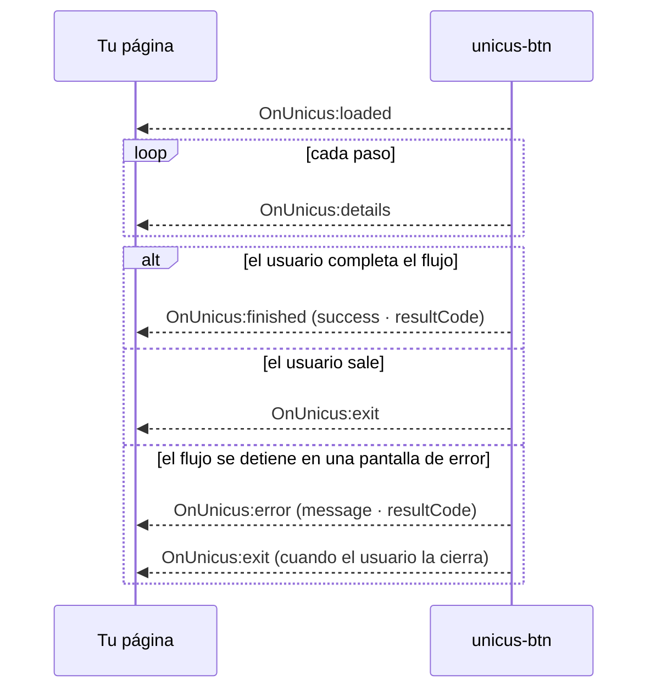

# Eventos

El elemento `<unicus-btn>` despacha `CustomEvent`s. Los datos están en
`event.detail`. Los eventos se propagan (bubble) y atraviesan los shadow roots, así que funciona un listener en el
elemento, en un ancestro o en `document`.

| Evento | Cuándo | Uso típico |
| --- | --- | --- |
| `OnUnicus:loaded` | Se creó la transacción: al montarse, de nuevo después de cualquier cambio de `customerid`, `clientid`, `transactiontype` o `data-flow-id`, y en el primer clic después de un `finished` / `exit` / `error` del botón. | Guarda el `tid`; habilita la interfaz que depende de él. |
| `OnUnicus:details` | Un paso inició, se completó, tuvo un reintento, falló o se omitió, o el servidor respondió a una carga de la cámara. Se dispara muchas veces. | Indicadores de progreso, analítica. Nunca lo trates como el resultado final. |
| `OnUnicus:finished` | El flujo llegó a un estado final (éxito, revisión manual o falla) y el usuario cerró la pantalla de resultado. | Continúa tu proceso; confirma del lado del servidor. |
| `OnUnicus:exit` | El usuario cerró la verificación antes de un estado final. | Ofrece intentarlo de nuevo. |
| `OnUnicus:error` | No se pudo crear la transacción, la verificación no cargó, o el flujo se detuvo en una pantalla de error (problema de configuración, de sesión o de red). | Muestra un error recuperable; registra `message` y `resultCode`. |

Todo evento es un `CustomEvent` con `bubbles: true` y `composed: true`.
`OnUnicus:loaded` y el `OnUnicus:error` propio del botón los produce el
botón; los demás eventos (y el `OnUnicus:error` generado dentro del flujo) se
retransmiten desde la aplicación web de Unicus, y solo desde el iframe que creó el botón.
`OnUnicus:details`, `OnUnicus:finished` y `OnUnicus:exit` comparten una misma envoltura:

| Campo | Tipo | Descripción |
| --- | --- | --- |
| `status_error` | boolean | `false` (`true` en `OnUnicus:error`). |
| `message` | string | Etiqueta legible, para los logs. |
| `transaction.exited` | boolean | `true` en `finished` y `exit`, `false` en `details`. |
| `transaction.transactionId` | string o null | El `tid` (`null` solo en un error `invalid_link`). |
| `transaction.state` | object | Payload específico de cada evento, descrito más abajo. |




Los eventos del navegador controlan tu interfaz de usuario. El resultado autoritativo de una
transacción es el que recibe tu backend a través del
[webhook](webhooks.md) o al llamar a
[Consultar el estado de una transacción](transaction-status.md) con el
`tid`. Las recargas de página, las pestañas cerradas y las condiciones de red pueden impedir que un
evento del navegador llegue a tu página.


## `OnUnicus:loaded`


```json
{
  "status_error": false,
  "loaded": true,
  "message": "Unicus SDK: loaded successfully",
  "link": "https://id.idunicus.com/#token=<TID>&process=enrollment&lang=es",
  "transaction": {
    "transactionId": "<TID>",
    "clientid": "123456789"
  }
}
```


`transaction.clientid` es el número de documento; es un string vacío para
`liveness`. `link` es la dirección de la verificación de esta transacción
(el botón la abre en el iframe, agregando el número de documento). El `process`
que contiene es `enrollment`, `verify` o `liveness`, según lo decide Unicus. No
se lo envíes al usuario: lleva el `tid`, y Unicus genera los enlaces para
otros dispositivos dentro del flujo con tokens de un solo uso.

## `OnUnicus:details`

Se emite en cada transición de paso y después de cada carga de la cámara.
`transaction.state` tiene una de dos formas; distínguelas con
`state.stepProgress === true` o con la presencia de `state.responseType`.

Qué dispositivo los produce:

* **El flujo se ejecuta en el iframe en un celular o tablet:** los eventos provienen de
  ese dispositivo a medida que el usuario avanza por los pasos.
* **El flujo inició en un computador y se hizo el traspaso al celular (hand-off):** los pasos completados
  en el computador antes del traspaso no producen `details`. Una vez que el usuario abre
  el enlace en el celular, los eventos del celular se retransmiten al computador y se
  emiten en tu página (`message` es `Unicus SDK: User is active on
  transaction`; los payloads de progreso de paso retransmitidos de esta forma también incluyen `seq` y
  `sentAt`, que puedes ignorar).

**Progreso de paso**, uno por cada transición de un paso. Los pasos `consent` e `info` no
lo producen:


```json
{
  "status_error": false,
  "message": "Unicus SDK: step progress",
  "transaction": {
    "exited": false,
    "transactionId": "<TID>",
    "state": {
      "stepProgress": true,
      "flowId": "enrolamiento-por-defecto",
      "stepId": "document",
      "stepType": "document",
      "status": "completed",
      "resultCode": 2000
    }
  }
}
```


| Campo | Tipo | Valores |
| --- | --- | --- |
| `stepProgress` | boolean | Siempre `true`. |
| `flowId` | string | Id del flujo que ejecuta la transacción. |
| `stepId` | string | Id del paso en el flujo, tal como se configuró en el portal. |
| `stepType` | string | `liveness`, `document`, `face_match`, `signature`, `otp`, `form`, `age_check` |
| `status` | string | `started`, `completed`, `retry` (intento de prueba de vida rechazado, el usuario lo intenta de nuevo), `failed`, `skipped` (paso opcional que falló o no se ejecutó) |
| `resultCode` | number | Presente cuando el paso terminó o tuvo un reintento. Consulta [Códigos de resultado](result-codes.md). |

**Resultado de paso del servidor**, producido por la API de Unicus después de cada carga de la cámara
(prueba de vida y documento). Es el mismo payload que enviaba el SDK anterior, sin los
campos internos (datos del documento, resultados de OCR, la respuesta biométrica).
La envoltura completa es la anterior con
`message: "Unicus SDK: User is active on transaction"`; solo se muestra `state`:


```json
{
  "state": {
    "responseType": "MATCH_3D_2D_ID_SCAN",
    "success": true,
    "resultCode": 2000,
    "isCompletelyDone": false,
    "matchLevel": 5
  }
}
```


| `responseType` | Paso |
| --- | --- |
| `LIVENESS_3D` | Prueba de vida. |
| `NEW_ENROLLMENT` | Prueba de vida más enrolamiento facial. |
| `MATCH_3D_3D` | Verificación facial contra el rostro enrolado. |
| `MATCH_3D_2D_ID_SCAN` | Captura del documento y comparación facial contra la foto del documento. Un payload por carga: frente, reverso, confirmación del usuario. `isCompletelyDone: true` en el último. |
| `ID_SCAN_ONLY` | Captura del documento sin comparación facial. |
| `GENERIC`, `ERROR`, `ENROLLMENT_RETRY` | Otras respuestas del servidor a una carga; `success` y `resultCode` indican qué ocurrió. |

Usa solo los campos que tu aplicación necesita; el payload puede incluir más
campos técnicos según el paso.

## `OnUnicus:finished`


```json
{
  "status_error": false,
  "message": "Unicus SDK: User ended transaction",
  "transaction": {
    "exited": true,
    "transactionId": "<TID>",
    "state": {
      "exited": true,
      "success": true,
      "resultCode": 2000
    }
  }
}
```


`transaction.state`:

| Campo | Tipo | Descripción |
| --- | --- | --- |
| `exited` | boolean | Siempre `true`. |
| `success` | boolean | `true` solo para un resultado exitoso. |
| `resultCode` | number | Código de resultado final del flujo. |

| `success` | `resultCode` | Significado |
| --- | --- | --- |
| `true` | `2000` (`0` y `200` en flujos legacy) | Identidad verificada; todos los pasos obligatorios se aprobaron. |
| `false` | `2013` | El flujo se completó pero la transacción está **en revisión manual** en Unicus (por ejemplo, un posible duplicado). No es una falla: espera el webhook. |
| `false` | cualquier otro | La verificación falló. El código indica el motivo; consulta [Códigos de resultado](result-codes.md). |

`finished` se emite cuando el usuario sale de la pantalla de resultado (con su botón o con el
botón de cerrar), cualquiera que sea el resultado. También es el evento que recibes cuando el
usuario cancela la cámara en un paso obligatorio (`resultCode` `2041`) o deniega el
acceso a la cámara (`9996`): estos casos terminan el flujo con una falla y una pantalla de resultado.
En un computador con traspaso al celular, la pantalla de resultado aparece cuando el celular termina
y Unicus confirma el resultado; si el celular se detiene en un error del que no puede
recuperarse, el computador muestra una falla y `finished` lleva ese código.

## `OnUnicus:exit`

Misma envoltura que `finished`; `transaction.state` es
`{ "exited": true, "success": false }`, sin `resultCode`. El usuario cerró
la verificación con su botón de cerrar antes de un estado final, o cerró una
pantalla de error. El siguiente clic en el botón retoma la misma transacción
mientras siga abierta (una nueva si venció).

Cerrar nunca cancela la transacción: sigue abierta y el usuario puede
retomarla mientras sea válida; si nadie lo hace, expira en Unicus. En un
computador, es posible que el computador solo esté reflejando el celular, así
que si el usuario ya abrió el enlace de traspaso, el celular todavía puede
terminar la transacción después de `exit`. Confía en tu webhook para conocer el
resultado.

## `OnUnicus:error`


```json
{
  "status_error": true,
  "message": "Unicus SDK: verification not configured (NO_FLOW)",
  "resultCode": 2002
}
```


**Los errores generados por el botón** tienen la forma plana anterior:

| Campo | Tipo | Descripción |
| --- | --- | --- |
| `status_error` | boolean | Siempre `true`. |
| `message` | string | `Unicus SDK: ` seguido de la causa. |
| `resultCode` | number o ausente | Código de resultado de Unicus, cuando la API devolvió uno. |

| `message` después de `Unicus SDK: ` | `resultCode` | Causa y solución |
| --- | --- | --- |
| `[customerid] and [transactiontype] are required` | — | Faltaban atributos cuando el usuario hizo clic. |
| `[clientid] must look like "ID:123456"` | — | `clientid` sin un número después de `TYPE:` (no se valida para `liveness`). |
| `verification not configured (…)` | `2002` | No hay flujo asignado a la empresa y al tipo de transacción, o el `data-flow-id` es desconocido. Asigna un flujo en el portal. El botón permanece en `no_flow`. |
| `user is currently blocked` | `2052` | La persona está bloqueada en Unicus tras fallas repetidas. Revísalo en el portal o contacta a soporte. |
| `could not create the transaction (…)` | Código de la API, cuando existe | Unicus rechazó la creación; el paréntesis contiene el motivo de la API. Revisa el Customer Token y el ambiente. |
| `cannot reach the server (…)` | — | Sin respuesta en 30 segundos, un problema de red, CORS o CSP, o una respuesta inválida. Consulta [Compatibilidad y seguridad](compatibility-and-security.md). |
| `the verification could not be loaded` | — | La verificación no se abrió en 20 segundos (bloqueada por la CSP de la página o por una extensión del navegador, o sin red). El botón quita la capa superpuesta y vuelve a *Reintentar*. |

Todos excepto `verification not configured` dejan el botón en el
estado `error` (*Reintentar*). La causa también se escribe en la consola del navegador.

**Los errores generados dentro del flujo** (sesión expirada, límite de solicitudes, paso rechazado
por el servidor…) se muestran al usuario en una pantalla de Unicus y se reportan mediante
`OnUnicus:error`, una vez por error. Usan la envoltura de los demás eventos
del flujo, más `resultCode` copiado al nivel superior:


```json
{
  "status_error": true,
  "message": "Unicus SDK: expired",
  "transaction": {
    "exited": false,
    "transactionId": "<TID>",
    "state": { "errorKey": "expired", "resultCode": 2051 }
  },
  "resultCode": 2051
}
```


| `errorKey` | `resultCode` | Significado |
| --- | --- | --- |
| `invalid_link` | — | La verificación se abrió sin una transacción válida. |
| `expired` | `2051`, o HTTP `401` | La transacción expiró o ya se completó. |
| `try_again` | `2054` | Unicus no pudo responder en este momento; el usuario puede reintentar en la misma pantalla. |
| `network` | — | Sin conexión, o una respuesta inesperada. El usuario puede reintentar. |
| `rate_limited` | HTTP `429` | Demasiadas solicitudes en poco tiempo. El usuario puede reintentar. |
| `session_mismatch` | HTTP `403` | La sesión no pertenece a esta transacción. |
| `flow_missing` | `2002` | No hay flujo asociado a la transacción. |
| `invalid_flow` | — | El flujo tiene una configuración que la aplicación web no reconoce. |
| `step_rejected` | `2052` (o el código devuelto) | El servidor rechazó un paso; se muestra el motivo al usuario. |
| `facetec_init` | p. ej. `9997` | No se pudo iniciar el motor de la cámara. El usuario puede reintentar. |

El botón permanece en `active`: la verificación sigue abierta para que el usuario pueda leer
el mensaje o reintentar. `OnUnicus:exit` le sigue cuando la cierra, a menos que un
reintento tenga éxito y el flujo continúe.

## Patrón recomendado


```js
const button = document.querySelector('unicus-btn');
let tid = null;

button.addEventListener('OnUnicus:loaded', ({ detail }) => {
  tid = detail.transaction.transactionId;
});

button.addEventListener('OnUnicus:details', ({ detail }) => {
  const s = detail.transaction.state;
  if (s.stepProgress) trackStep(s.stepId, s.status);          // tu analítica
});

button.addEventListener('OnUnicus:finished', ({ detail }) => {
  const { success, resultCode } = detail.transaction.state;
  if (success || resultCode === 2013) {
    refreshFromBackend(tid);        // tu backend confirma con Unicus
  } else {
    showRetry(resultCode);
  }
});

button.addEventListener('OnUnicus:exit', () => showRetry());
button.addEventListener('OnUnicus:error', ({ detail }) => showUnavailable(detail));
```

