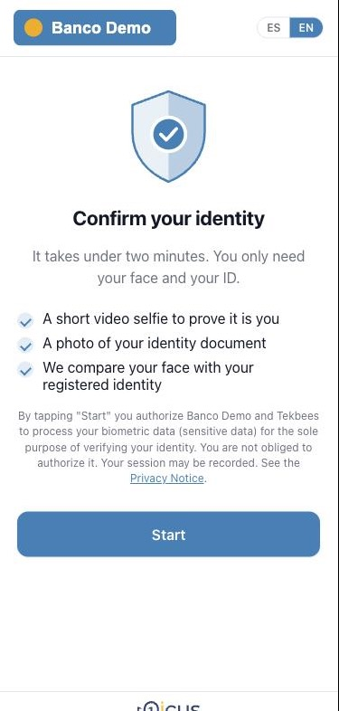
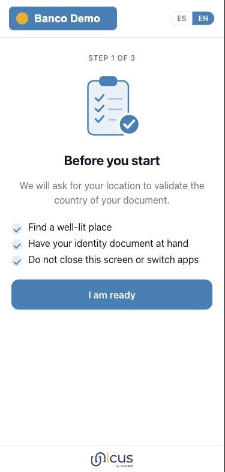
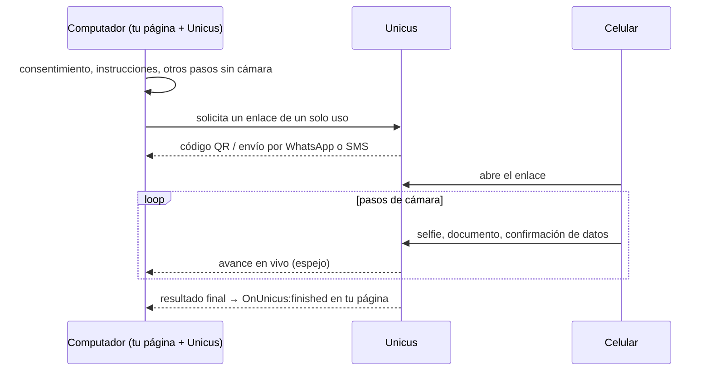
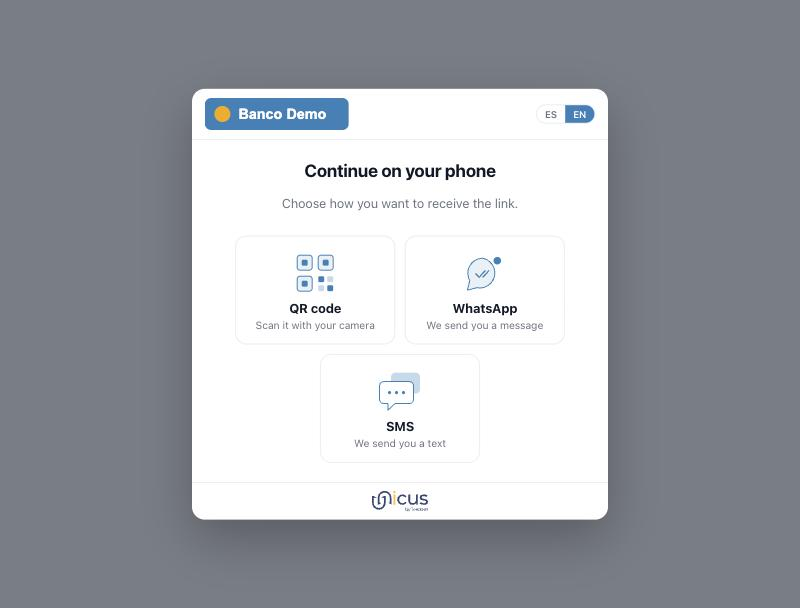

# Flujos y traspaso al celular

## Flujos modulares

*Ejemplo de un flujo completo. Los pasos oscuros se ejecutan en una sola sesión
de cámara; los demás no necesitan cámara. Tu flujo puede usar cualquier
subconjunto, en cualquier orden que el portal permita.*

En Web SDK 5.0 la verificación es un **flujo**: una lista ordenada de pasos que
tu empresa compone en el portal administrativo y asigna a un tipo de
transacción. La aplicación web ejecuta el flujo asociado a cada transacción, por
lo que un cambio en el portal se aplica a la siguiente transacción sin tocar tu
página.

| Tipo de paso | Lo que hace el usuario | Dónde se ejecuta |
| --- | --- | --- |
| `consent` | Lee qué se capturará y por qué, y acepta. Siempre va primero; se agrega automáticamente si el flujo no lo incluye. | Cualquier dispositivo |
| `info` | Lee instrucciones (buena luz, documento a la mano). | Cualquier dispositivo |
| `liveness` | Selfie en video. Demuestra que hay una persona viva presente y captura el rostro. | Cámara del celular o tableta |
| `document` | Fotografía el frente y el reverso del documento y confirma los datos leídos por OCR. Validaciones del lado del servidor configuradas por flujo: clasificador de documentos, coincidencia del número de documento, consulta al registro oficial. | Cámara del celular o tableta |
| `face_match` | El rostro de la selfie se compara con la foto del documento, o con el rostro enrolado previamente. | Servidor, dentro de la sesión de cámara |
| `signature` | Dibuja una firma electrónica en pantalla después de leer el documento mostrado. | Cualquier dispositivo |
| `otp` | Recibe un código de un solo uso por SMS, WhatsApp o correo electrónico y lo escribe. | Cualquier dispositivo |
| `form` | Diligencia un formulario de datos definido en el portal (campos, tipos, reglas de validación). | Cualquier dispositivo |
| `age_check` | Sin pantalla: Unicus compara la edad estimada a partir de la selfie de prueba de vida con un umbral (8, 13, 16, 18, 21, 25 o 30). Se ubica justo después de la sesión de cámara que captura la prueba de vida. | Servidor |

<figure><figcaption>
Consentimiento: qué se capturará y por qué.
</figcaption></figure> <figure><figcaption>
Preparación antes de que se abra la cámara.
</figcaption></figure>

Las pantallas usan el logo y los colores de tu empresa; los ejemplos muestran
una empresa de muestra.

Los pasos de cámara consecutivos (`liveness`, `document`, `face_match`) se
ejecutan en una sola sesión de cámara, de modo que el usuario abre la cámara una
sola vez. En un computador, los pasos anteriores al primer paso de cámara se
completan allí; a partir del primer paso de cámara, el resto del flujo (incluidos
los pasos posteriores sin cámara, como `signature`, `otp` o `form`) se ejecuta
en el celular.

### Reglas en las que puede confiar el integrador

* Unicus hace cumplir el orden de los pasos. Un paso no se puede omitir ni
  enviar fuera de orden.
* El avance se guarda del lado del servidor. Si se recarga la pestaña de
  verificación en el celular, el flujo se retoma en el primer paso incompleto.
  Volver a abrir un enlace de traspaso ya usado no lo hace: el usuario solicita
  uno nuevo desde el computador, y el nuevo enlace retoma en el primer paso
  incompleto.
* Recargar **tu** página mientras la verificación está abierta la cierra; el
  botón de la página recargada crea una nueva transacción.
* Una transacción finaliza con `success` solo cuando todos los pasos
  obligatorios fueron aprobados. Un paso configurado como opcional puede fallar
  sin que falle la transacción.
* `OnUnicus:details` informa los pasos por su `stepId`, de modo que tu página
  puede mostrar el avance de los pasos que existen en tu flujo en lugar de una
  lista fija. Los pasos `consent` e `info` no se informan, y tampoco los pasos
  completados en el computador antes de un traspaso (consulta
  [Eventos](events.md)).

### Variantes de flujo

`data-flow-id="<slug>"` ejecuta un flujo específico publicado en el portal en
lugar de la asignación predeterminada para el tipo de transacción. Úsalo para
flujos específicos de un producto (por ejemplo, un flujo más liviano para
clientes recurrentes) o para pruebas A/B.

## Traspaso al celular

Los pasos de cámara se ejecutan en un celular o tableta. Cuando el flujo se abre
en un computador de escritorio o portátil, siempre traspasa los pasos de cámara,
aunque el computador tenga cámara web. Los celulares y tabletas se reconocen por
su navegador, no por el tamaño de la ventana. Cuando el flujo llega a su primer
paso de cámara, la aplicación web ofrece los canales de traspaso al celular
(hand-off) habilitados para tu empresa:

| Canal | Qué sucede |
| --- | --- |
| Código QR | El usuario lo escanea con la cámara del celular. Siempre disponible. |
| WhatsApp | El usuario escribe el número de celular; Unicus envía un mensaje de plantilla con el enlace. Se habilita por empresa. |
| SMS | El usuario escribe el número de celular; Unicus envía un mensaje de texto con el enlace. Se habilita por empresa. |

Cuando el código QR es el único canal de tu empresa, el computador pasa
directamente al código QR. Cada mensaje de WhatsApp o SMS lleva un enlace nuevo;
el código QR conserva su enlace mientras sea válido.

<figure><figcaption>
Los canales habilitados para la empresa, ofrecidos en el computador.
</figcaption></figure>

La pantalla del computador se convierte entonces en un **espejo**: muestra en
tiempo real cada paso que completa el celular (frente del documento, comparación
facial, reverso, confirmación de datos…) y finalmente el resultado. La página
del cliente sigue recibiendo los eventos `OnUnicus:*` desde el computador, así
que tu integración no cambia: la pantalla de resultado aparece en el computador
cuando el celular termina y Unicus confirma el resultado, y `finished` se emite
cuando el usuario la cierra. Además de las actualizaciones en vivo, el
computador consulta la transacción en Unicus cada pocos segundos, de modo que el
resultado llega aunque se pierda una actualización en vivo.


Si el celular termina pero la pestaña del computador se cerró (o el usuario
cerró la verificación en el computador, lo que emite `exit`), el resultado
queda registrado de todas formas en Unicus. Cerrar el lado del computador nunca
cancela la transacción. Tu webhook o `query-transaction` tienen el resultado.


### Enlaces de un solo uso

Los enlaces para el celular nunca contienen el id de la transacción. Llevan un
**token de traspaso de un solo uso** en el fragmento de la URL
(`https://id.idunicus.com/#h=…`):

* El fragmento nunca se envía a ningún servidor: ni en la solicitud, ni en el
  `Referer`, ni en los logs de acceso.
* El enlace funciona una sola vez. Abrirlo por segunda vez muestra "the link
  expired or was already used" (el enlace expiró o ya fue usado).
* El enlace expira si no se usa; la transacción tiene su propia expiración.
* Si Unicus no puede abrir el enlace en ese momento, el celular muestra "try
  again" (inténtalo de nuevo) con un botón **Retry** (Reintentar). El mismo
  enlace sigue siendo válido: no se necesita un nuevo código QR ni un nuevo
  mensaje.
* El celular elimina el token de la barra de direcciones en cuanto lo lee.

Los enlaces que llegan al usuario los genera Unicus dentro del flujo. Tu página
no construye enlaces de verificación.

## Ejecutar todo en el celular

Cuando el botón se presiona en un celular o tableta, todo el flujo se ejecuta
allí, en el mismo iframe. No se muestra ninguna pantalla de traspaso.

## Tiempos y consumo de datos

* En el dispositivo que ejecuta la cámara, el motor biométrico se descarga
  mientras el usuario lee las pantallas de consentimiento e instrucciones, y el
  navegador lo guarda en caché para transacciones posteriores en el mismo
  dispositivo, por lo que una primera visita con una conexión lenta tarda más
  que las siguientes. Cuando el navegador tiene activado el ahorro de datos o
  informa una conexión 2G, la descarga espera hasta que empieza el paso de
  cámara. Los flujos sin pasos de cámara nunca lo descargan.
* Un enrolamiento completo (selfie más los dos lados del documento) sube
  aproximadamente 1.5 MB.
* Una transacción que se deja abierta expira en Unicus; volver a abrir el enlace
  después de la expiración muestra "the session expired" (la sesión expiró).
