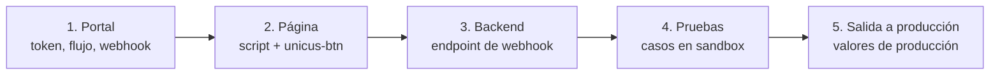
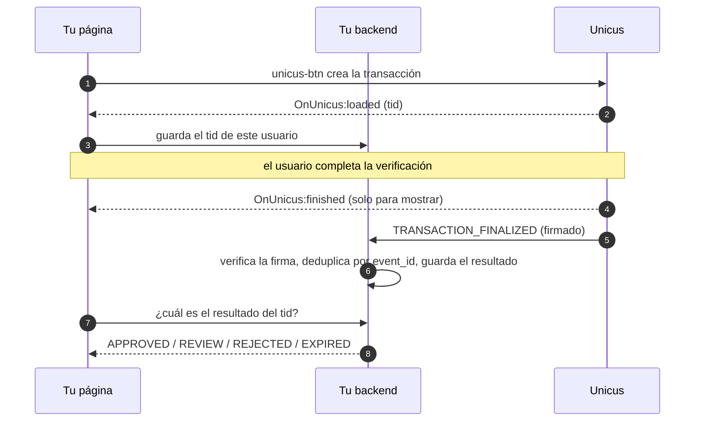

# Lista de integración

Una integración típica toma un día: unas pocas líneas en tu página y un endpoint
en tu backend. Sigue los pasos en orden.

## 1. En el portal administrativo (primero en sandbox)

- [ ] Solicita a Tekbees una empresa de **ambiente de pruebas (sandbox)** y la
      URL del script de sandbox.
- [ ] Copia el [Customer Token](customer-token.md) (Compañía → Configuraciones).
- [ ] Crea un **flujo** y asígnalo al tipo de transacción que usarás
      (`enrollment-verify` o `liveness`). Sin él, el botón muestra
      "Verification not configured" (validación no configurada) (`2002`).
      Consulta [Flujos y traspaso al celular](flows-and-handoff.md).
- [ ] Revisa la marca (logo y colores) y los canales de traspaso al celular
      (hand-off) (QR, WhatsApp, SMS).
- [ ] Registra tu **URL de webhook** y **genera el secreto de firma**. Guarda el
      secreto en el gestor de secretos de tu backend. Consulta
      [Webhooks](webhooks.md).
- [ ] Si tu backend va a llamar a `query-transaction`, genera una **API key** de
      la empresa para ello (solo del lado del servidor). Consulta
      [Consultar el estado de una transacción](transaction-status.md).

## 2. En tu página

- [ ] Carga el script una sola vez, con `defer`.
- [ ] Renderiza `<unicus-btn>` con `customerid`, `transactiontype` y, para
      enrolamiento / verificación, `clientid` (`<type>:<number>`). Consulta
      [Inicio rápido](quick-start.md) y [Referencia del botón](button-reference.md).
- [ ] En `OnUnicus:loaded`, envía el `tid` a tu backend y guárdalo con tu
      usuario o caso. Es la clave que une la página, el webhook y
      `query-transaction`.
- [ ] En `OnUnicus:finished`, muestra una pantalla de espera o de resultado, pero
      **no otorgues acceso a partir del evento del navegador**: consulta a tu
      backend, que decide con el webhook. Consulta [Eventos](events.md).
- [ ] Maneja `OnUnicus:exit` (el usuario cerró la verificación) y
      `OnUnicus:error` (muestra un mensaje; `2002` significa que el flujo no
      está configurado).
- [ ] Si tu sitio envía una Content-Security-Policy o una Permissions-Policy,
      permite los dominios de Unicus y la cámara. Consulta
      [Compatibilidad y seguridad](compatibility-and-security.md).

## 3. En tu backend

- [ ] Endpoint que recibe `POST` JSON por `https` y responde `2xx` en menos de
      30 segundos.
- [ ] Verifica `X-Unicus-Signature` sobre el cuerpo sin procesar y rechaza
      timestamps con más de 5 minutos de antigüedad.
- [ ] Deduplica por `meta.event_id` (las entregas son al menos una vez y se
      reintentan durante aproximadamente 22 horas).
- [ ] Decide según `data.outcome`: `APPROVED` → continuar; `REVIEW` → pendiente
      hasta `TRANSACTION_REVIEW_RESOLVED`; `REJECTED`, `EXPIRED`, `CANCELLED` →
      no verificado.
- [ ] Relaciona el webhook con tu usuario mediante `data.tid` (el `tid` que tu
      página guardó). Si lo necesitas, compara `data.document.idNumberOCR` con
      el documento que esperabas.
- [ ] Opcional: un proceso de conciliación que llame a
      [Consultar el estado de una transacción](transaction-status.md) (con tu
      API key) para las transacciones que no tengan webhook después de algunas
      horas (por ejemplo, mientras tu endpoint estuvo caído).
- [ ] No registres en logs el cuerpo del webhook: contiene datos personales.

## 4. Pruebas en el sandbox

| # | Caso | Resultado esperado |
| --- | --- | --- |
| 1 | Completa el flujo con un documento válido, en un computador y con traspaso a un celular. | `OnUnicus:finished` con `success: true`; webhook `APPROVED`, `result_code` `2000`. |
| 2 | Complétalo directamente en un celular. | Igual que en 1. |
| 3 | Haz fallar una captura (cubre el documento, usa una foto de una pantalla) y luego termina correctamente. | Los intentos fallidos aparecen en `data.attempts`; resultado `APPROVED`. |
| 4 | Haz fallar una captura y cierra la página. | Después de 20 minutos, webhook `REJECTED` con `last_failure`. |
| 5 | Abre la verificación y abandónala sin que falle nada. | Después de 20 minutos, webhook `EXPIRED` (`6003`). |
| 6 | Cancela la cámara dentro de la verificación. | `OnUnicus:finished` con `success: false` y `resultCode` `2041`; webhook `CANCELLED`. |
| 7 | Niega el permiso de cámara. | Una pantalla de resultado explica cómo permitirlo; `OnUnicus:finished` con `resultCode` `9996`. |
| 7b | En un computador, cierra la ventana de verificación antes de terminar. | `OnUnicus:exit`. La transacción sigue abierta (el usuario aún puede terminar en el celular); si nadie lo hace, el webhook llega después de 20 minutos. En un celular, cerrar tampoco la cancela: al volver a abrir, el flujo se retoma. |
| 8 | Elimina la asignación de flujo del tipo de transacción. | `OnUnicus:error` con `2002` y el botón muestra "Verification not configured" (validación no configurada). |
| 9 | Haz que tu endpoint responda `500` una vez. | El mismo `event_id` llega de nuevo; lo procesas una sola vez. |
| 10 | Envía a tu endpoint una solicitud con una firma incorrecta. | Tu endpoint la rechaza (`401`). |

## 5. Salida a producción

- [ ] Reemplaza los valores de sandbox por los de **producción**: URL del script,
      Customer Token, URL y secreto del webhook, API key (cada ambiente tiene
      los suyos).
- [ ] Asigna el o los flujos en la empresa de producción.
- [ ] Ejecuta el caso 1 una vez en producción con un documento real.
- [ ] Monitorea tu endpoint de webhook (respuestas distintas de `2xx`, fallas de
      firma).
- [ ] Ten a la mano [Errores y solución de problemas](errors-and-troubleshooting.md)
      y el contacto de [Soporte](support.md).
