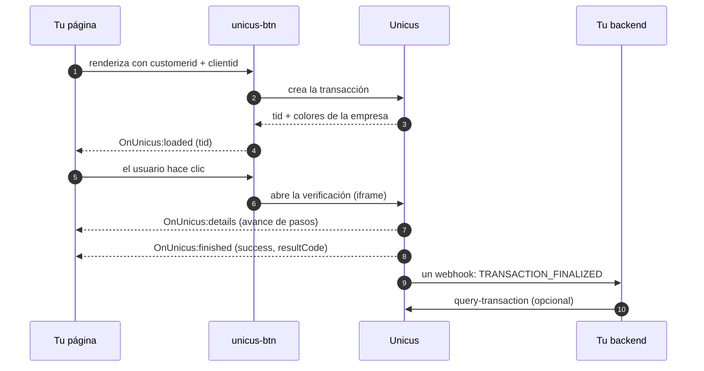

# Descripción general


**Próximamente.** Web SDK 5.0 aún no está disponible en producción. Tekbees
anunciará la fecha de lanzamiento. En esa fecha Web SDK 4.x deja de funcionar y
todas las integraciones ejecutan 5.0, incluidas las páginas que todavía cargan
la URL actual del script. Mientras tanto, solicita a Tekbees acceso al ambiente
de pruebas (sandbox) para prepararte.


Unicus Web SDK 5.0 es la nueva integración web de la plataforma de verificación
de identidad Unicus. Desde la página del cliente sigue siendo un script y un
elemento HTML: `<unicus-btn>`. Todo lo demás —la creación de la transacción, las
pantallas de verificación, la cámara, el traspaso al celular
del usuario (hand-off) y el resultado— lo gestiona Unicus.


Web SDK 5.0 mantiene el contrato público del botón anterior: los mismos
atributos (`customerid`, `transactiontype`, `clientid`, `language`), los mismos
eventos de navegador `OnUnicus:*` y la misma propiedad `transactionId`. Una
integración existente no tiene que editar su página: en la fecha de lanzamiento
la URL del script que ya carga sirve 5.0. Lo que sí debe hacer primero es
asignar un flujo en el portal. Consulta
[Migración desde Web SDK 4.x](migration-from-v4.md).


## Qué hay de nuevo

| Área | Web SDK 4.x | Web SDK 5.0 |
| --- | --- | --- |
| Flujo | Fijo: rostro y luego documento. | **Modular.** Tu empresa compone el flujo en el portal administrativo de Unicus: consentimiento, instrucciones, prueba de vida, documento, comparación facial, firma electrónica, OTP, formulario de datos, verificación de edad. La aplicación web ejecuta el flujo que esté asignado al tipo de transacción. |
| Peso | Varios megabytes antes de abrir la cámara. | Unos pocos kilobytes de código de aplicación; el motor biométrico se descarga una sola vez en segundo plano mientras el usuario lee las primeras pantallas y queda en caché para transacciones posteriores. Diseñado para redes móviles de bajo ancho de banda. |
| Usuarios de computador | Traspaso al celular mediante código QR. | Traspaso al celular mediante código QR, WhatsApp o SMS (canales habilitados por empresa). La página del computador refleja el avance del celular paso a paso y muestra el resultado final. |
| Enlaces de traspaso | Id de la transacción en la URL. | Tokens de traspaso de un solo uso en el fragmento de la URL. El id de la transacción nunca viaja en un enlace, un Referer ni un log del servidor. |
| Botón | Etiqueta fija, estado de carga. | Colores de marca aplicados automáticamente, etiqueta personalizada, dos tamaños, estados visibles de carga / listo / verificando / error; un clic abre el flujo incluso mientras la transacción aún se está creando. |
| Errores | Mensajes genéricos. | Códigos de resultado en los eventos `details`, `finished` y `error`, y motivos de rechazo en la pantalla del usuario (consulta [Códigos de resultado](result-codes.md)). |
| Textos | Fijos. | Títulos y descripciones de los pasos, consentimiento, instrucciones, acuerdo de firma y etiquetas de formulario configurados por flujo en español e inglés; etiqueta del botón por página (consulta [Textos e idiomas](texts-and-languages.md)). |
| Seguridad | Id de la transacción visible en los enlaces. | Sesiones de corta duración vinculadas a una transacción, enlaces de un solo uso, mensajería con verificación de origen entre tu página y Unicus, permisos de cámara estrictos. |

## Cómo funciona

1. La página del cliente carga `sdkButton.js` y renderiza `<unicus-btn>` con el
   **Customer Token** de la empresa y el documento del usuario.
2. El botón crea la transacción en Unicus en cuanto se renderiza y emite
   `OnUnicus:loaded` con el id de la transacción (`tid`).
3. Cuando el usuario hace clic, el botón abre la aplicación web de Unicus en un
   iframe de pantalla completa. La aplicación web obtiene la sesión: la marca de
   la empresa y el **flujo** asignado a la transacción.
4. La aplicación web ejecuta el flujo. En un celular o tableta, todo el flujo se
   ejecuta allí. En un computador de escritorio, los pasos anteriores al primer
   paso de cámara se ejecutan localmente y el resto se traspasa al celular del
   usuario; el computador refleja el avance y muestra el resultado final.
5. Los pasos informan su avance a la página del cliente mediante
   `OnUnicus:details`. El final del flujo produce `OnUnicus:finished` (u
   `OnUnicus:exit` si el usuario cerró la verificación antes de un estado final).
6. Tu backend recibe el resultado autoritativo a través de tu
   [webhook](webhooks.md) o llamando a
   [Consultar el estado de una transacción](transaction-status.md). Unicus envía
   **un** webhook por transacción, `TRANSACTION_FINALIZED`, cuando la transacción
   llega a su estado final; no hay webhooks por paso. Si ese estado final es una
   revisión manual, un segundo webhook, `TRANSACTION_REVIEW_RESOLVED`, llega
   cuando se decide la revisión.

La aplicación del cliente nunca llama directamente a `/start-process-transaction`,
`/get-restart-session` ni `/process-request`, y nunca crea el iframe
manualmente.

## Lo que necesitas de Unicus

| Valor | Dónde va | Descripción |
| --- | --- | --- |
| [Customer Token](customer-token.md) | Atributo `customerid` | Token público de tu empresa, generado en el portal administrativo (Compañía → Configuraciones). Es seguro renderizarlo en HTML: identifica a la empresa, no autoriza nada por sí mismo. Un token por ambiente. |
| URL del script | `<script src>` | `https://unicusbtn.idunicus.com/v5/sdkButton.js` en producción. Tekbees proporciona la URL del ambiente de pruebas (sandbox). |
| Flujo | Portal administrativo | Al menos un flujo asignado al tipo de transacción que uses. Sin él, el botón muestra "Verification not configured" (verificación no configurada) (código de resultado `2002`). |

Para enrolamiento y verificación también necesitas el tipo y el número de
documento del usuario (atributo `clientid`).

## Orden de lectura

1. [Inicio rápido](quick-start.md): script, elemento, eventos, ejemplo completo.
2. [Lista de integración](integration-checklist.md): cada paso, frontend y
   backend, y las pruebas que debes ejecutar antes de la salida a producción.
3. [Referencia del botón](button-reference.md): atributos, estados, apariencia,
   ciclo de vida.
4. [Eventos](events.md): el payload de cada evento y cómo reaccionar.
5. [Flujos y traspaso al celular](flows-and-handoff.md): lo que ve el usuario en
   cada tipo de paso y cómo funciona el traspaso al celular.
6. [Textos e idiomas](texts-and-languages.md): qué textos controlas.
7. [Códigos de resultado](result-codes.md) y
   [Errores y solución de problemas](errors-and-troubleshooting.md).
8. [Webhooks](webhooks.md) y
   [Consultar el estado de una transacción](transaction-status.md): el resultado
   autoritativo para tu backend.
9. [Compatibilidad y seguridad](compatibility-and-security.md) antes de la salida
   a producción.

Para enviarle al usuario un enlace en lugar de integrar el botón, consulta
[Unicus Link](unicus-link.md).
