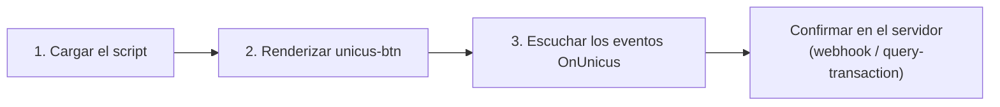

# Inicio rápido


**Próximamente.** Web SDK 5.0 aún no está disponible en producción. Tekbees
anunciará la fecha de lanzamiento. En esa fecha Web SDK 4.x deja de funcionar y
todas las integraciones ejecutan 5.0, incluidas las páginas que todavía cargan
la URL actual del script. Mientras tanto, solicita a Tekbees acceso al ambiente
de pruebas (sandbox) para prepararte.




## 1. Carga el script

Agrega el script una sola vez por página, con `defer`. Es liviano y registra el
elemento `<unicus-btn>`.


```html
<script src="https://unicusbtn.idunicus.com/v5/sdkButton.js" defer></script>
```


La ruta `/v5/` recibe actualizaciones compatibles de forma automática
(corrección de errores, nuevos atributos opcionales). Un cambio incompatible se
publicará bajo una ruta nueva.

## 2. Renderiza el botón


```html
<unicus-btn
  id="unicus-verification"
  customerid="<CUSTOMER_TOKEN>"
  transactiontype="enrollment-verify"
  clientid="ID:123456789">
</unicus-btn>
```


<figure><figcaption><p>El botón en una página, con el color de la empresa: por defecto, y grande con un texto del botón personalizado y esquinas cuadradas.</p></figcaption></figure>

* `customerid`: el Customer Token de tu empresa (Compañía → Configuraciones en el
  portal administrativo).
* `transactiontype`: `enrollment-verify` enrola a la persona si Unicus aún no
  la conoce y la verifica si ya la conoce. `liveness` ejecuta un flujo solo de
  prueba de vida y no necesita `clientid`.
* `clientid`: tipo y número de documento separados por `:` (`ID`, `FD`, `PP`,
  `DL`). Obligatorio para `enrollment-verify`; sin un número después de `:` el
  botón pasa a *Reintentar* y emite `OnUnicus:error`.

El botón crea la transacción en cuanto está en la página. En la primera visita
se pinta en un color neutro hasta que Unicus responde con los colores de tu
empresa; luego los colores se recuerdan en el navegador (`localStorage`), de
modo que las visitas siguientes muestran el color de la marca desde el primer
pintado. Un clic abre la verificación; si el usuario hace clic mientras la
transacción todavía se está creando, el flujo se abre en cuanto está listo.

Para evitar un salto en el diseño mientras se carga el script, reserva el
espacio del botón en tu hoja de estilos:


```css
unicus-btn:not(:defined) { display: inline-block; min-width: 200px; height: 48px; }
```


## 3. Escucha los eventos


```html
<script>
  const button = document.querySelector('#unicus-verification');

  button.addEventListener('OnUnicus:loaded', ({ detail }) => {
    // Transacción creada. Guarda el id para correlacionar el webhook después.
    console.log('tid', detail.transaction.transactionId);
  });

  button.addEventListener('OnUnicus:details', ({ detail }) => {
    // Solo progreso (paso iniciado, completado, reintentado, fallido). Nunca el resultado final.
    console.log('step', detail.transaction.state);
  });

  button.addEventListener('OnUnicus:finished', ({ detail }) => {
    const { success, resultCode } = detail.transaction.state;
    if (success) {
      // Continúa tu proceso. Confírmalo con tu webhook o con query-transaction.
    } else if (resultCode === 2013) {
      // Completada, pendiente de revisión manual en Unicus.
    } else {
      // La verificación falló; muestra una opción de reintento.
    }
  });

  button.addEventListener('OnUnicus:exit', () => {
    // El usuario cerró la verificación antes de un estado final.
  });

  button.addEventListener('OnUnicus:error', ({ detail }) => {
    // No se pudo crear la transacción, o el flujo se detuvo en una pantalla de error
    // (en ese caso la verificación sigue abierta y luego llega OnUnicus:exit).
    console.error(detail.message, detail.resultCode);
  });
</script>
```


Los eventos se propagan (bubble), así que también puedes escucharlos en
`document`: `document.addEventListener('OnUnicus:finished', handler)`.

## Ejemplo HTML completo


```html
<!doctype html>
<html lang="es">
  <head>
    <meta charset="utf-8" />
    <meta name="viewport" content="width=device-width, initial-scale=1" />
    <script src="https://unicusbtn.idunicus.com/v5/sdkButton.js" defer></script>
  </head>
  <body>
    <h1>Verifica tu identidad</h1>

    <unicus-btn
      id="unicus-verification"
      customerid="<CUSTOMER_TOKEN>"
      transactiontype="enrollment-verify"
      clientid="ID:123456789"
      language="es">
    </unicus-btn>

    <p id="status"></p>

    <script>
      const button = document.querySelector('#unicus-verification');
      const status = document.querySelector('#status');
      let tid = null;

      button.addEventListener('OnUnicus:loaded', ({ detail }) => {
        tid = detail.transaction.transactionId;
      });

      button.addEventListener('OnUnicus:finished', async ({ detail }) => {
        const { success, resultCode } = detail.transaction.state;
        status.textContent = success
          ? 'Identidad verificada.'
          : resultCode === 2013
            ? 'Verificación en revisión.'
            : 'No pudimos verificar tu identidad. Inténtalo de nuevo.';
        // Resultado oficial: consulta a tu backend, que consulta a Unicus con el tid.
        await fetch('/api/verification/' + tid + '/refresh', { method: 'POST' });
      });

      button.addEventListener('OnUnicus:error', ({ detail }) => {
        status.textContent = 'La verificación no está disponible en este momento.';
        console.error('Unicus', detail);
      });
    </script>
  </body>
</html>
```


## Renderizar el botón desde JavaScript

El elemento se puede crear de forma dinámica. Define los atributos antes de
agregarlo al DOM para que la transacción se cree una sola vez.


```js
const button = document.createElement('unicus-btn');
button.setAttribute('customerid', customerToken);
button.setAttribute('transactiontype', 'enrollment-verify');
button.setAttribute('clientid', `ID:${documentNumber}`);
button.addEventListener('OnUnicus:finished', onFinished);
container.appendChild(button);
```


Cambiar `customerid`, `clientid`, `transactiontype` o `data-flow-id` en un botón
ya renderizado descarta la transacción actual y crea una nueva.

## Volver a empezar

No necesitas crear la transacción tú mismo para que el usuario vuelva a
intentarlo:

* Después de `OnUnicus:finished`, el siguiente clic (o `button.open()`) crea una
  transacción **nueva**, emite `OnUnicus:loaded` con el nuevo `tid` y abre el
  flujo.
* Después de `OnUnicus:exit`, el siguiente clic **retoma** la misma transacción
  mientras siga abierta: el usuario continúa donde iba, sin repetir los pasos
  ya hechos. `OnUnicus:loaded` se emite de nuevo con el mismo `tid`. Si la
  transacción ya venció, se crea una nueva.
* Después de un `OnUnicus:error` del botón (estado `error`, texto del botón
  *Reintentar*), un clic o `button.open()` reintenta la creación.
* Un botón cuyo estado es `no_flow` no se abre. Corrige la asignación del flujo
  en el portal y luego recarga la página o renderiza un elemento nuevo.

Recargar tu página mientras la verificación está abierta la cierra: ni
`finished` ni `exit` llegan a la página recargada. El botón de la página
recargada retoma la misma transacción mientras siga abierta (mismo `tid`), así
que el usuario continúa donde iba; si venció, se crea una nueva. El botón
recuerda la transacción abierta en el navegador, así que esto funciona solo en
el mismo navegador. Tu webhook o
[Consultar el estado de una transacción](transaction-status.md) siempre tienen
el resultado final.

## Notas para frameworks

### Aplicaciones de una sola página

* Mantén el elemento montado mientras la verificación está abierta. Quitarlo
  del DOM (cambio de ruta, renderizado condicional, una lista con nuevas keys)
  cierra la verificación **sin** `OnUnicus:finished` ni `OnUnicus:exit`; el
  siguiente clic en un botón montado de nuevo retoma la misma transacción
  mientras siga abierta.
* No cambies `customerid`, `clientid`, `transactiontype` ni `data-flow-id`
  mientras la verificación está abierta: cada cambio crea una transacción nueva.
* Volver a renderizar con los mismos valores de atributos no hace nada: la
  transacción se conserva.
* Asocia los listeners al elemento (o a `document`) y quítalos cuando el
  componente se desmonte.

### React


```jsx
import { useEffect, useRef } from 'react';

export function UnicusButton({ customerToken, documentNumber, onFinished }) {
  const ref = useRef(null);

  useEffect(() => {
    const el = ref.current;
    if (!el) return;
    const handler = (event) => onFinished(event.detail.transaction.state);
    el.addEventListener('OnUnicus:finished', handler);
    return () => el.removeEventListener('OnUnicus:finished', handler);
  }, [onFinished]);

  return (
    <unicus-btn
      ref={ref}
      customerid={customerToken}
      transactiontype="enrollment-verify"
      clientid={`ID:${documentNumber}`}
    />
  );
}
```


Con TypeScript, declara el elemento una sola vez:


```ts
declare module 'react' {
  namespace JSX {
    interface IntrinsicElements {
      'unicus-btn': React.DetailedHTMLProps<React.HTMLAttributes<HTMLElement>, HTMLElement> & {
        customerid: string;
        transactiontype: 'enrollment-verify' | 'liveness';
        clientid?: string;
        language?: 'es' | 'en';
        label?: string;
        size?: 'lg';
        radius?: string;
        'data-flow-id'?: string;
        disabled?: boolean;
      };
    }
  }
}
```


### Vue 3

Indícale al compilador que `unicus-btn` es un custom element:


```js
// vite.config.js
import vue from '@vitejs/plugin-vue';

export default {
  plugins: [
    vue({ template: { compilerOptions: { isCustomElement: (tag) => tag === 'unicus-btn' } } }),
  ],
};
```


### Angular

Agrega `CUSTOM_ELEMENTS_SCHEMA` al módulo o al componente standalone que
renderiza el botón, y asocia los listeners con `@ViewChild` + `addEventListener`.
