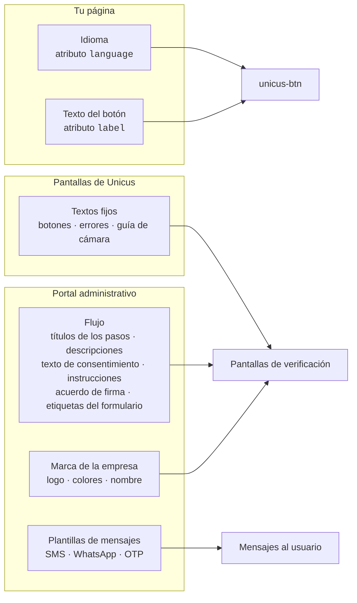

# Textos e idiomas

Nada en la página del cliente controla la redacción de las pantallas de
verificación. Los textos viven con el flujo en el portal administrativo, de modo
que la misma página puede servir a distintos productos, empresas o campañas con
sus propios textos.

## De dónde viene cada texto

| Texto | Dónde cambiarlo | Idiomas |
| --- | --- | --- |
| Texto del botón | Atributo `label` de `<unicus-btn>` (por defecto "Validar identidad" / "Verify identity"). | Por página. |
| Nombre, logo y colores de la empresa | Portal → Compañía → Configuraciones. | — |
| Título y descripción del paso | Portal → editor de flujos, en cada paso. Se muestran como encabezado de la pantalla, en el espejo del computador y en la lista de progreso. | Campos en español e inglés; un único valor se usa para ambos. |
| Texto de consentimiento y enlace al aviso de privacidad | Editor de flujos, paso `consent`. Cuando el texto de consentimiento se deja vacío, se muestra el texto por defecto de Unicus con el nombre de tu empresa (pide autorización para tratar datos biométricos solo si el flujo tiene pasos con cámara; si no, datos personales); cuando el enlace de privacidad se deja vacío (o no es una dirección `https://`), se enlaza la política de privacidad de Tekbees, en el idioma del usuario. La lista de lo que se capturará se genera a partir de los pasos del flujo. | Español e inglés. |
| Instrucciones antes de la cámara | Editor de flujos, paso `info` (elementos con viñetas). | Español e inglés. |
| Acuerdo mostrado con la firma electrónica | Editor de flujos, paso `signature`: texto del acuerdo y una URL opcional de un documento para mostrar. | Español e inglés. |
| Etiquetas de los campos y de las opciones del formulario | Editor de flujos, paso `form`. | Español e inglés. |
| Mensajes de OTP, SMS y WhatsApp | Plantillas de Unicus por empresa; WhatsApp usa una plantilla aprobada. Solicita los cambios a través del soporte de Tekbees. | Según el idioma del mensaje. |
| Textos fijos de la interfaz (botones, guía de cámara, pantallas de error, pantallas de resultado) | Mantenidos por Unicus en español e inglés. | — |

Un texto que se deja vacío en el flujo usa el texto por defecto de Unicus para
ese paso.

## Cómo se elige el idioma

1. El atributo `language` del botón, cuando está presente (`es`, `en` o una
   variante regional como `en-US`). Cualquier otro valor significa español.
2. Si no, el idioma del navegador, cuando es uno de los compatibles.
3. Si no, español.

Se usa el mismo idioma para el texto del botón y para las pantallas de
verificación.

El usuario puede cambiar entre español e inglés con el selector de la barra
superior de las pantallas de los pasos, de las opciones de traspaso al celular
(hand-off) y de las pantallas de error; la elección se aplica a los textos de
las pantallas y a los textos del flujo, y viaja con el enlace cuando el flujo
continúa en el celular. La guía de la cámara toma el idioma activo en el momento
en que se abre la cámara. Los mensajes enviados al celular (SMS, WhatsApp, OTP)
usan el idioma activo en el momento del envío. El selector no cambia el texto
del botón en tu página.


Los textos del flujo aceptan un único valor o un valor por idioma. Cuando solo
se entrega un valor, se muestra tal cual en ambos idiomas (un texto llenado solo
en español se muestra en español también a los usuarios en inglés), así que
conviene llenar ambos cuando tus usuarios mezclan idiomas.


## Ejemplo

Un flujo para una solicitud de crédito podría definir:

| Paso | Título (es / en) | Descripción (es / en) |
| --- | --- | --- |
| consent | Confirma tu identidad / Confirm your identity | Te tomará menos de dos minutos / It takes less than two minutes |
| document | Tu cédula / Your ID | Frente y reverso, sin reflejos / Front and back, no glare |
| form | Datos de contacto / Contact details | Para enviarte la respuesta / So we can send you the answer |

Los mismos títulos aparecen en las pantallas del celular y en la lista de
progreso del computador mientras el usuario completa los pasos en el celular.
