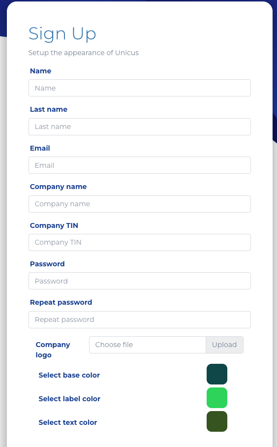

# Sign up

To create an account in the administrative portal, enter the URL: [Unicus Admin Panel](https://dev-app.idunicus.com/#/sign-up) . Once there you will enter the personal data about the creator and the company you are registering.

<figure><figcaption></figcaption></figure>

Once the data is automatically validated, a box will appear on the screen to continue the process and enter the platform.

