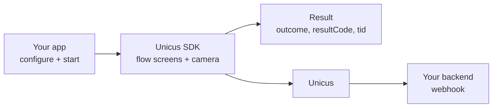

# Android integration


**Coming soon.** The Unicus mobile SDKs are not yet available in production.
Today only the **DEV** environment is available; STAGING and PRODUCTION answer
`environment_not_available`. Tekbees will announce the production release.
Until then, ask Tekbees for a DEV Customer Token and the SDK package to
prepare.


The Unicus Android SDK runs a complete identity verification inside your native
Android app. Your app passes the user's document and your Customer Token; the
SDK creates the transaction, applies your company branding, runs the flow
assigned in the administrative portal (consent, forms, camera steps, signature,
OTP…), and returns one result object with the transaction id (`tid`). The
biometric engine is embedded: your app never imports engine APIs, never
forwards `onActivityResult` and never handles the camera permission itself.
Your backend confirms the result with the [webhook](../sdk-web-v5/webhooks.md)
or [Get a transaction status](../sdk-web-v5/transaction-status.md).

## Pages in this section

| Page | What you find |
| --- | --- |
| [Quick start](android/quick-start.md) | Dependency, configuration, start and result in a few lines. |
| [Installation](android/installation.md) | Package contents, Gradle setup, permissions, R8. |
| [Configuration](android/configuration.md) | Every `UnicusSdkConfig` option, environments, logging, branding. |
| [Start a verification](android/start-a-verification.md) | Document, country selection, existing transaction, location, cancelling, threading. |
| [Results and events](android/results-and-events.md) | Result fields, outcome handling, progress events, API logs. |
| [Custom UI steps](android/custom-ui-steps.md) | Your own screens for consent, form, signature, OTP and document signing. |
| [Texts and languages](android/texts-and-languages.md) | `Unicus_*` text keys and the languages of each screen. |
| [Release checklist](android/release-checklist.md) | What to check before going live. |

Shared by every mobile SDK: [Overview](overview.md),
[Flows and UI steps](flows-and-ui-steps.md),
[Results and resuming](results-and-resuming.md),
[Result codes](result-codes.md),
[Errors and troubleshooting](errors-and-troubleshooting.md),
[Compatibility and security](compatibility-and-security.md),
[Versioning](versioning.md) and [Support](support.md).

## Requirements

| Item | Requirement |
| --- | --- |
| Android | `minSdk 21` or newer. |
| Build | `compileSdk 34` or newer, Android Gradle Plugin 8.x or 9.x, Java 17 toolchain, AndroidX. |
| Language | Kotlin (Kotlin Gradle plugin 2.0 or newer) or Java only. Coroutine variants for Kotlin, callbacks for both. |
| Flow screens (WebView mode) | Android System WebView (Chromium) 90 or newer. |
| Device | Physical device with a camera for end-to-end tests. |
| Permissions | `CAMERA` and `INTERNET`, added by the SDK. Location is optional. |
| Credentials | Your company's [Customer Token](../sdk-web-v5/customer-token.md) for the environment. Nothing else: the SDK embeds its own keys. |
| Portal | A flow assigned to your company (otherwise `transaction_refused` with `2002`). |

Distribution today: a ZIP package delivered by Tekbees with a local Maven
repository. A hosted Maven repository is coming soon.
