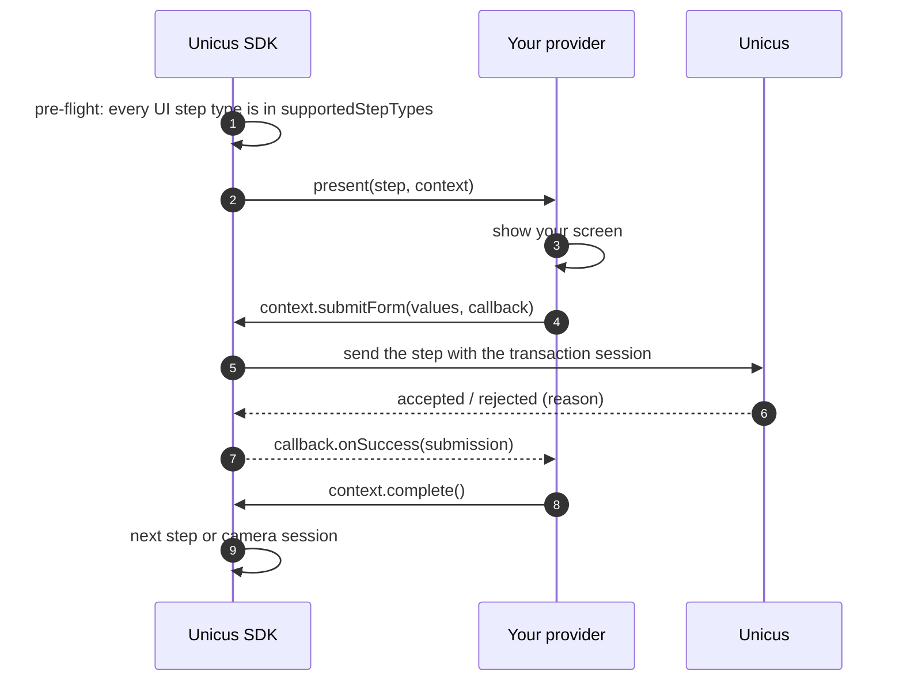
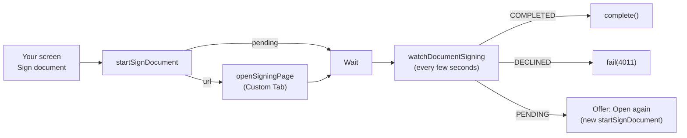

# Custom UI steps

By default the SDK shows the non-biometric steps of the flow (consent, info,
form, handwritten signature, OTP, document signing) with the Unicus flow
screens in a secured WebView. With `UnicusUiStepMode.Custom` your app renders
them with its own screens instead, and the SDK still makes every call to Unicus.
The camera steps (liveness, document, face match) always run in the SDK.

Use Custom mode when your security policy does not allow a WebView, when you
need certificate pinning on every screen, or when the steps must look exactly
like the rest of your app. Otherwise keep the default WebView mode: new step
types and wording changes then need no app release. See
[Flows and UI steps](../flows-and-ui-steps.md).



## Turn it on




```kotlin
UnicusSdk.shared.configure(
    UnicusSdkConfig(apiKey = "<CUSTOMER_TOKEN>", environment = UnicusEnvironment.DEV)
        .copy(uiStepMode = UnicusUiStepMode.Custom(MyStepProvider(stepScreens)))
)
```





```java
UnicusSdk.getShared().configure(
    new UnicusSdkConfig.Builder("<CUSTOMER_TOKEN>", UnicusEnvironment.DEV)
        .uiStepMode(new UnicusUiStepMode.Custom(new MyStepProvider(stepScreens)))
        .build());
```




The provider lives as long as the configuration. Do not keep an `Activity` in
it: open your screens through your own navigation layer (`stepScreens` in the
examples) from the activity that is in the foreground.

Before showing anything, the SDK checks that every UI step of the flow is in
`supportedStepTypes`. If one is not, `start` fails with `flow_not_supported`
(`9020`) and the transaction is closed: nothing fails in the middle of a flow.

## The provider


```kotlin
import com.tekbees.unicus.sdk.*
import com.tekbees.unicus.sdk.model.*

class MyStepProvider(private val screens: StepScreens) : UnicusUiStepProvider {

    override val supportedStepTypes = setOf(
        UnicusFlowStepType.CONSENT,
        UnicusFlowStepType.INFO,
        UnicusFlowStepType.FORM,
        UnicusFlowStepType.SIGNATURE,
        UnicusFlowStepType.OTP,
        UnicusFlowStepType.SIGN_DOCUMENT
    )

    override fun present(step: UnicusFlowStep, context: UnicusStepContext) {
        when (step.type) {
            UnicusFlowStepType.CONSENT -> presentConsent(step, context)
            UnicusFlowStepType.INFO -> presentInfo(step, context)
            UnicusFlowStepType.FORM -> presentForm(step, context)
            UnicusFlowStepType.SIGNATURE -> presentSignature(step, context)
            UnicusFlowStepType.OTP -> presentOtp(step, context)
            UnicusFlowStepType.SIGN_DOCUMENT -> presentSignDocument(step, context)
        }
    }

    // The app called cancelActiveSession while this step was shown: close your screen.
    override fun dismiss(step: UnicusFlowStep) = screens.close()

    private fun text(value: Any?, context: UnicusStepContext): String? =
        UnicusLocalizedText.from(value)?.resolve(context.language)
}
```


What the provider receives:

| Member | Description |
| --- | --- |
| `step.id`, `step.type` | Step id in the flow and its type (`UnicusFlowStepType`). |
| `step.title`, `step.description` | Texts written in the portal (`UnicusLocalizedText`, resolve them with `context.language`). |
| `step.required` | `false` lets the flow continue when the step fails. |
| `step.config` | Step configuration from the portal (raw map, keys below). |
| `context.tid`, `context.flowId` | Transaction and flow. |
| `context.language` | `es` or `en`, from the device language. |
| `context.theme` | Company colours (`windowColor`, `buttonColor`, `textColor`, `backgroundColor`). |

Configuration keys per step type (as composed in the portal):

| Type | `step.config` keys |
| --- | --- |
| `consent` | `text` (localized), `privacyUrl` |
| `info` | `items` (list of localized texts) |
| `form` | `fields`: list of `name`, `label` (localized), `type` (`text`, `email`, `tel`, `number`, `date`, `select`), `required`, `options`, `pattern` |
| `signature` | `agreementText` (localized), `minStrokes`, `documentUrl` |
| `otp` | `channel` (`sms`, `whatsapp`, `email`), `length`, `destinationMasked`, `askDestination`, `resendAfterSeconds` |
| `sign_document` | Typed in `step.signDocumentConfig`: `templateName`, `lockData`, `signer`, `fields` |

## Rules

* `present` is called on the main thread, once per step, in flow order.
* End every step with **exactly one** of:
  * `context.complete()`: the step is done, the SDK continues.
  * `context.fail(resultCode)`: the step failed. A required step ends the flow
    with that code; an optional one is skipped.
  * `context.cancel()`: the user left. Not a cancellation: `start` ends with
    `2003` `RESUMABLE` and the transaction can be resumed.
* Every context callback runs on the main thread. `onSuccess` with
  `accepted == false` is a **rejection** by Unicus with a typed `rejection`:
  let the user correct and submit again. `onError` means the call itself
  failed (network, session): offer to try again.
* After `cancelActiveSession`, the SDK calls `dismiss(step)` and ignores later
  calls on that context.
* The SDK sends the data with the transaction session. You never call Unicus
  directly and never handle tokens.

## Consent

Send the **exact text the user saw**, in `context.language`:


```kotlin
private fun presentConsent(step: UnicusFlowStep, context: UnicusStepContext) {
    val consentText = text(step.config["text"], context) ?: screens.defaultConsentText(context.language)
    val privacyUrl = step.config["privacyUrl"] as? String
    screens.showConsent(consentText, privacyUrl,
        onAccept = {
            context.recordConsent(consentText, privacyUrl, unicusCallback(
                onError = { screens.showRetry(it) },
                onSuccess = { if (it.accepted) context.complete() else screens.showRejection(it.rejection) }
            ))
        },
        onLeave = { context.cancel() })
}
```


## Info


```kotlin
private fun presentInfo(step: UnicusFlowStep, context: UnicusStepContext) {
    val items = (step.config["items"] as? List<*>).orEmpty().mapNotNull { text(it, context) }
    screens.showInfo(step.title?.resolve(context.language), items, onContinue = {
        context.recordInfo(unicusCallback(
            onError = { screens.showRetry(it) },
            onSuccess = { if (it.accepted) context.complete() else screens.showRejection(it.rejection) }
        ))
    })
}
```


## Form

Values are sent by field `name`. A `FORM_INVALID` rejection gives the fields to
fix (`field name → REQUIRED`, `INVALID_TYPE`…):


```kotlin
private fun presentForm(step: UnicusFlowStep, context: UnicusStepContext) {
    val fields = (step.config["fields"] as? List<*>).orEmpty().filterIsInstance<Map<*, *>>()
    screens.showForm(fields, context.language, onSubmit = { values: Map<String, String> ->
        context.submitForm(values, unicusCallback(
            onError = { screens.showRetry(it) },
            onSuccess = { answer ->
                when {
                    answer.accepted -> context.complete()
                    answer.rejection?.kind == UnicusStepRejectionKind.FORM_INVALID ->
                        screens.showFieldErrors(answer.rejection!!.fields)
                    else -> screens.showRejection(answer.rejection)
                }
            }
        ))
    })
}
```


## Handwritten signature

Send a PNG of at most 1 MB, the number of strokes and the agreement text as
shown:


```kotlin
private fun presentSignature(step: UnicusFlowStep, context: UnicusStepContext) {
    val agreement = text(step.config["agreementText"], context)
    screens.showSignaturePad(agreement, onDone = { png: ByteArray, strokes: Int ->
        context.submitSignature(png, strokes, agreement, unicusCallback(
            onError = { screens.showRetry(it) },
            onSuccess = { answer ->
                // SIGNATURE_INVALID: answer.rejection?.field says what to fix (for example "strokes")
                if (answer.accepted) context.complete() else screens.showRejection(answer.rejection)
            }
        ))
    })
}
```


## OTP

Ask for the phone or e-mail only when `askDestination` is `true`. Codes are
never resent or re-verified automatically:


```kotlin
private fun presentOtp(step: UnicusFlowStep, context: UnicusStepContext) {
    val askDestination = step.config["askDestination"] == true
    screens.showOtp(askDestination,
        onSend = { destination: String? ->
            context.sendOtp(if (askDestination) destination else null, unicusCallback(
                onError = { screens.showRetry(it) },
                onSuccess = { sent ->
                    when {
                        sent.alreadyVerified -> context.complete()
                        sent.sent -> screens.showCodeInput(sent.destinationMasked)
                        // OTP_RESEND_TOO_SOON: sent.rejection.seconds to wait
                        else -> screens.showRejection(sent.rejection)
                    }
                }
            ))
        },
        onCode = { code: String ->
            context.verifyOtp(code, unicusCallback(
                onError = { screens.showRetry(it) },
                onSuccess = { answer ->
                    when {
                        answer.accepted -> context.complete()
                        // 4001 attempts exhausted, step out of order...: end the step
                        answer.isTerminal ->
                            context.fail(answer.resultCode ?: UnicusResultCode.ATTEMPTS_EXHAUSTED)
                        else -> screens.showWrongCode(answer.attemptsLeft)   // OTP_INVALID_CODE
                    }
                }
            ))
        },
        onLeave = { context.cancel() })
}
```


## Document signing (`sign_document`)

The document is signed in the Unicus Sign page, opened in the system browser
(Custom Tabs, never a WebView). Unicus reads the outcome from Unicus Sign; your
screen only opens the page and watches the status.




```kotlin
private var signWatch: UnicusSignWatch? = null

private fun presentSignDocument(step: UnicusFlowStep, context: UnicusStepContext) {
    val config = step.signDocumentConfig
    screens.showSignDocument(config?.templateName,
        onSign = { activity -> openSigning(activity, context) },   // also "Open again"
        onForeground = { signWatch?.checkNow() },
        onDestroy = { signWatch?.stop() },
        onLeave = { signWatch?.stop(); context.cancel() })

    signWatch = context.watchDocumentSigning(object : UnicusSignWatchListener {
        override fun onStatus(check: UnicusSignStatusCheck) {
            when (check.status) {
                UnicusSignStatus.COMPLETED -> context.complete()          // already recorded by Unicus
                UnicusSignStatus.DECLINED -> context.fail(UnicusResultCode.SIGN_DECLINED)
                UnicusSignStatus.PENDING -> screens.showOpenAgain()
                UnicusSignStatus.NOT_STARTED -> Unit
                null -> check.rejection?.let {                             // for example STEP_OUT_OF_ORDER
                    context.fail(check.resultCode ?: UnicusResultCode.STEP_REJECTED)
                }
            }
        }
        override fun onError(error: UnicusSdkException) { /* network: the watch keeps polling */ }
    })
}

private fun openSigning(activity: Activity, context: UnicusStepContext) {
    context.startSignDocument(unicusCallback(
        onError = { screens.showRetry(it) },
        onSuccess = { start ->
            val url = start.url
            when {
                start.started && url != null -> context.openSigningPage(activity, url)
                start.pending -> screens.showWaitingForSignature()          // already signed
                // SIGN_EMAIL_MISSING, SIGN_NOT_CONNECTED, STEP_NOT_AVAILABLE: configuration of the company
                // SIGN_SERVICE_UNAVAILABLE (4014): temporary, offer to try again
                else -> screens.showSignProblem(start.rejection?.kind)
            }
        }
    ))
}
```


* The signing link is single-use and short-lived. To open the page again, call
  `startSignDocument` again; never reuse an old `url`.
* `openSigningPage` opens only `https` links and returns `false` when no app can
  open them.
* Call `checkNow()` when your screen returns to the foreground (the user comes
  back from the browser) and `stop()` when it is destroyed.
* `signDocumentStatus(callback)` does one status check if you prefer to poll
  yourself; a call rejected by Unicus arrives as `onError` with code
  `sign_status_rejected`: end the step with `fail(...)`.
* Each answer also emits the `stepProgress` event (see
  [Results and events](results-and-events.md#events)).

## Java

The same API is available from Java:


```java
public class MyStepProvider implements UnicusUiStepProvider {
    private final StepScreens screens;

    public MyStepProvider(StepScreens screens) { this.screens = screens; }

    @Override public Set<String> getSupportedStepTypes() {
        return new HashSet<>(Arrays.asList(UnicusFlowStepType.CONSENT, UnicusFlowStepType.FORM));
    }

    @Override public void present(UnicusFlowStep step, UnicusStepContext context) {
        if (UnicusFlowStepType.FORM.equals(step.getType())) {
            screens.showForm(step, values -> context.submitForm(values,
                new UnicusCallback<UnicusStepSubmission>() {
                    @Override public void onSuccess(UnicusStepSubmission answer) {
                        if (answer.getAccepted()) context.complete();
                        else screens.showRejection(answer.getRejection());
                    }
                    @Override public void onError(UnicusSdkException error) { screens.showRetry(error); }
                }));
        } else {
            screens.showConsent(step, context);
        }
    }

    @Override public void dismiss(UnicusFlowStep step) { screens.close(); }
}
```


## Rejection reasons

`UnicusStepRejection.kind` values you will see most:

| Kind | Step | Extra data | What to do |
| --- | --- | --- | --- |
| `FORM_INVALID` | form | `fields` (name → `REQUIRED`, `INVALID_TYPE`…) | Mark the fields and let the user submit again. |
| `SIGNATURE_INVALID` | signature | `field` | Ask to sign again. |
| `OTP_RESEND_TOO_SOON` | otp | `seconds` | Wait before allowing "resend". |
| `OTP_INVALID_CODE` | otp | `attemptsLeft` in the submission | Let the user type again. |
| `OTP_EXPIRED`, `OTP_NOT_SENT` | otp | — | Offer to send a new code. |
| `OTP_DESTINATION_REQUIRED`, `OTP_DESTINATION_INVALID` | otp | — | Ask for a valid phone or e-mail. |
| `OTP_ATTEMPTS_EXHAUSTED` | otp | `resultCode` 4001 | `fail(4001)`. |
| `STEP_OUT_OF_ORDER`, `STEP_NOT_IN_FLOW`, `STEP_TYPE_MISMATCH`, `NO_FLOW` | any | `stepIds` | Terminal: `fail(resultCode)`. |
| `SIGN_EMAIL_MISSING`, `SIGN_NOT_CONNECTED`, `STEP_NOT_AVAILABLE` | sign_document | — | Company configuration: `fail(resultCode)` and contact Tekbees. |
| `SIGN_SERVICE_UNAVAILABLE` | sign_document | — | Temporary: offer to try again. |

`UnicusStepSubmission.isTerminal` is `true` when the step cannot be retried.
The full list of codes is in [Result codes](../result-codes.md).

Next: [Texts and languages](texts-and-languages.md).
