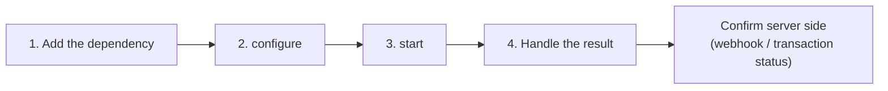

# Quick start


**Coming soon.** The Unicus mobile SDKs are not yet available in production.
Today only the **DEV** environment is available; STAGING and PRODUCTION answer
`environment_not_available`. Tekbees will announce the production release.
Until then, ask Tekbees for a DEV Customer Token and the SDK package to
prepare.




## 1. Add the dependency

Copy the `sdk/repo` folder of the package delivered by Tekbees into your
project (for example `vendor/unicus/repo`) and register it:


```kotlin
// settings.gradle.kts
dependencyResolutionManagement {
    repositories {
        google()
        mavenCentral()
        maven { url = uri(rootDir.resolve("vendor/unicus/repo")) }
    }
}
```



```kotlin
// app/build.gradle.kts
dependencies {
    implementation("com.tekbees.unicus:unicus-sdk:0.1.0")
}
```


`CAMERA` and `INTERNET` are merged from the SDK manifest. Location is optional
(see [Installation](installation.md#permissions)).

## 2. Configure

Call `configure` once, for example in `Application.onCreate`, with your
[Customer Token](../../sdk-web-v5/customer-token.md) and the environment:


```kotlin
UnicusSdk.shared.configure(
    UnicusSdkConfig(apiKey = "<CUSTOMER_TOKEN>", environment = UnicusEnvironment.DEV)
)
```


## 3. Start and handle the result




```kotlin
import com.tekbees.unicus.sdk.UnicusSdk
import com.tekbees.unicus.sdk.unicusCallback
import com.tekbees.unicus.sdk.model.*

val request = UnicusVerificationRequest.enrollmentVerify(
    UnicusDocument(UnicusDocumentType.ID, "123456789")
)

UnicusSdk.shared.start(activity, request, unicusCallback<UnicusVerificationResult>(
    onError = { error -> showError(error.code, error.message) },   // technical error, see Errors
    onSuccess = { result ->
        when (result.outcome) {
            UnicusVerificationOutcome.SUCCESS,
            UnicusVerificationOutcome.WARNING -> verified(result.tid)   // confirm in your backend
            UnicusVerificationOutcome.RESUMABLE -> pending(result.tid)  // 2003: start again to continue
            else -> notVerified(result.resultCode, result.rejectionReason)
        }
    }
))
```





```kotlin
import com.tekbees.unicus.sdk.UnicusSdk
import com.tekbees.unicus.sdk.start
import com.tekbees.unicus.sdk.model.*

lifecycleScope.launch {
    try {
        val result = UnicusSdk.shared.start(activity, request)
        handle(result)
    } catch (error: UnicusSdkException) {
        showError(error.code, error.message)
    }
}
```


Cancelling the coroutine cancels the verification it started.




```java
import com.tekbees.unicus.sdk.*;
import com.tekbees.unicus.sdk.model.*;

UnicusSdk.getShared().configure(new UnicusSdkConfig("<CUSTOMER_TOKEN>", UnicusEnvironment.DEV));

UnicusSdk.getShared().start(
    this,
    UnicusVerificationRequest.enrollmentVerify(new UnicusDocument(UnicusDocumentType.ID, "123456789")),
    new UnicusCallback<UnicusVerificationResult>() {
        @Override public void onSuccess(UnicusVerificationResult result) {
            switch (result.getOutcome()) {
                case SUCCESS:
                case WARNING: verified(result.getTid()); break;
                case RESUMABLE: pending(result.getTid()); break;
                default: notVerified(result.getResultCode(), result.getRejectionReason());
            }
        }
        @Override public void onError(UnicusSdkException error) {
            showError(error.getCode(), error.getMessage());
        }
    });
```




The SDK shows every screen: the flow screens configured in the portal and the
camera. Callbacks always arrive on the main thread.

## 4. What each outcome means

| `outcome` | Typical code | What to do |
| --- | --- | --- |
| `SUCCESS` | `2000` | Verified. Send `tid` to your backend and confirm with the webhook. |
| `WARNING` | `2013` | Completed with a warning (review). Treat according to your rules. |
| `RESUMABLE` | `2003` | The user left before finishing. Calling `start` again with the same document continues where they left off. |
| `FAILED` | `2052`, `6xxx`, `9010`… | Not verified. `rejectionReason` gives the machine-readable reason. |
| `CANCELED` | `2041`, `2051`, `2061`, `4001` | Cancelled, expired or out of attempts. Offer to start again. |
| `ERROR` | `2054`, `4014`, `9xxx` | Technical failure. When `isRetryable` is true, just try again. |


The result in the app is for the user's screen. **Grant access from your
backend**, using the [webhook](../../sdk-web-v5/webhooks.md) or
[Get a transaction status](../../sdk-web-v5/transaction-status.md) with the
`tid`.


## Next steps

* [Installation](installation.md): package contents, permissions, R8.
* [Configuration](configuration.md): every option.
* [Results and events](results-and-events.md) and
  [Result codes](../result-codes.md).
* [Errors and troubleshooting](../errors-and-troubleshooting.md).
* [Release checklist](release-checklist.md).
