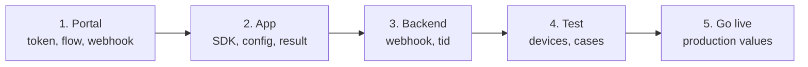

# Release checklist

Follow the steps in order. Do the tests in DEV first.

## 1. In the administrative portal

- [ ] Ask Tekbees for a DEV company, its
      [Customer Token](../../sdk-web-v5/customer-token.md) and the SDK package.
- [ ] Assign a **flow** enabled for mobile. Check it runs with your UI step
      mode (no camera-free document step, a face match only after a liveness).
      See [Flows and UI steps](../flows-and-ui-steps.md).
- [ ] Review the branding (colours) and add your logo as a drawable of the app
      (`setAndroidLogoResourceName`).
- [ ] Register your [webhook](../../sdk-web-v5/webhooks.md) URL and store the
      signing secret in your backend.

## 2. In your app

- [ ] The dependency resolves from the Unicus repository; `minSdk` ≥ 21,
      `compileSdk` ≥ 34. See [Installation](installation.md).
- [ ] `configure` runs once, before `start`, with the token injected per build
      type (not hard-coded in source control).
- [ ] Location: declared only if you need it, and reported in the Play Console
      *Data safety* form.
- [ ] `start` is called once per user action, never again on activity
      recreation; a second call while one runs gives `session_active`.
- [ ] Every `outcome` has a screen, including `RESUMABLE` (`2003`) and
      `isRetryable` errors. See [Results and events](results-and-events.md).
- [ ] Every `onError` shows a message and keeps `error.code` in your logs. See
      [Errors and troubleshooting](../errors-and-troubleshooting.md).
- [ ] The `tid` is sent to your backend; access is **granted by the backend**,
      not by the app callback.
- [ ] `clearResumeData(context)` is called on logout.
- [ ] `secureScreens = true` if your policy forbids screenshots.
- [ ] `enableApiLogging` is off in release builds and
      `includeSensitiveApiLogData` is never on.
- [ ] Custom mode only: every step type of the flow is in
      `supportedStepTypes`, each step ends with exactly one of `complete`,
      `fail` or `cancel`, and `dismiss` closes your screen. See
      [Custom UI steps](custom-ui-steps.md).
- [ ] The release build (R8 on) runs a full verification.

## 3. In your backend

- [ ] Store the `tid` with your user or case.
- [ ] Verify the webhook signature, deduplicate by event id, decide by the
      outcome of the webhook. See [Webhooks](../../sdk-web-v5/webhooks.md).
- [ ] Optional: reconcile transactions without a webhook with
      [Get a transaction status](../../sdk-web-v5/transaction-status.md).

## 4. Test on devices

Use physical devices: at least one with the oldest Android version you support
and one recent device.

| # | Case | Expected |
| --- | --- | --- |
| 1 | Complete the flow with a valid document. | `SUCCESS` (`2000`); webhook approved. |
| 2 | Deny the camera permission. | The SDK explains how to allow it; the result is typically `ERROR` (`9996`). |
| 3 | Close a flow screen and confirm leaving. | `RESUMABLE` (`2003`). |
| 4 | After case 3, call `start` again with the same document. | The flow continues where it was; `result.resumed` is `true`. |
| 5 | Cancel inside the camera. | `CANCELED` (`2041`) (or `2003` if Unicus keeps the flow open). |
| 6 | Call `cancelActiveSession` during the flow. | Screens close; `start` ends with `2041` or `2003`. |
| 7 | Rotate the device and send the app to the background during a flow screen. | The flow continues where the user was. |
| 8 | Turn on airplane mode during a flow screen. | The screen offers "try again"; `pageError` event. |
| 9 | Use a device with an outdated Android System WebView (WebView mode). | `webview_unavailable`; update WebView from Play Store. |
| 10 | Remove the flow assignment in the portal. | `onError` with `transaction_refused` and `resultCode` `2002`. |
| 11 | Configure `PRODUCTION` before it is announced. | `environment_not_available`. |
| 12 | Corporate devices: run case 1 under your MDM / VPN / RASP. | Same as case 1. See [Compatibility and security](../compatibility-and-security.md). |

## 5. Go live

PRODUCTION is not available yet. When Tekbees announces it:

- [ ] Update the SDK to the version that enables PRODUCTION (environments are
      embedded per SDK version). See [Versioning](../versioning.md).
- [ ] Use `UnicusEnvironment.PRODUCTION` and the production Customer Token,
      webhook URL and secret.
- [ ] Assign the flow(s) in the production company.
- [ ] Run case 1 in production with a real document.
- [ ] Keep the [Support](../support.md) contact at hand: send the `tid`, the
      platform, `UnicusSdk.shared.version` and sanitized logs.
