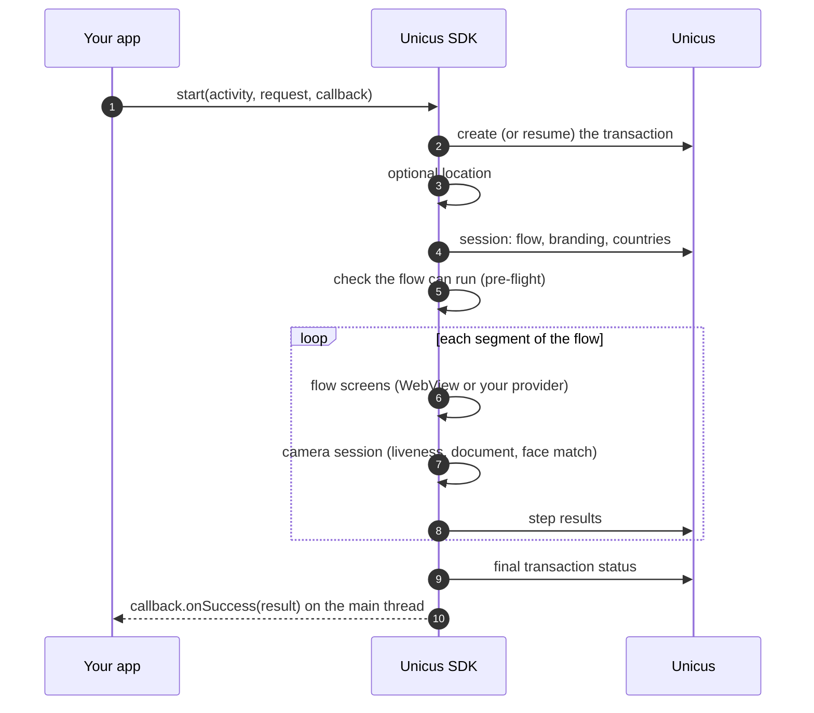

# Start a verification

## With the user's document

`enrollmentVerify` is the recommended start. Your app only passes the document
type and number: Unicus enrols the person if it does not know them and
verifies them if it does.


```kotlin
val request = UnicusVerificationRequest.enrollmentVerify(
    UnicusDocument(UnicusDocumentType.ID, "123456789")
)
UnicusSdk.shared.start(activity, request, callback)
```


| `UnicusDocumentType` | Code | Document |
| --- | --- | --- |
| `ID` | `ID` | National identity document. |
| `FOREIGN_DOCUMENT` | `FD` | Foreigner's identity document. |
| `PASSPORT` | `PP` | Passport. |
| `DRIVER_LICENSE` | `DL` | Driver's licence. |

What happens after `start`:



Before showing anything, the SDK checks that every pending step can run with
your [UI step mode](configuration.md#options). If not, `start` fails with
`flow_not_supported` and the transaction is closed. See
[Flows and UI steps](../flows-and-ui-steps.md).

## Choosing the country first

When your company has more than one active country, prepare the transaction,
let the user pick the country, then start. With a single active country the
SDK selects it and `requiresCountrySelection` is `false`.




```kotlin
import com.tekbees.unicus.sdk.prepareEnrollmentVerify
import com.tekbees.unicus.sdk.start

lifecycleScope.launch {
    try {
        val prepared = UnicusSdk.shared.prepareEnrollmentVerify(activity, document)
        val country = if (prepared.requiresCountrySelection) {
            pickCountry(prepared.countries.map { it.code })   // ISO-2 codes: "CO", "MX", ...
        } else {
            prepared.country
        }
        val result = UnicusSdk.shared.start(activity, prepared.toRequest(country))
        handle(result)
    } catch (error: UnicusSdkException) {
        showError(error)
    }
}
```





```java
UnicusSdk.getShared().prepareEnrollmentVerify(activity, document,
    new UnicusCallback<UnicusPreparedVerification>() {
        @Override public void onSuccess(UnicusPreparedVerification prepared) {
            String country = prepared.getRequiresCountrySelection()
                    ? pickCountry(prepared.getCountries())
                    : prepared.getCountry();
            UnicusSdk.getShared().start(activity, prepared.toRequest(country), resultCallback);
        }
        @Override public void onError(UnicusSdkException error) { showError(error); }
    });
```




`prepared.tid` is the transaction id; `prepared.resumed` is `true` when Unicus
continued an open transaction of the same person.

## On an existing transaction

To continue a transaction whose `tid` you already have (for example a
`RESUMABLE` result kept by your app), start it with `existingTransaction`:


```kotlin
UnicusSdk.shared.start(activity, UnicusVerificationRequest.existingTransaction(tid), callback)
```


The SDK continues at the first pending step. A transaction that no longer exists
or expired fails with `transaction_expired` (`2051`).

## Automatic resume

With `resumeOpenTransactions = true` (default) you do not need to keep the
`tid`. When the user leaves and your app later calls `start` with the **same
document**, the SDK continues the open transaction where the user left off,
as long as it has not expired (about 20 minutes without activity). The result
has `resumed = true` and the event `transactionResumed` is emitted.

The resume key is stored encrypted in your app's private storage. Call
`UnicusSdk.shared.clearResumeData(context)` when the user logs out. See
[Results and resuming](../results-and-resuming.md).

## Location

Location is optional metadata of the transaction (see
[Installation](installation.md#permissions)). Per request you can override the
configuration:


```kotlin
UnicusVerificationRequest.enrollmentVerify(document, collectLocation = false)
```


The SDK waits a bounded time for the location and then continues without it.
The events `locationCollected` or `locationSkipped` tell you which happened.

## Cancelling

Your app can cancel the running verification, for example when the user logs
out or a timer of yours expires:




```kotlin
UnicusSdk.shared.cancelActiveSession("User logged out")

// or, in a coroutine, wait until Unicus answered
// (import com.tekbees.unicus.sdk.awaitCancelActiveSession):
UnicusSdk.shared.awaitCancelActiveSession("User logged out")
```





```java
UnicusSdk.getShared().cancelActiveSession("User logged out");
```




The SDK closes its screens, runs nothing else, tells Unicus, and the `start`
callback receives the result: `2041` `CANCELED`, or `2003` `RESUMABLE` when
Unicus keeps open a flow that is already past its camera session. The callback
of `cancelActiveSession` runs after that result and never fails. Calling it
while `start` is still preparing ends `start` the same way, without showing
anything.

Cancelling the coroutine that called the `suspend` `start` also cancels the
verification.

Leaving is not cancelling:

| What happens | Result of `start` |
| --- | --- |
| The user closes a flow screen (and confirms), presses back on it, swipes the app away, or your custom provider calls `cancel()`. | `2003` `RESUMABLE`: the transaction stays open and can be resumed. |
| The user cancels inside the camera. | `2041` `CANCELED` (or `2003` if Unicus keeps the flow open). |
| Your app calls `cancelActiveSession`. | Same as a camera cancel. |

## Threading and lifecycle rules

* Every callback and listener runs on the **main thread**. Call the SDK from the
  main thread too (for example from a click handler).
* Only **one** verification runs at a time. A second `start` while one is
  active fails with `session_active`. `UnicusSdk.shared.isSessionActive` tells
  you whether one is running.
* Pass a live `Activity` to `start`. The SDK opens its own activities above it;
  you do not forward `onActivityResult` or permission results.
* Do not call `start` again when your activity is recreated (rotation, process
  restore): check `savedInstanceState == null` as the example app does. The SDK
  survives the recreation of its own screens and continues where the user was.
* The Android back button on a flow screen asks the user to confirm leaving;
  leaving gives `2003` `RESUMABLE`.

Next: [Results and events](results-and-events.md).
