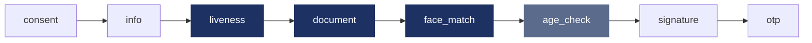

# Flows and UI steps

## Flows from the portal

The verification is a **flow**: an ordered list of steps that your company
composes in the Unicus administrative portal. The mobile SDKs run the same
flows as [Web SDK 5.0](../sdk-web-v5/flows-and-handoff.md). A change in the
portal applies to the next transaction without a new version of your app.

*Example flow. Dark steps run in one native camera session; the grey step is
answered by Unicus; the others are UI steps.*

On mobile the whole flow runs on the device. There is no hand-off to another
device.

## Step types

| Step type | What the user does | Kind |
| --- | --- | --- |
| `consent` | Reads what will be captured and why, and accepts. | UI |
| `info` | Reads instructions (good light, document at hand). | UI |
| `liveness` | Video selfie that proves a live person is present. | Camera |
| `document` | Photographs the front and back of the document. Server validations configured per flow (classifier, document number match, official registry, document material). | Camera |
| `face_match` | The selfie is compared with the document photo, or with the face enrolled earlier. | Camera |
| `age_check` | No screen: Unicus checks the age estimated from the selfie against the flow's threshold. | Server |
| `form` | Fills a data form defined in the portal. | UI |
| `signature` | Draws a signature on screen after reading the document shown. | UI |
| `otp` | Receives a one-time code by SMS, WhatsApp or e-mail and types it. | UI |
| `sign_document` | Signs a document in Unicus Sign. The signing page opens in the system browser sheet (Custom Tabs on Android, Safari view on iOS) and the flow continues when the signature is completed or declined. Requires Unicus Sign enabled for your company. | UI |

New UI step types added to the portal later run in WebView mode without an SDK
update.

## Segments

The SDK groups the pending steps into **segments** and runs them in order:

* consecutive camera steps form **one camera session**, so the user opens the
  camera once;
* consecutive UI steps open the flow screens once;
* an `age_check` is answered by Unicus with the camera session before it.

After each segment the SDK asks Unicus which steps are still pending. Progress
lives in Unicus, never on the device: a step cannot be skipped or submitted out
of order. When no step is pending, Unicus gives the final result.

## UI step modes

The configuration option `uiStepMode` decides how the UI steps are shown. The
camera steps always run in the native camera screens.

| Mode | UI steps | Platforms |
| --- | --- | --- |
| **WebView** (default) | The Unicus flow screens, in a locked-down WebView owned by the SDK, with a native top bar showing your company logo and a close button. | Android, iOS, Flutter |
| **Custom** | Your own native screens. The SDK tells you which step to show and makes the Unicus API calls for you. | Android and iOS only |
| **Disabled** | None. Only camera and server steps can run; a flow with any UI step fails before anything is shown. | Android, iOS, Flutter |

### WebView mode

The flow screens use the logo and colours of your company and the texts
configured per flow in the portal. The WebView loads only the Unicus flow app
domain of your environment, keeps no data after it closes and receives the
transaction session through a private channel with the SDK, never in a URL.

The close button and the Android back button ask the user to confirm. Leaving is
not a cancellation: the transaction stays open and can be resumed (see
[Results and resuming](results-and-resuming.md)).

### Custom mode

Use it when your security policy forbids WebViews, requires certificate pinning
on every screen, or when you want the UI steps to look exactly like your app.
Your app declares the step types it can render; the SDK checks the flow against
that list before showing anything. For each step your app shows its screen and
calls the SDK (record consent, submit the form, send and verify the OTP, start
the document signature) and then completes, fails or leaves the step.

* [Android: Custom UI steps](android/custom-ui-steps.md)
* [iOS: Custom UI steps](ios/custom-ui-steps.md)
* Flutter apps use WebView or Disabled mode; see
  [Flutter: UI steps](flutter/ui-steps.md).

### Disabled mode

For apps that only run biometric flows (for example liveness plus document
with face match). Any UI step in the assigned flow makes `start` fail with
`flow_not_supported`.

## Consent

The consent step runs when the flow includes it. Mobile transactions do not
require it by default. To always show a consent screen first, even when the
flow has none, set the configuration option `prependConsent` to `true`: the SDK
adds a consent step at the start of the flow (shown by the flow screens, or by
your Custom provider, which must then support `consent`).

## Flow rules for mobile

The SDK checks the whole pending flow **before showing anything**. When the flow
cannot run, `start` fails with the error `flow_not_supported`, Unicus closes the
transaction with result code `9020`, and no attempt is used.

| Rule | Why |
| --- | --- |
| A `face_match` needs a `liveness` step in the same camera group or earlier in the flow. | The match compares against the face captured by that liveness. |
| A `document` step cannot be alone in a camera group: combine it with `liveness`, or with `face_match` after an earlier liveness. | A document-only scan completes no step. |
| `liveness`, `document` and `face_match` are always required. | Enforced by Unicus, even if the flow marks them optional: a failed camera step ends the flow. |
| Every UI step must be supported by the configured `uiStepMode` (and by your Custom provider). | Otherwise the flow could stop halfway. |
| The flow must be published for the **mobile** channel. | In the portal a flow can be published for web, mobile or both (`flowChannels`). A web-only flow fails on mobile. |
| The flow format must be readable by this SDK version. | A newer flow format needs an SDK update. |

`9020` and `flow_not_supported` mean the same thing: fix the flow in the portal
or the `uiStepMode` of your app, then start a new verification.

## Progress events

The SDK reports the flow progress through its event listener: segment started
(UI, camera or server), step started, step completed, step failed, and
recoverable errors shown by a flow screen. Events carry the `stepId` and step
type, so your app can show progress for the steps that exist in your flow. See
the results and events page of your platform:
[Android](android/results-and-events.md), [iOS](ios/results-and-events.md),
[Flutter](flutter/results-and-events.md).
