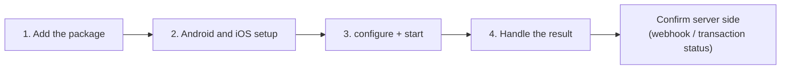

# Quick start


**Coming soon.** The Unicus mobile SDKs are not yet available in production.
Only the **DEV** environment is available today; `staging` and `production`
answer `environment_not_available`. Tekbees will announce the production
release.




## 1. Add the package

Copy the `sdk/unicus_sdk_flutter` folder of the package Tekbees delivered into
your repository (for example `vendor/unicus_sdk_flutter`) and reference it in
`pubspec.yaml`:


```yaml
dependencies:
  unicus_sdk_flutter:
    path: vendor/unicus_sdk_flutter
```


Run `flutter pub get`. There is no URL or key to look up: the SDK carries them
for each environment.

## 2. Android and iOS setup

* **Android:** `minSdk` 21, `compileSdk` 34 or higher, Android Gradle Plugin
  8.x or 9.x and Kotlin Gradle Plugin 2.0 or higher (Flutter 3.47 itself
  requires AGP 8.11.1 and Kotlin 2.2.20). The plugin adds the camera and
  internet permissions.
* **iOS:** deployment target 15.0 and a camera usage description in
  `ios/Runner/Info.plist`:


```xml
<key>NSCameraUsageDescription</key>
<string>We use the camera to verify your identity.</string>
```


To run Debug builds on a physical iPhone, add the Podfile helper described in
[Installation](installation.md#debug-builds-on-a-physical-iphone).

## 3. Configure and start


```dart
import 'package:unicus_sdk_flutter/unicus_sdk_flutter.dart';

final unicus = UnicusSdkFlutter();

Future<void> verify() async {
  await unicus.configure(const UnicusSdkConfig(
    apiKey: '<CUSTOMER_TOKEN>',
    environment: UnicusEnvironment.dev,
  ));
  try {
    final result = await unicus.start(const UnicusVerificationRequest.enrollmentVerify(
      document: UnicusDocument(type: UnicusDocumentType.id, externalDatabaseRefId: '123456789'),
    ));
    if (result.isResumable) {
      // 2003: the user left; calling start again with the same document continues.
    } else if (result.success) {
      // Verified. Send result.tid to your backend and confirm there.
    } else {
      // Not verified: result.outcome, result.resultCode, result.rejectionReason.
    }
  } on UnicusSdkException catch (e) {
    showError(e.code); // the verification could not run (see Errors and troubleshooting)
  }
}
```


`enrollmentVerify` enrols the person if Unicus does not know them yet and
verifies them if it does. Your app asks only for the document type and number.

## 4. Handle the result

| `result.outcome` | Code | What to do |
| --- | --- | --- |
| `success` | 2000 | Verified. Validate the `tid` in your backend. |
| `warning` | 2013 | Verified with a warning (possible duplicate). |
| `resumable` | 2003 | The user left or steps remain. Call `start` again with the same document. |
| `failed` | 2052, 4011, 6xxx… | Not verified. On 2052, `rejectionReason` says why. |
| `canceled` | 2041, 2051… | Cancelled, expired or out of attempts. Let the user start again. |
| `error` | 2054, 4014, technical 9xxx codes | Technical failure. When `isRetryable` is true, simply try again. |

**Resuming.** If the user leaves, the next `start` with the same document
continues where they left off (up to 20 minutes without activity):
`result.resumed` is `true`. Call `unicus.clearResumeData()` when the user logs
out. See [Results and resuming](../results-and-resuming.md).

The result in the app is for the user experience. Grant access from your
backend, with the [webhook](../../sdk-web-v5/webhooks.md) or
[Get a transaction status](../../sdk-web-v5/transaction-status.md).

## Run the example

The package includes the minimum integration in one file:


```bash
cd example
flutter pub get
flutter run -t lib/quick_start.dart --dart-define=UNICUS_API_KEY=<CUSTOMER_TOKEN>
```


## Next steps

* [Installation](installation.md): full Android and iOS setup.
* [Configuration](configuration.md): every option.
* [Results and events](results-and-events.md) and
  [Errors and troubleshooting](../errors-and-troubleshooting.md).
