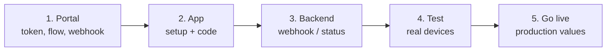

# Release checklist

Follow the steps in order. Run the tests on physical devices: the camera
screens do not run in emulators or simulators.

## 1. In the administrative portal

- [ ] Copy the [Customer Token](../../sdk-web-v5/customer-token.md) of each
      environment.
- [ ] Assign a **flow** to the `enrollment-verify` transaction type and enable
      it for mobile. Without it, `start` throws `transaction_refused` (2002)
      or `flow_not_supported` (9020). See
      [Flows and UI steps](../flows-and-ui-steps.md).
- [ ] Review the branding (logo and colours) and the flow texts in Spanish and
      English.
- [ ] Register your **webhook URL** and keep the signing secret in your
      backend. See [Webhooks](../../sdk-web-v5/webhooks.md).

## 2. In your app

- [ ] `unicus_sdk_flutter` from the package of the version you will ship
      (`path:` dependency committed or in your artifact repository).
- [ ] Android: `minSdk` 21+, `compileSdk` 34+, AGP and Kotlin Gradle Plugin at
      the versions your Flutter requires (Flutter 3.47: AGP 8.11.1+, Kotlin
      2.2.20+). See [Installation](installation.md).
- [ ] Android: location permissions declared only if you want location, and
      reported in Play Console's *Data safety*.
- [ ] iOS: `platform :ios, '15.0'`, `NSCameraUsageDescription` (and
      `NSLocationWhenInUseUsageDescription` if you want location), Podfile
      helper for Debug builds on a device.
- [ ] iOS: if the app uses `WKAppBoundDomains`, the flow screens domain is
      listed.
- [ ] The Customer Token is not hard-coded in source control and can be
      rotated.
- [ ] `configure` runs before `start`, with `environment` set; one
      `UnicusSdkFlutter` instance.
- [ ] Every `outcome` is handled, including `resumable` (2003); `isRetryable`
      offers a retry. See [Results and events](results-and-events.md).
- [ ] `UnicusSdkException` is caught and shown with your own message (not
      `e.message`). See
      [Errors and troubleshooting](../errors-and-troubleshooting.md).
- [ ] The `tid` is sent to your backend; access is not granted from the app
      result alone.
- [ ] `clearResumeData()` is called on logout.
- [ ] `enableApiLogging` and `includeSensitiveApiLogData` are off in release
      builds; `secureScreens` decided.
- [ ] Camera texts (`verificationTextOverrides`) in the languages of your app.

## 3. In your backend

- [ ] Webhook endpoint verifies the signature and deduplicates deliveries.
- [ ] The decision uses the webhook outcome (or
      [Get a transaction status](../../sdk-web-v5/transaction-status.md)) for
      the `tid` your app sent.

## 4. Test on real devices

Test on at least one Android phone and one iPhone, with signed builds (not
`--no-codesign`), in Debug and in Release.

| # | Case | Expected |
| --- | --- | --- |
| 1 | Complete the flow with a valid document. | `success` (2000); webhook approved; the transaction appears in the portal. |
| 2 | Same document a second time. | Verification (not enrolment) succeeds. |
| 3 | Leave a flow screen (back) halfway. | `resumable` (2003) with `resumeReason` `userLeft`. |
| 4 | Start again with the same document within 20 minutes. | `result.resumed` is `true`; it continues from the pending step. |
| 5 | Cancel inside the camera. | `canceled` (2041). |
| 6 | `cancelActiveSession()` from your app. | `canceled` (2041), or `resumable` (2003) after the camera session. |
| 7 | Deny the camera permission. | The verification does not succeed; your app explains how to allow the camera. |
| 8 | Deny location (if declared). | The verification continues without location. |
| 9 | Airplane mode before `start`. | `UnicusSdkException` `network_error`. |
| 10 | Several active countries (if applicable). | Your selector appears before the camera. |
| 11 | Device in Spanish and in English. | Flow screens and camera texts in the expected language. |
| 12 | Android with an outdated WebView (if you support old devices). | `webview_unavailable`, handled with your message. |
| 13 | Release build (R8 on Android, Release on iOS). | Same as case 1. |

## 5. Go live

- [ ] Update to the SDK version Tekbees announces for production and switch
      to `UnicusEnvironment.production` with the production Customer Token.
- [ ] Production webhook URL and secret configured.
- [ ] Run case 1 once in production with a real document.
- [ ] Keep [Errors and troubleshooting](../errors-and-troubleshooting.md) and
      [Support](../support.md) at hand.
