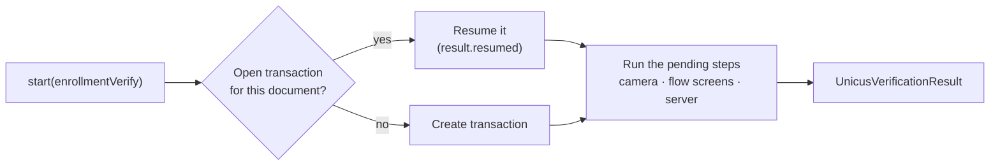

# Start a verification



## With a document (recommended)


```dart
final result = await unicus.start(
  const UnicusVerificationRequest.enrollmentVerify(
    document: UnicusDocument(
      type: UnicusDocumentType.id,
      externalDatabaseRefId: '123456789',
    ),
  ),
);
```


`enrollmentVerify` creates an `ENROLLMENT-VERIFY` transaction: Unicus enrols
the person if it does not know them and verifies them if it does, and runs the
flow assigned to your company in the portal. Ask the user only for the
document type and number.

| `UnicusDocumentType` | Code | Document |
| --- | --- | --- |
| `id` | `ID` | National identity document |
| `foreignDocument` | `FD` | Foreign document |
| `passport` | `PP` | Passport |
| `driverLicense` | `DL` | Driver licence |

`start` returns when the verification ends, with a
[result](results-and-events.md). It throws `UnicusSdkException` only when the
verification could not run (configuration, network, flow not supported…).

## Country selection

When your company has one active country, the SDK selects it. When it has
several, prepare the transaction first and let the user choose:


```dart
final prepared = await unicus.prepareEnrollmentVerify(
  document: const UnicusDocument(
    type: UnicusDocumentType.id,
    externalDatabaseRefId: '123456789',
  ),
);

final country = prepared.requiresCountrySelection
    ? await showCountryPicker(prepared.countries) // your own selector
    : prepared.country;

final result = await unicus.start(prepared.toRequest(country: country));
```


* `prepared.countries` lists the active countries (`UnicusCompanyCountry`,
  `code` is ISO 3166-1 alpha-2: `CO`, `MX`, `US`…). `prepared.defaultCountry`
  is a sensible preselection.
* `prepared.tid` is the transaction id; `prepared.resumed` is `true` when an
  open transaction of the same document was continued.
* `unicus.getCompanyCountries(tid: tid)` loads the active countries of any
  transaction.

## Existing transaction

Continue a transaction by its `tid`, for example one your backend created, or
one that ended as `resumable`:


```dart
final result = await unicus.start(
  UnicusVerificationRequest.existingTransaction(tid: tid),
);
```


With `resumeOpenTransactions` on (default) you do not need the `tid` to
resume: calling `start` again with the same document continues the open
transaction (up to 20 minutes without activity). Call
`unicus.clearResumeData()` when the user logs out, so the next user of the
device does not continue someone else's transaction. See
[Results and resuming](../results-and-resuming.md).

## Location

Location is optional metadata of the transaction. By default
(`collectLocationOnStart: true`) the SDK asks for it before starting, only if
your app declares the permission (Android manifest, iOS
`NSLocationWhenInUseUsageDescription`). If the permission is missing, denied
or the location services are off, the verification continues without it.

* Per request, `collectLocation: false` (or `true`) overrides the
  configuration.
* If your app already has the location, pass it as `location` (JSON text with
  `latitude`, `longitude`, `accuracy` and `timestamp`) with
  `collectLocation: false`.


```dart
final request = UnicusVerificationRequest.enrollmentVerify(
  document: document,
  collectLocation: false,
  location: jsonEncode({'latitude': 4.711, 'longitude': -74.072, 'accuracy': 20, 'timestamp': millis}),
);
```


The other fields of `UnicusVerificationRequest` (`flow`, `minMatchLevel`,
`enableSearch1N`, `transactionComponentId`, `state`, `clientIp`,
`extraProcessRequestFields`) are advanced: keep the defaults unless Tekbees
asks otherwise. `UnicusVerificationRequest.processTransaction` and the unnamed
constructor are deprecated: use `enrollmentVerify`.

## Cancelling

Leaving is not cancelling. When the user leaves a flow screen, the transaction
stays open and `start` returns 2003 (`resumable`). Only a cancel inside the
camera, or your app's explicit cancel, ends the transaction:


```dart
await unicus.cancelActiveSession();
```


* It closes the SDK screens wherever the user is (camera, flow screens,
  between steps, or while `start` is still preparing: then nothing is shown).
* It cancels the transaction in Unicus and waits for the answer (10 seconds at
  most).
* The pending `start` completes with **2041** (`canceled`), or with **2003**
  (`resumable`) when Unicus keeps the transaction because the flow is already
  past its camera session.
* The `cancelActiveSession` future completes after that `start` result. With
  no verification running it does nothing.

A cancel by the user inside the camera follows the same rule. To cancel
automatically, for example after a time limit of your own, call it from a
timer:


```dart
final timer = Timer(const Duration(minutes: 5), () => unicus.cancelActiveSession());
try {
  final result = await unicus.start(request);
  // handle result
} finally {
  timer.cancel();
}
```


## Threading and lifecycle rules

* All methods are asynchronous: call them from your UI isolate and `await`
  them. The SDK runs its work on native threads; your UI is never blocked.
* **One verification at a time.** A second `start` while one is running
  throws `session_active`.
* Call `start` with your app in the foreground: the SDK presents its screens
  over the current Activity (Android) or view controller (iOS). Otherwise it
  throws `no_activity` / `host_activity_lost` (Android) or
  `no_view_controller` (iOS).
* `configure` is checked per `UnicusSdkFlutter` instance: use one instance
  (for example in your dependency injection) and configure it before
  `start`, `prepareEnrollmentVerify` and `getCompanyCountries`.
  `clearResumeData` and `cancelActiveSession` do not need `configure`.
* The native SDK is shared by the whole process. Apps with several Flutter
  engines (add-to-app, background engines of messaging or work plugins) are
  supported: events and logs are delivered to every live engine.

Next: [Results and events](results-and-events.md).
