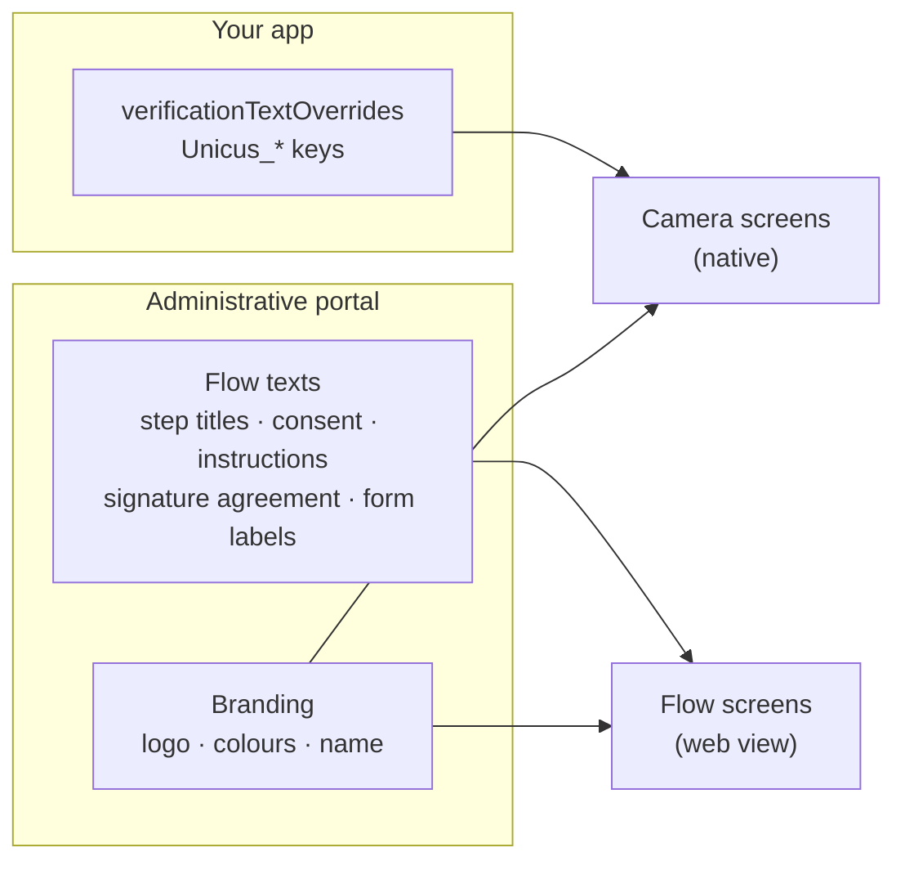

# Texts and languages

A verification shows two kinds of screens, and their texts come from different
places:



| Screens | Texts | Language |
| --- | --- | --- |
| Camera screens (liveness, document, face match) | Built-in English texts, replaced by your `verificationTextOverrides`. | The one of the map you pass. |
| Flow screens (consent, info, form, signature, OTP, results of UI steps) | Fixed texts maintained by Unicus, plus the flow texts you write in the portal. | The device language: Spanish when it is Spanish, English otherwise. |

## Camera screens: text overrides

Pass a map of `Unicus_*` keys to their text in `configure`. Keys you do not
include keep the built-in text; `<br/>` becomes a line break.


```dart
const myUnicusTexts = <String, String>{
  UnicusVerificationTextKey.actionImReady: 'ESTOY LISTO',
  UnicusVerificationTextKey.actionTryAgain: 'INTENTAR DE NUEVO',
  UnicusVerificationTextKey.cameraPermissionHeader: 'Habilitar cámara',
  UnicusVerificationTextKey.retryHeader: 'Intentémoslo de nuevo',
  'Unicus_idscan_type_selection_header': 'Prepárate para escanear<br/>tu documento',
};

await unicus.configure(const UnicusSdkConfig(
  apiKey: '<CUSTOMER_TOKEN>',
  environment: UnicusEnvironment.dev,
  verificationTextOverrides: myUnicusTexts,
));
```


* `UnicusVerificationTextKey` has constants for the public keys (buttons,
  camera permission, feedback while framing the face, document capture and
  review, upload and result messages, retry screen, accessibility labels).
  You can also write the key as a string.
* Use only keys with the `Unicus_` prefix: they are the public contract and
  work the same on Android and iOS.
* The example app of the package has complete English and Spanish maps in
  `example/lib/sample_unicus_texts.dart` (`sampleUnicusEnglishTexts`,
  `sampleUnicusSpanishTexts`). Copy that file into your app as a starting
  point and keep your texts in your source code.

### Follow the language of your app

The camera texts do not follow the device language by themselves. Choose the
map before configuring, for example from your app locale:


```dart
final language = Localizations.localeOf(context).languageCode;
await unicus.configure(UnicusSdkConfig(
  apiKey: customerToken,
  environment: UnicusEnvironment.dev,
  verificationTextOverrides: language == 'es' ? spanishUnicusTexts : englishUnicusTexts,
));
```


### Document data confirmation

The labels of the screen where the user confirms the data read from the
document are set with `verificationOcrLocalization`. Coordinate that dictionary
with Tekbees support.

## Flow screens

The flow screens take the device language (Spanish if the device is in
Spanish, English otherwise) and use:

* Fixed texts (buttons, errors, results) maintained by Unicus in Spanish and
  English.
* The texts of your flow (step titles and descriptions, consent text and
  privacy link, instructions, signature agreement, form labels), written in
  the portal's flow editor in Spanish and English. A text filled in only one
  language is shown as is in both.
* Your company name, logo and colours.

`verificationTextOverrides` does not change the flow screens. See
[Texts and languages of the Web SDK](../../sdk-web-v5/texts-and-languages.md)
for the full list of flow texts, which are shared with the web.
