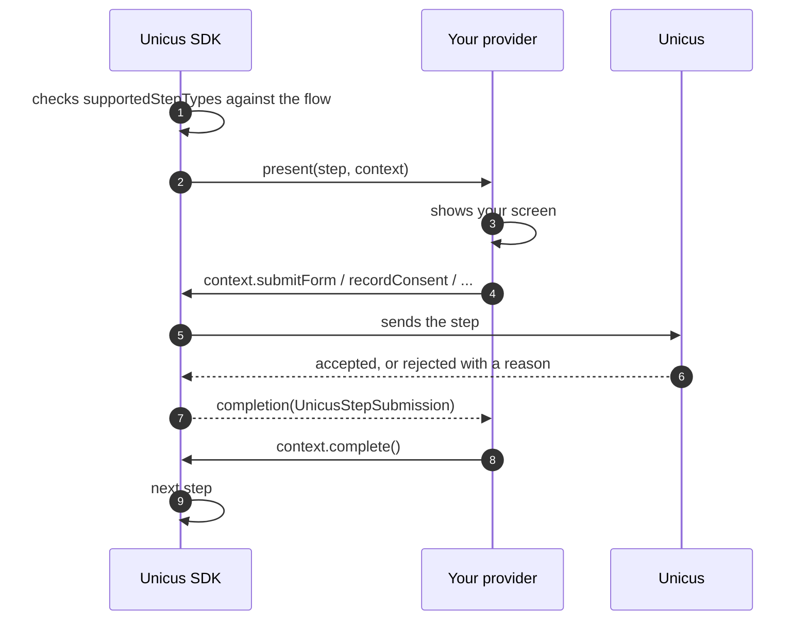

# Custom UI steps

By default (`uiStepMode: .webView`) the SDK shows the flow screens (consent,
info, form, signature, OTP, `sign_document`) itself. With
`.custom(provider)` your app draws those screens and the SDK makes every API
call. The camera steps (liveness, document, face match) always run in the SDK's
native camera screens, in every mode. Concepts and when to choose each mode:
[Flows and UI steps](../flows-and-ui-steps.md).


Choose `.custom` when your company forbids WebViews or requires certificate
pinning on every screen. Otherwise keep `.webView`: new step types designed in
the portal work without an app update.


## How it works



1. Before showing anything, the SDK checks that your provider declares every UI
   step type of the flow. If one is missing, `start` fails with
   `flow_not_supported` and nothing is shown.
2. For each UI step, the SDK calls `present(step:context:)` on the main queue,
   one step at a time, in flow order.
3. Your screen sends the data through `context`. A step **rejected** by Unicus
   is a `.success` with `accepted == false` and a typed `rejection`; `.failure`
   means the call itself failed (network, session).
4. End every step exactly once: `complete()`, `fail(resultCode:)` or
   `cancel()`.

## Configure


```swift
let provider = MyStepProvider()          // keep a strong reference while verifications run
var config = UnicusSdkConfig(apiKey: "<CUSTOMER_TOKEN>", environment: .dev)
config.uiStepMode = .custom(provider)
UnicusSdk.shared.configure(config)
```


## The provider


```swift
import UIKit
import SafariServices
import UnicusSDK

final class MyStepProvider: UnicusUiStepProvider {
    let supportedStepTypes: Set<String> = [
        UnicusStepType.consent, UnicusStepType.info, UnicusStepType.form,
        UnicusStepType.signature, UnicusStepType.otp, UnicusStepType.signDocument
    ]
    var pollTimer: Timer?   // sign_document status polling

    func present(step: UnicusFlowStep, context: UnicusStepContext) {
        switch step.type {
        case UnicusStepType.consent:      showConsent(step, context)
        case UnicusStepType.info:         showInfo(step, context)
        case UnicusStepType.form:         showForm(step, context)
        case UnicusStepType.signature:    showSignature(step, context)
        case UnicusStepType.otp:          showOtp(step, context)
        case UnicusStepType.signDocument: showSignDocument(step, context)
        default:                          context.cancel()
        }
    }

    // Optional: the host app called cancelActiveSession() while `step` was shown.
    func dismiss(step: UnicusFlowStep) {
        // Remove your screen. The context no longer accepts calls.
    }
}
```


`UnicusFlowStep` gives `id`, `type`, `required`, `title` and `description`
(`UnicusLocalizedText`: use `localized(context.language)`), `config` (the step
settings from the portal) and `signDocumentConfig` for `sign_document`.
`UnicusStepContext` gives `tid`, `flowId`, `step`, `language` (`es` or `en`),
`theme` (company colours and logo) and `presentingViewController`.

## Ending a step

| Call | Effect |
| --- | --- |
| `context.complete()` | The step is done; the SDK continues with the next one. |
| `context.fail(resultCode:)` | A required step ends the flow with that code; an optional one is skipped. |
| `context.cancel()` | The person left. **Not** a cancellation: the transaction stays open and `start` ends with 2003 `.resumable`. |

## Consent

Send the exact text you showed.


```swift
func showConsent(_ step: UnicusFlowStep, _ context: UnicusStepContext) {
    let text = step.description?.localized(context.language) ?? "<your consent text>"
    // ... show `text`; when the person accepts:
    context.recordConsent(text: text, privacyUrl: "https://example.com/privacy") { [self] result in
        switch result {
        case .success(let submission) where submission.accepted: context.complete()
        case .success(let submission): showRejection(submission.rejection)
        case .failure(let error): showNetworkError(error)
        }
    }
}
```


## Info


```swift
func showInfo(_ step: UnicusFlowStep, _ context: UnicusStepContext) {
    // ... show the instructions; when the person continues:
    context.recordInfo { result in
        if case .success(let submission) = result, submission.accepted { context.complete() }
    }
}
```


## Form


```swift
func showForm(_ step: UnicusFlowStep, _ context: UnicusStepContext) {
    // Build the fields from step.config; on submit:
    context.submitForm(values: ["email": "ana@example.com"]) { [self] result in
        switch result {
        case .success(let submission) where submission.accepted:
            context.complete()
        case .success(let submission):
            // FORM_INVALID: field name -> REQUIRED, INVALID_TYPE, PATTERN_MISMATCH, UNKNOWN_FIELD, TOO_LONG
            showFieldErrors(submission.rejection?.fields ?? [:])
        case .failure(let error):
            showNetworkError(error)
        }
    }
}
```


## Signature

Send the handwritten signature as PNG (at most 1 MB) with the number of strokes.


```swift
func showSignature(_ step: UnicusFlowStep, _ context: UnicusStepContext) {
    // ... capture the drawing; on accept:
    context.submitSignature(png: pngData, strokes: strokeCount, agreementText: agreementShown) { [self] result in
        switch result {
        case .success(let submission) where submission.accepted: context.complete()
        case .success(let submission): showRejection(submission.rejection)   // SIGNATURE_INVALID, .field
        case .failure(let error): showNetworkError(error)
        }
    }
}
```


## OTP


```swift
func showOtp(_ step: UnicusFlowStep, _ context: UnicusStepContext) {
    // destination only when the step asks the person for it
    context.sendOtp(destination: nil) { [self] result in
        switch result {
        case .success(let sent) where sent.alreadyVerified:
            context.complete()
        case .success(let sent) where sent.sent:
            showCodeEntry(maskedDestination: sent.destinationMasked, validFor: sent.expiresInSeconds)
        case .success(let sent):
            showRejection(sent.rejection)            // OTP_RESEND_TOO_SOON: rejection.seconds
        case .failure(let error):
            showNetworkError(error)
        }
    }
}

func verify(code: String, _ context: UnicusStepContext) {
    context.verifyOtp(code: code) { [self] result in       // never retried automatically
        switch result {
        case .success(let submission) where submission.accepted:
            context.complete()
        case .success(let submission) where submission.isTerminal:
            context.fail(resultCode: submission.resultCode ?? UnicusResultCode.attemptsExhausted)  // 4001
        case .success(let submission):
            showWrongCode(attemptsLeft: submission.attemptsLeft)
        case .failure(let error):
            showNetworkError(error)
        }
    }
}
```


## Document signing (`sign_document`)

The person signs a document template in the signing service. Unicus fills the
document and records the step result itself: your provider only opens the
signing page and polls the status.

* Open the URL in `SFSafariViewController`, **never** in a WebView (the signing
  service forbids frames).
* Links are single-use and expire in 5 minutes: call `startSignDocument` again
  for "Open again", never reuse a URL.
* `pending` without `url` means the person already signed: only poll.
* Poll every `UnicusSignDocument.pollInterval` (4 s) and when your app returns to
  the foreground.


```swift
func showSignDocument(_ step: UnicusFlowStep, _ context: UnicusStepContext) {
    let title = step.signDocumentConfig?.templateName ?? "Document"
    // Current state: .notStarted -> show "Sign document"; .pending -> waiting + "Open again".
    context.signDocumentStatus { [self] result in
        guard case .success(let status) = result else { return }
        switch status.state {
        case .notStarted: showSignButton(title)
        case .pending:    showWaiting(title); startPolling(context)
        case .completed:  context.complete()
        case .declined:   context.fail(resultCode: UnicusResultCode.signDeclined)   // 4011
        @unknown default: break
        }
    }
}

// On "Sign document" or "Open again":
func openSigningPage(_ context: UnicusStepContext) {
    context.startSignDocument { [self] result in
        switch result {
        case .success(let start) where start.accepted:
            if let url = start.url {
                context.presentingViewController?.present(SFSafariViewController(url: url), animated: true)
            }
            startPolling(context)
        case .success(let start):
            // 4012 SIGN_EMAIL_MISSING, 4013 SIGN_NOT_CONNECTED, 4014 SIGN_SERVICE_UNAVAILABLE (retry), 2052
            showRejection(start.rejection)
        case .failure(let error):
            showNetworkError(error)
        }
    }
}

func startPolling(_ context: UnicusStepContext) {
    pollTimer?.invalidate()
    pollTimer = Timer.scheduledTimer(withTimeInterval: UnicusSignDocument.pollInterval, repeats: true) { [self] _ in
        context.signDocumentStatus { [self] result in
            guard case .success(let status) = result else { return }
            switch status.state {
            case .completed: pollTimer?.invalidate(); context.complete()     // never send it through submitForm
            case .declined:  pollTimer?.invalidate(); context.fail(resultCode: UnicusResultCode.signDeclined)
            default: break
            }
        }
    }
}
```


`step.signDocumentConfig` (`UnicusSignDocumentConfig`) has `templateId`,
`templateName`, `signerRoleId`, `lockData`, `signer` and `fields`. Status
changes are also emitted as `stepProgress` events.

## Rejections

`submission.rejection` (`UnicusStepRejection`) has a `kind` and its data:

| `kind` | Data | What to do |
| --- | --- | --- |
| `.formInvalid` | `fields` (field → error) | Show the errors next to the fields. |
| `.signatureInvalid` | `field` | Ask to sign again. |
| `.otpInvalidCode`, `.otpExpired` | `attemptsLeft` on the submission | Ask for the code again / send a new one. |
| `.otpResendTooSoon` | `seconds` | Wait before resending. |
| `.otpAttemptsExhausted` (4001) | — | `fail(resultCode:)`. |
| `.stepOutOfOrder`, `.stepNotInFlow`, `.stepTypeMismatch`, `.stepNotAvailable`, `.noFlow` | `stepIds` | Configuration problem: `fail(resultCode:)` and contact support. |
| `.signEmailMissing`, `.signNotConnected` | — | Configuration of the signing step. |
| `.signServiceUnavailable` | — | Temporary: offer to retry. |

`submission.isTerminal` is `true` when retrying the same step makes no sense.

## Threading

`present` and `dismiss` are called on the main queue, and every `context`
completion runs on the main queue. A context stops accepting calls once its step
ended (`step_inactive`). In the Swift 6 language mode, import the SDK with
`@preconcurrency import UnicusSDK`; when the compiler asks for main-actor
isolation around UIKit calls in your provider, wrap them in
`MainActor.assumeIsolated { ... }`.
