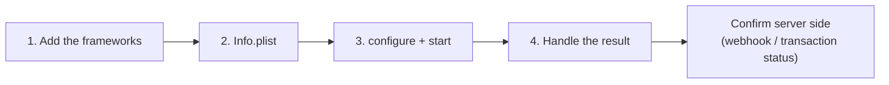

# Quick start


**Coming soon.** The mobile SDKs are not yet available in production. Only the
DEV environment is available today; Tekbees will announce the production
release. Ask Tekbees for a DEV Customer Token to prepare your integration.




## 1. Add the dependency

Tekbees delivers the SDK as a ZIP package. Copy its `sdk` folder into your
repository (for example `Vendor/Unicus`) and choose one option:

* **Xcode**: drag `UnicusSDK.xcframework` and the verification engine framework
  from `sdk/Frameworks` to your app target with **Embed & Sign**. Do not add the
  framework whose name ends in `ForDevelopment`.
* **CocoaPods**: `pod 'UnicusSDK', :path => 'Vendor/Unicus'`
* **Swift Package Manager**: *File > Add Package Dependencies… > Add Local…*,
  choose `Vendor/Unicus`, link the `UnicusSDK` product.

Debug builds on a physical iPhone need one extra build phase. See
[Installation](installation.md#debug-builds-on-a-physical-iphone).

## 2. Add the permissions to Info.plist


```xml
<key>NSCameraUsageDescription</key>
<string>We use the camera to verify your identity.</string>
<!-- Optional: location as transaction metadata. Without it the verification continues. -->
<key>NSLocationWhenInUseUsageDescription</key>
<string>We record where the verification starts.</string>
```


## 3. Configure and start


```swift
import UnicusSDK

// Once, for example at app start-up.
UnicusSdk.shared.configure(UnicusSdkConfig(apiKey: "<CUSTOMER_TOKEN>", environment: .dev))

// When the person taps "Verify my identity".
let document = UnicusDocument(type: .id, externalDatabaseRefId: "123456789")
UnicusSdk.shared.start(.enrollmentVerify(document: document), from: self) { result in
    switch result {
    case .success(let verification) where verification.isResumable:
        showPending()                       // 2003: start again with the same document to continue
    case .success(let verification) where verification.success:
        approve(tid: verification.tid)      // confirm the tid in your backend
    case .success(let verification):
        showRejected(code: verification.resultCode)
    case .failure(let error):
        showError(error.code)               // could not run: configuration, network...
    }
}
```


With `async/await`:


```swift
do {
    let verification = try await UnicusSdk.shared.start(.enrollmentVerify(document: document), from: self)
    handle(verification)
} catch let error as UnicusSdkError {
    showError(error.code)
}
```


* `apiKey` is your company's [Customer Token](../../sdk-web-v5/customer-token.md)
  for that environment. It is the only value you provide: URLs and keys come
  with the SDK.
* `environment`: `.dev` today. `.staging` and `.production` answer
  `environment_not_available` until Tekbees publishes them.
* `from:` is the view controller that presents the verification. When omitted,
  the SDK uses the top-most view controller.
* Completions always arrive on the main queue.

## 4. Handle the result

`start` ends in `.success(UnicusVerificationResult)` whenever the verification
ran, also when the person was not verified. Route by `result.outcome`:

| `outcome` | Meaning | What to do |
| --- | --- | --- |
| `.success` | Identity verified (2000). | Continue. Confirm the `tid` in your backend. |
| `.resumable` | Transaction still open (2003): the person left or steps remain. | Call `start` again with the same document: it continues where it stopped. |
| `.warning` | Verified with a warning (2013). | Review according to your rules. |
| `.failed` | Not verified (face, document, rejected step, declined signature). | Business message; allow a new attempt. |
| `.canceled` | Cancelled (2041), expired (2051) or retries exhausted. | Allow starting again. |
| `.error` | Technical failure. `isRetryable` (2054, 4014) means try again. | Retry or contact support. |

`.failure(UnicusSdkError)` means the verification could not run;
`error.code` is stable (`not_configured`, `environment_not_available`,
`network_error`, `flow_not_supported`…). See
[Errors and troubleshooting](../errors-and-troubleshooting.md).


The result in the app is for display. Decide access in your backend with the
[webhook](../../sdk-web-v5/webhooks.md) or
[Get a transaction status](../../sdk-web-v5/transaction-status.md), using the
`tid`.


If the person leaves before finishing, the next `start` with the same document
continues the open transaction (up to 20 minutes without activity). Call
`UnicusSdk.shared.clearResumeData()` on logout. See
[Results and resuming](../results-and-resuming.md).

## Next steps

* [Installation](installation.md): package contents, CocoaPods, SPM, the Debug
  build phase.
* [Configuration](configuration.md): every option.
* [Results and events](results-and-events.md): result fields and progress
  events.
* [Release checklist](release-checklist.md).
