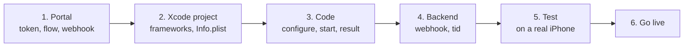

# Release checklist

Follow the steps in order. Do them first in DEV; repeat the configuration in
each environment Tekbees enables for you.

## 1. Administrative portal

- [ ] Copy the [Customer Token](../../sdk-web-v5/customer-token.md) of the
      environment.
- [ ] Create a **flow** and assign it to the enrollment / verification
      transaction type. Without it `start` fails with `transaction_refused`
      (`resultCode` 2002).
- [ ] Check the flow is published for the **mobile** channel, and that it
      respects the flow rules (a face match needs a liveness before it; no
      document step alone). Otherwise `start` fails with `flow_not_supported`.
      See [Flows and UI steps](../flows-and-ui-steps.md).
- [ ] Review branding (logo and colours) and the step texts in Spanish and
      English.
- [ ] Register your **webhook** URL and store its signing secret in your
      backend. See [Webhooks](../../sdk-web-v5/webhooks.md).

## 2. Xcode project

- [ ] `UnicusSDK.xcframework` and the verification engine framework embedded
      with **Embed & Sign** (or through CocoaPods / SPM). The `ForDevelopment`
      framework is **not** embedded. See [Installation](installation.md).
- [ ] *Run Script* phase for Debug builds on a device, after *Embed Frameworks*.
- [ ] `NSCameraUsageDescription` in `Info.plist` (and
      `NSLocationWhenInUseUsageDescription` if you want location), with texts
      in your app's languages.
- [ ] If `Info.plist` declares `WKAppBoundDomains`: the flow app domain is
      listed.
- [ ] Deployment target iOS 15.0 or newer.
- [ ] Customer Token and environment per build configuration; no DEV values in
      the Release build.

## 3. Code

- [ ] `configure` runs once before the first `start`.
- [ ] `start` uses `.enrollmentVerify(document:)` with the person's real
      document type and number.
- [ ] Every outcome is handled, including `.resumable` (offer to continue) and
      `@unknown default`. See [Results and events](results-and-events.md).
- [ ] `.failure` shows a message based on `error.code`, never `error.message`.
- [ ] The `tid` is sent to your backend and stored with your user or case.
- [ ] Access is **not** granted from the app result alone.
- [ ] `clearResumeData()` on logout.
- [ ] `enableApiLogging` and `includeSensitiveApiLogData` are `false` in Release.
- [ ] With `.custom` mode: the provider declares every UI step type of your
      flows and implements `dismiss(step:)`. See
      [Custom UI steps](custom-ui-steps.md).

## 4. Backend

- [ ] The webhook endpoint verifies the signature, deduplicates events and
      decides by the outcome. See [Webhooks](../../sdk-web-v5/webhooks.md).
- [ ] Optional reconciliation with
      [Get a transaction status](../../sdk-web-v5/transaction-status.md) for
      transactions without a webhook.

## 5. Test on a physical iPhone

| # | Case | Expected |
| --- | --- | --- |
| 1 | Complete the flow with a valid document. | `.success`, 2000; webhook approved. |
| 2 | Same document again (already enrolled). | Verification instead of enrollment; `.success`. |
| 3 | Cancel inside the camera. | `.canceled`, 2041. |
| 4 | Leave a flow screen (close it). | `.resumable`, 2003. Calling `start` with the same document continues where it stopped (event `transactionResumed`). |
| 5 | Deny the camera permission. | The camera screen explains how to enable it; closing it ends `start` with a result, without a crash. |
| 6 | Deny the location permission. | The verification continues (`locationSkipped`). |
| 7 | Airplane mode before `start`. | `.failure` with `network_error`. |
| 8 | Call `start` twice quickly. | The second fails with `session_active`. |
| 9 | Remove the flow assignment in the portal. | `.failure`, `transaction_refused`, `resultCode` 2002. |
| 10 | Device in Spanish and in English. | Flow screens follow the device language; camera texts match your overrides. |
| 11 | Release build on a device. | Runs with the production engine binary (no Debug swap). |

## 6. Go live

- [ ] Update to the SDK version Tekbees indicates for production and switch to
      `environment: .production` with the production Customer Token when
      Tekbees announces it.
- [ ] Assign the flow and webhook in the production company.
- [ ] Run case 1 once in production with a real document.
- [ ] Keep [Errors and troubleshooting](../errors-and-troubleshooting.md) and
      [Support](../support.md) at hand; send the `tid`, iOS version and
      `UnicusSdk.shared.version` with every support request.
