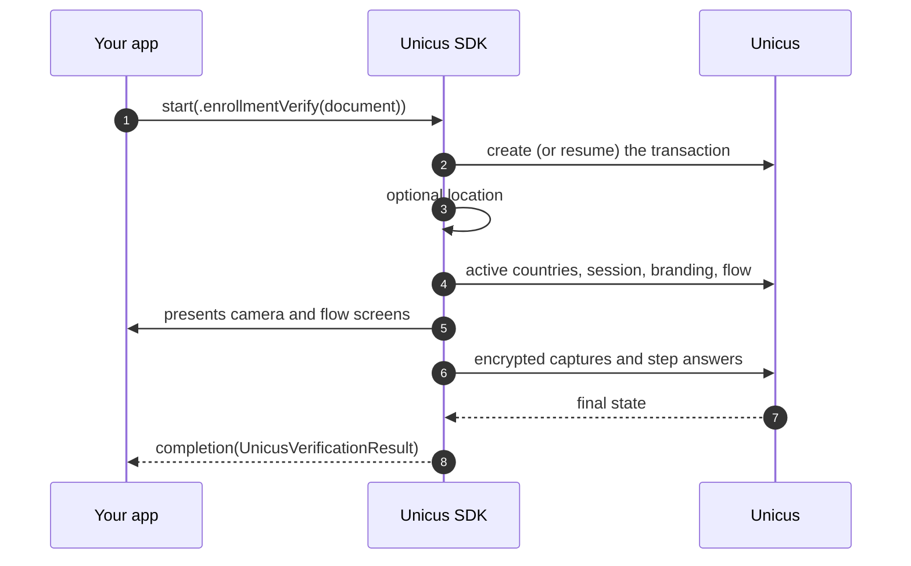

# Start a verification

## With a document (recommended)

`enrollmentVerify` enrols the person if Unicus does not know them yet and
verifies them if it does. Your app only gives the document type and number.




```swift
let document = UnicusDocument(type: .id, externalDatabaseRefId: "123456789")

UnicusSdk.shared.start(.enrollmentVerify(document: document), from: self) { result in
    switch result {
    case .success(let verification): handle(verification)
    case .failure(let error): showError(error.code)
    }
}
```





```swift
let document = UnicusDocument(type: .id, externalDatabaseRefId: "123456789")

do {
    let verification = try await UnicusSdk.shared.start(.enrollmentVerify(document: document), from: self)
    handle(verification)
} catch let error as UnicusSdkError {
    showError(error.code)
}
```




| `UnicusDocumentType` | Code | Document |
| --- | --- | --- |
| `.id` | `ID` | National identity card |
| `.foreignDocument` | `FD` | Foreign resident document |
| `.passport` | `PP` | Passport |
| `.driverLicense` | `DL` | Driver licence |

What the SDK does after `start`:



Optional parameters of `enrollmentVerify`: `country` (ISO-2, for example `"CO"`),
`location` (see [Location](#location)) and `collectLocation` (overrides
`collectLocationOnStart` for this request).

## With country selection

When your company has a single active country, `start` selects it. When it has
several and the person must choose, prepare the transaction first:




```swift
let prepared = try await UnicusSdk.shared.prepareEnrollmentVerify(document: document)
let country = prepared.requiresCountrySelection
    ? await showCountryPicker(prepared.countries)      // your UI, returns an ISO-2 code
    : prepared.country
let verification = try await UnicusSdk.shared.start(prepared.toRequest(country: country), from: self)
```





```swift
UnicusSdk.shared.prepareEnrollmentVerify(document: document) { prepared in
    switch prepared {
    case .success(let prepared):
        // Show your picker when prepared.requiresCountrySelection, then:
        let country = prepared.country ?? prepared.countries.first?.code
        UnicusSdk.shared.start(prepared.toRequest(country: country), from: self) { result in
            // handle result
        }
    case .failure(let error):
        showError(error.code)
    }
}
```




`UnicusPreparedVerification` has `tid`, `country`, `location`, `countries`
(`UnicusCompanyCountry`, `code` is ISO-2), `requiresCountrySelection`,
`defaultCountry` and `resumed` (`true` when the open transaction of the same
document was continued). `getCompanyCountries(tid:)` reloads the countries of a
transaction.

## Continue an existing transaction

A transaction that ended as `.resumable` (2003) stays open for 20 minutes without
activity. Two ways to continue it:

* **Automatic** (default): call `start` again with the **same document**. The SDK
  keeps a resume key in the Keychain and continues the open transaction (event
  `transactionResumed`, `result.resumed == true`).
* **By `tid`**: when you stored the `tid`:


```swift
let verification = try await UnicusSdk.shared.start(.existingTransaction(tid: savedTid), from: self)
```


The flow continues at the first pending step. Call
`UnicusSdk.shared.clearResumeData()` when the user logs out. See
[Results and resuming](../results-and-resuming.md).

## Location

By default the SDK asks for the device location before the session and attaches
it to the transaction (the first time, iOS shows the permission prompt). It continues without location when
the user denies the permission, location services are off, or your
`Info.plist` has no `NSLocationWhenInUseUsageDescription`. Events
`locationCollected` / `locationSkipped` tell you what happened.

* Turn it off for every verification: `collectLocationOnStart = false`.
* Turn it off for one request: `.enrollmentVerify(document: document, collectLocation: false)`.
* Already have it: pass `location:` as a JSON string with `latitude`,
  `longitude`, `accuracy` and `timestamp` (ISO 8601).

## Cancel the active verification


```swift
UnicusSdk.shared.cancelActiveSession()

// or, to know when the cancellation was reported:
UnicusSdk.shared.cancelActiveSession(message: "User logged out") { result in
    if case .failure(let error) = result { print(error.code) }
}
```


From `async` code the async overload is selected:
`try await UnicusSdk.shared.cancelActiveSession()`.

`cancelActiveSession` ends the verification wherever it is (camera, flow
screens, custom step, between steps, or while `start` is preparing), cancels the
transaction in Unicus and waits for the answer (at most 10 seconds). The `start`
completion then receives 2041 (`.canceled`), or 2003 (`.resumable`) when the
flow was already past its camera steps and Unicus keeps it open. The
`cancelActiveSession` completion runs after the `start` completion.

What cancels and what does not:

| Event | Transaction | Result |
| --- | --- | --- |
| The person taps cancel inside the camera | Cancelled | 2041 `.canceled` (or 2003 `.resumable`, see above) |
| Your app calls `cancelActiveSession()` | Cancelled | Same as above |
| The person leaves a flow screen (closes it) | Stays open | 2003 `.resumable` |
| A custom provider calls `context.cancel()` | Stays open | 2003 `.resumable` |

## Threading and presentation

* Call the SDK from any thread: methods hop to the main queue, and the `async`
  overloads run on the main actor.
* Completions and handlers are always called on the main queue.
* Only one verification at a time: a second `start` fails with `session_active`.
  Check `UnicusSdk.shared.isSessionActive` or wait for the completion.
* `from:` should be a view controller in a window. When omitted (or not in a
  window), the SDK presents from the top-most view controller. If nothing can
  present, or the screen does not appear, `start` fails with
  `no_view_controller` instead of waiting.
* The SDK owns its screens until the completion runs. Do not dismiss them
  yourself; use `cancelActiveSession()`.
