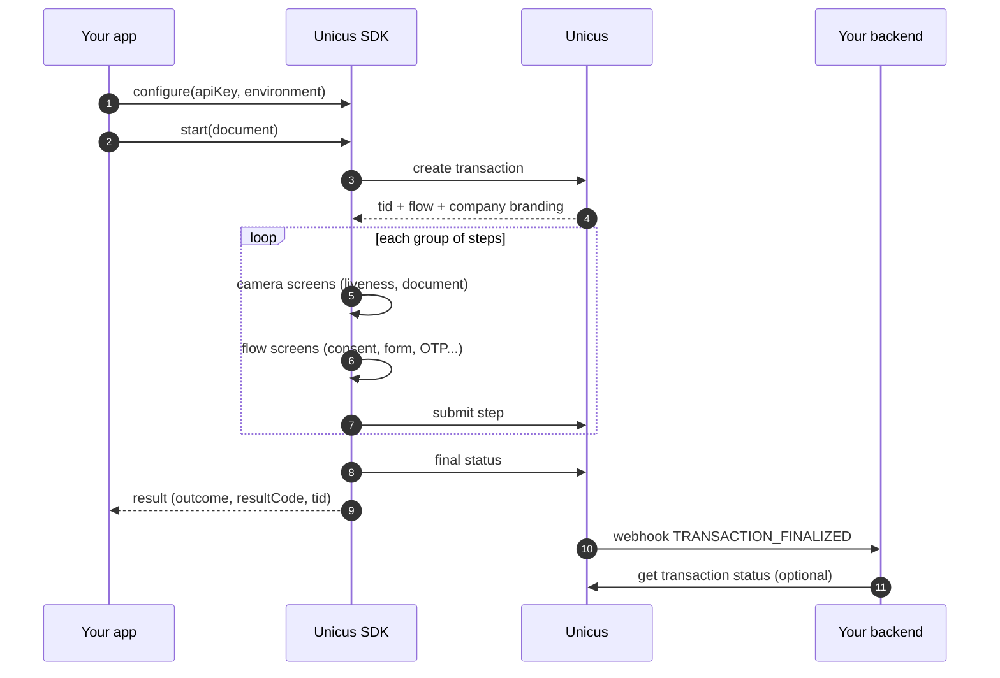

# Overview


**Coming soon.** The Unicus mobile SDKs are not yet available in production.
Today only the **DEV** environment is available; Tekbees will announce the
production release. Until then, ask Tekbees for the SDK package and a Customer
Token for DEV to prepare your integration.


The Unicus mobile SDKs run identity verification inside your native or Flutter
app. Your app passes the user's document and receives a result. Everything in
between is handled by the SDK and Unicus: transaction creation, company
branding, the camera, the flow screens, encryption and the calls to the Unicus
API.

Your app integrates **Unicus only**. The biometric engine is packaged inside the
SDK: do not add other biometric or document-capture libraries, and do not
forward activity results or permission results to the SDK.

## How a verification works

1. Your app configures the SDK once with its **Customer Token** (`apiKey`) and
   the environment.
2. Your app calls `start` with the user's document type and number.
3. The SDK creates the transaction in Unicus and receives the **flow** that
   your company assigned in the administrative portal, with the logo and
   colours of your company.
4. The SDK runs the flow on the device. Camera steps (liveness, document, face
   match) run in native camera screens. Screens without a camera (consent,
   instructions, form, signature, OTP) run in the Unicus flow screens shown by
   the SDK, or in your own screens on Android and iOS. See
   [Flows and UI steps](flows-and-ui-steps.md).
5. The SDK returns a result to your app: an outcome, a result code and the
   transaction id (`tid`). See [Results and resuming](results-and-resuming.md).
6. Your backend receives the authoritative result through your
   [webhook](../sdk-web-v5/webhooks.md) or by calling
   [Get a transaction status](../sdk-web-v5/transaction-status.md) with the
   `tid`.


The result your app receives drives the user experience. Business decisions
(open an account, approve a loan) belong to your backend, with the webhook or
the transaction status: anything reported by a device can be tampered with.


## Which SDK to choose

| Your app | SDK | Start here |
| --- | --- | --- |
| Native Android (Kotlin or Java) | Unicus Android SDK | [Android integration](android-integration.md) |
| Native iOS (Swift or Objective-C) | Unicus iOS SDK | [iOS integration](ios-integration.md) |
| Flutter (Android and iOS) | Unicus Flutter SDK, a plugin over the two native SDKs | [Flutter integration](flutter-integration.md) |

The three SDKs share the same behaviour, result codes and error codes. One
difference: your own screens for the non-camera steps (Custom mode) are
available in the native SDKs only.

## Requirements summary

| | Android | iOS | Flutter |
| --- | --- | --- | --- |
| Minimum OS | Android 5.0 (`minSdk 21`) | iOS 15.0 | Same as Android and iOS |
| Toolchain | `compileSdk 34+`, Android Gradle Plugin 8.x or 9.x, Kotlin 2.0+ or Java only, Java 17 | Xcode 16+, Swift 5.9 | Flutter 3.19+, Dart 3.3+ |
| Dependency | Maven repository delivered in the package | XCFrameworks or CocoaPods | `path:` dependency + CocoaPods on iOS |
| Permissions | Camera (added by the SDK); location optional | `NSCameraUsageDescription`; location optional | As Android and iOS |
| Device | Physical device with a camera | Physical device with a camera | Physical device with a camera |

Details per platform: [Compatibility and security](compatibility-and-security.md).

## What you need from Unicus

| Value | Where it goes | Description |
| --- | --- | --- |
| SDK package | Your project | ZIP delivered by Tekbees with the SDK, a quick start and an example app. Hosted Maven, Swift Package Manager and CocoaPods repositories are coming soon. |
| [Customer Token](../sdk-web-v5/customer-token.md) | `apiKey` in the SDK configuration | Token of your company, from the administrative portal (Company → Settings). One per environment. It is the only value your app passes: the SDK embeds everything else. |
| Environment | `environment` in the SDK configuration | `DEV` today. `STAGING` and `PRODUCTION` will be enabled in a later SDK version; until then the SDK answers `environment_not_available`. |
| Flow | Administrative portal | At least one flow assigned to your company and published for mobile. Without it the transaction is refused (result code `2002`). |

## Reading order

1. The quick start of your platform:
   [Android](android/quick-start.md), [iOS](ios/quick-start.md) or
   [Flutter](flutter/quick-start.md).
2. [Flows and UI steps](flows-and-ui-steps.md): what runs on the device and how
   the screens without a camera are shown.
3. [Results and resuming](results-and-resuming.md): outcomes, leaving versus
   cancelling, and resuming an open transaction.
4. [Result codes](result-codes.md) and
   [Errors and troubleshooting](errors-and-troubleshooting.md).
5. [Webhooks](../sdk-web-v5/webhooks.md) and
   [Get a transaction status](../sdk-web-v5/transaction-status.md): the
   authoritative result for your backend.
6. [Compatibility and security](compatibility-and-security.md) and the release
   checklist of your platform before going live.
7. [Versioning](versioning.md) and [Support](support.md).
