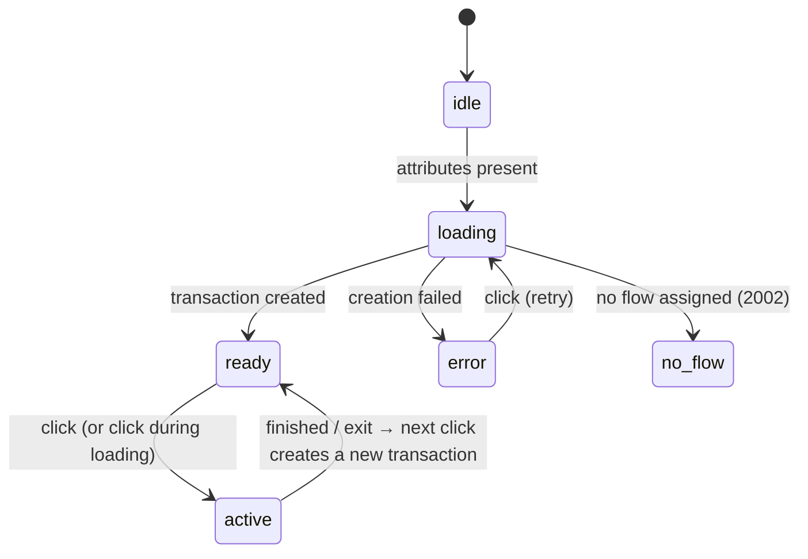

# Button reference

## Attributes

| Attribute | Required | Values | Description |
| --- | --- | --- | --- |
| `customerid` | Yes | Customer Token | Public token of the company (Company → Settings in the administrative portal). Sent as the `X-Customer-ID` header when the transaction is created. |
| `transactiontype` | Yes | `enrollment-verify`, `liveness` | `enrollment-verify` enrols a person Unicus does not know and verifies one it already knows; the decision is made by Unicus. `liveness` runs a liveness-only flow. The portal assigns a flow to each transaction type. |
| `clientid` | For `enrollment-verify` | `TYPE:NUMBER` | Document type and number, for example `ID:123456789`. Types: `ID` national id, `FD` foreign document, `PP` passport, `DL` driver licence. Sent as `documentType` and `externalDatabaseRefID`. |
| `language` | No | `es`, `en` | Language of the button label and of the verification screens. Defaults to the browser language when supported, otherwise Spanish. |
| `data-flow-id` | No | flow slug | Runs a specific flow variant instead of the one assigned to the transaction type (for example an A/B variant or a flow for a specific product). The slug is shown in the portal. An unknown slug leaves the button in the *not configured* state (`2002`). |
| `label` | No | text | Replaces the default label ("Validar identidad" / "Verify identity"), for example `Ingresar con mi rostro` on a login screen. |
| `size` | No | `lg` | Larger button (56 px pill instead of 44 px). |
| `color` | No | `#rrggbb` | Forces the brand colour. When absent, the colour configured for the company in the portal is applied as soon as the transaction is created and remembered in the browser for the next visits. |
| `textcolor` | No | `#rrggbb` | Forces the label colour. |
| `disabled` | No | — | Prevents opening the flow. |

Attributes are read when the element is connected and whenever they change.
Changing `customerid`, `clientid`, `transactiontype` or `data-flow-id` discards
the current transaction and creates a new one; `OnUnicus:loaded` fires again.

## States



The button reflects its state in the `state` attribute, so you can style or
observe it (`button.getAttribute('state')`).

| State | What the user sees | Meaning |
| --- | --- | --- |
| `idle` | Neutral button | Waiting for the required attributes. |
| `loading` | Brand mark animating in the badge | The transaction is being created. A click during this state is honoured: the flow opens as soon as the transaction is ready. |
| `ready` | Brand colour, label | Transaction created (`OnUnicus:loaded` was emitted). |
| `active` | Label "Validando…" / "Verifying…" | The verification is open in the iframe. |
| `error` | Grey button, label "Reintentar" / "Retry" | The transaction could not be created (`OnUnicus:error`). A click retries. |
| `no_flow` | Grey button, label "Verificación no configurada" | No flow is assigned to this company and transaction type, or `data-flow-id` is unknown (result code `2002`). Fix it in the portal. |

## Lifecycle

1. **Mount.** The transaction is created immediately so the flow opens without
   delay when the user clicks. If the user never clicks, the transaction expires
   on its own in Unicus; nothing is recorded against the person.
2. **Click.** The button opens the Unicus verification in a full-screen iframe
   over your page, with permission for camera, microphone, geolocation and
   fullscreen. Your page stays loaded underneath.
3. **Events.** Progress arrives through `OnUnicus:details`; the end through
   `OnUnicus:finished` or `OnUnicus:exit`. The iframe is removed when the flow
   ends.
4. **Again.** After `finished` or `exit` the next click creates a **new**
   transaction. A transaction is never reused.

The flow is not rendered in a popup window, so popup blockers do not affect it.

## Properties and methods

| Member | Description |
| --- | --- |
| `button.transactionId` | Current `tid`, or `null` before `OnUnicus:loaded`. Also available as `button.__transactionId` for compatibility with 1.x code. |
| `button.open()` | Opens the flow programmatically, same as a click. |
| `customElements.get('unicus-btn').version` | Version string of the loaded script. |

## Appearance

The button is a hexagonal white badge with the Unicus mark over a pill in your
brand colour, the same design as Web SDK 1.x. Colours come from the company configuration in the portal
(`windowColor`, `textColor`); you can override them per page with attributes or
CSS custom properties on the element:


```css
unicus-btn {
  --unicus-color: #1e3163;        /* pill background */
  --unicus-text-color: #ffffff;   /* label */
  --unicus-badge: #ffffff;        /* hexagon */
  --unicus-mark: #1e3163;         /* Unicus mark inside the hexagon */
  --unicus-accent: #f9ab01;       /* sweep colour of the loading animation */
  --unicus-radius: 14px;
  --unicus-font: inherit;
}
```


The inner `<button>` is exposed as `::part(button)` for advanced styling:


```css
unicus-btn::part(button) { box-shadow: none; }
```



Keep the Unicus mark visible. It tells the user that the verification is run
by Unicus and not by your site, which is part of the consent the user gives.


## Verification screens

Colours and logo of the verification screens are configured in the
administrative portal (Company → Settings) and applied to every screen,
including the camera screens: frame, buttons, progress, result animations and
the document capture guidance. The customer page does not pass any appearance
values for the screens. Texts are configured with the flow; see
[Texts and languages](texts-and-languages.md).
