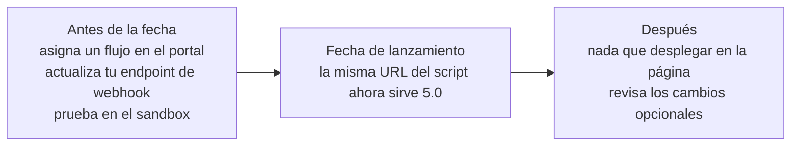

# Migración desde Web SDK 4.x


[English version](../migration-from-v4.md)



**Próximamente.** Web SDK 5.0 aún no está disponible en producción. Tekbees
anunciará la fecha de lanzamiento. En esa fecha Web SDK 4.x deja de funcionar y
todas las integraciones ejecutan 5.0, incluidas las páginas que todavía cargan
la URL actual del script. Mientras tanto, solicita a Tekbees acceso al ambiente
de pruebas (sandbox) para prepararte.


## Qué sucede en la fecha de lanzamiento

Web SDK 5.0 reemplaza a 4.x para todos los clientes en la misma fecha. No hay un
período en el que ambas versiones funcionen en paralelo.

* La URL del script que tu página ya carga
  (`https://unicusbtn.idunicus.com/sdkButton.js`) empieza a servir Web SDK 5.0.
  **No tienes que editar tu página.**
* Los atributos, los eventos y la propiedad `transactionId` no cambian, así que
  tu código existente sigue funcionando.
* Web SDK 4.x deja de funcionar. Una página no puede quedarse en 4.x.



## Antes de la fecha de lanzamiento (obligatorio)


**Asigna un flujo a cada tipo de transacción que uses.** En 4.x el proceso era
fijo; en 5.0 es un flujo compuesto en el portal administrativo. Una empresa sin
flujo en la fecha de lanzamiento obtiene un botón que muestra "Verification not
configured" (verificación no configurada) y no se abre.


1. Crea el o los flujos que reproducen lo que hacen hoy tus usuarios (por
   ejemplo, consentimiento → prueba de vida → documento → comparación facial) y
   asígnalos a los tipos de transacción que usas (`enrollment-verify`,
   `liveness`).
2. Revisa la marca de la empresa: logo y colores hexadecimales. Las pantallas de
   5.0 los aplican en todas partes, incluidas las pantallas de cámara.
3. Habilita los canales de traspaso al celular (hand-off) que quieras (QR,
   WhatsApp, SMS).
4. Prueba tu página en el ambiente de pruebas (sandbox) con la URL del script de
   sandbox que proporciona Tekbees. Consulta la lista de verificación en
   [Compatibilidad y seguridad](compatibility-and-security.md).

## En tu backend (obligatorio)


**Actualiza tu endpoint de webhook.** 4.x enviaba un webhook por paso
(`LIVENESS_FACEMAP`, `FRONT_DOCUMENT`, `BACK_DOCUMENT`, `MATCH_DOCUMENT`,
`VERIFY_LIVENESS`). 5.0 envía **un** webhook por transacción,
`TRANSACTION_FINALIZED`, con el resultado final, además de
`TRANSACTION_REVIEW_RESOLVED` cuando se decide una transacción en revisión
manual. El código que espera `MATCH_DOCUMENT` para marcar a una persona como
verificada nunca volverá a ejecutarse.


| 4.x | 5.0 |
| --- | --- |
| Varios webhooks por transacción, uno por paso, identificados por `data.process`. | Un `TRANSACTION_FINALIZED` por transacción, identificado por `meta.event` y deduplicado por `meta.event_id`. |
| Éxito cuando llegaba `MATCH_DOCUMENT` (o `VERIFY_LIVENESS`) con `success: true`. | Éxito cuando `data.outcome` es `APPROVED`. `REVIEW` está pendiente; `REJECTED`, `EXPIRED`, `CANCELLED` son fallas finales. |
| Una transacción abandonada no enviaba nada. | Una transacción abandonada finaliza después de 20 minutos de inactividad (24 horas si el enlace nunca se abrió) y envía `EXPIRED` o `REJECTED`. |
| Datos del documento en `MATCH_DOCUMENT` (`idName`, `idNumberOCR`, `docFront`…). | Los mismos campos del documento en `data.document`; las imágenes solo si están habilitadas para tu empresa; de lo contrario, mediante `query-transaction`. |
| Sin firma. | Firmado con HMAC-SHA256 una vez que generas un secreto en el portal. |

Pasos:

1. Acepta `TRANSACTION_FINALIZED` y `TRANSACTION_REVIEW_RESOLVED` en tu endpoint
   y decide según `data.outcome` (consulta [Webhooks](webhooks.md)).
2. Deduplica por `meta.event_id`: las entregas se reintentan durante
   aproximadamente 22 horas.
3. Genera un secreto de webhook en el portal y verifica la firma.
4. Pruébalo en el sandbox con una transacción completada, una fallida y una
   abandonada.

Las transacciones creadas antes de la fecha de lanzamiento se cierran sin enviar
el nuevo webhook.

## En la página (opcional)

No es necesario cambiar nada. Hay dos opciones disponibles si las quieres:

* **Fija la versión mayor.** Las integraciones nuevas, y las existentes que
  prefieran una versión explícita, pueden cargar el script desde la ruta con
  versión. Ambas URL sirven el mismo script.


```html
<script src="https://unicusbtn.idunicus.com/v5/sdkButton.js" defer></script>
```


* **Usa lo nuevo.** La tabla lista qué cambió y qué hacer al respecto, si es
  necesario.

| Comportamiento en 4.x | Comportamiento en 5.0 | Acción |
| --- | --- | --- |
| Etiqueta del botón fija. | Atributo `label`. | Ninguna, salvo que quieras otro texto. |
| Colores tomados de la respuesta de la transacción. | Igual, además de recordarse en el navegador y poder sobrescribirse con `color` / `textcolor` o variables CSS. | Ninguna. |
| `OnUnicus:details` solo llevaba resultados de pasos biométricos. | También lleva payloads `stepProgress` para cada paso del flujo (consentimiento, firma, OTP, formulario…). | Si tu código lee `state.path`, este sigue llegando en los payloads biométricos (también como `responseType`). Agrega el manejo de `state.stepProgress` si muestras el avance. |
| Estado de `OnUnicus:finished` `{ exited, success }`. | Agrega `resultCode`. `2013` significa en revisión manual. | Trata `success: false` con `resultCode: 2013` como pendiente. |
| `OnUnicus:error` solo con mensaje. | Agrega `resultCode` y el caso `2002` *no configurado*. También se informan los errores dentro de la verificación. | Muestra un mensaje diferente para `2002` si quieres. |
| Flujo fijo. | Flujo configurado en el portal. | **Obligatorio antes de la fecha de lanzamiento** (ver arriba). |
| Traspaso al celular solo por QR. | QR, WhatsApp, SMS (por empresa). | Habilita en el portal los canales que quieras. |
| Textos de pantalla fijos. | Títulos, descripciones, consentimiento, instrucciones y etiquetas de formulario por flujo, en español e inglés. | Diligéncialos en el editor de flujos; los campos vacíos usan los textos predeterminados de Unicus. |

## CSP

Agrega `https://id.idunicus.com` a `frame-src` si tu política de 4.x apuntaba a
un dominio de flujo diferente, y conserva `connect-src` para la API. Hazlo antes
de la fecha de lanzamiento: una política que bloquee el nuevo dominio deja la
verificación sin poder abrirse.
