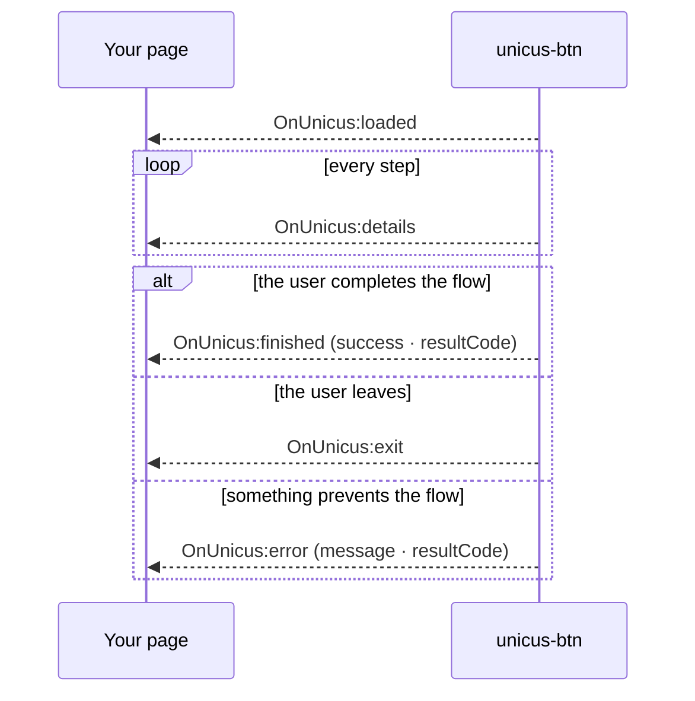

# Events

The `<unicus-btn>` element dispatches `CustomEvent`s. The data is in
`event.detail`. Events bubble and cross shadow roots, so a listener on the
element, on an ancestor or on `document` all work.

| Event | When | Typical use |
| --- | --- | --- |
| `OnUnicus:loaded` | The transaction was created. | Store the `tid`; enable UI that depends on it. |
| `OnUnicus:details` | A step progressed, completed, was retried or failed. Fires many times. | Progress indicators, analytics. Never treat it as the final result. |
| `OnUnicus:finished` | The flow reached a final state and the user closed the last screen. | Continue your process; confirm server side. |
| `OnUnicus:exit` | The user closed the verification before a final state. | Offer to try again. |
| `OnUnicus:error` | The transaction could not be created, or the flow stopped because of a configuration, session or network problem. | Show a recoverable error; log `message` and `resultCode`. |




Browser events drive your user interface. The authoritative result of a
transaction is the one your backend receives through the
[webhook](webhooks.md) or by calling
[Get a transaction status](transaction-status.md) with the
`tid`. Page reloads, closed tabs and network conditions can prevent a browser
event from reaching your page.


## `OnUnicus:loaded`


```json
{
  "status_error": false,
  "loaded": true,
  "message": "Unicus SDK: loaded successfully",
  "link": "https://id.idunicus.com/#token=<TID>&process=enrollment&lang=es",
  "transaction": {
    "transactionId": "<TID>",
    "clientid": "123456789"
  }
}
```


`transaction.clientid` is the document number; it is an empty string for
`liveness`. `link` is the URL the button itself opens in the iframe; do not
send it to the user, Unicus generates the links for other devices inside the
flow with one-time tokens.

## `OnUnicus:details`

Emitted once per step transition. `transaction.state` has one of two shapes.

**Step progress**, produced by the Unicus web app for every step of the flow:


```json
{
  "status_error": false,
  "message": "Unicus SDK: step progress",
  "transaction": {
    "exited": false,
    "transactionId": "<TID>",
    "state": {
      "stepProgress": true,
      "flowId": "enrolamiento-por-defecto",
      "stepId": "document",
      "stepType": "document",
      "status": "completed",
      "resultCode": 2000
    }
  }
}
```


| Field | Values |
| --- | --- |
| `stepType` | `consent`, `info`, `liveness`, `document`, `face_match`, `signature`, `otp`, `form`, `age_check` |
| `status` | `started`, `completed`, `retry`, `failed`, `skipped` |
| `resultCode` | Present on `completed`, `retry` and `failed`. See [Result codes](result-codes.md). |

**Server step result**, produced by the Unicus API after each camera upload
(liveness and document). It is the same payload the previous SDK sent, with
internal fields removed:


```json
{
  "state": {
    "responseType": "MATCH_3D_2D_ID_SCAN",
    "success": true,
    "resultCode": 2000,
    "isCompletelyDone": false,
    "matchLevel": 5
  }
}
```


| `responseType` | Step |
| --- | --- |
| `LIVENESS_3D` | Liveness check. |
| `NEW_ENROLLMENT` | Liveness plus face enrolment. |
| `MATCH_3D_3D` | Face verification against the enrolled face. |
| `MATCH_3D_2D_ID_SCAN` | Document capture and face match against the document photo. One payload per upload: front, back, user confirmation. |
| `ID_SCAN_ONLY` | Document capture without face match. |

Use only the fields your application needs; the payload can carry more
technical fields depending on the step.

## `OnUnicus:finished`


```json
{
  "status_error": false,
  "message": "Unicus SDK: User ended transaction",
  "transaction": {
    "exited": true,
    "transactionId": "<TID>",
    "state": {
      "exited": true,
      "success": true,
      "resultCode": 2000
    }
  }
}
```


| `success` | `resultCode` | Meaning |
| --- | --- | --- |
| `true` | `2000` (`0` and `200` in legacy flows) | Identity verified; every required step passed. |
| `false` | `2013` | Flow completed but the transaction is **under manual review** in Unicus (for example a possible duplicate). Not a failure: wait for the webhook. |
| `false` | any other | Verification failed. The code says why; see [Result codes](result-codes.md). |

`finished` is also emitted when the flow ended with a failure and the user
closed the result screen.

## `OnUnicus:exit`

Same envelope as `finished`, with `state.success` `false` and no final
`resultCode`. The user closed the verification before a final state (close
button, browser back, or camera session cancelled). The transaction is marked
*cancelled by the user* (`2041`) in Unicus. The next click on the button
creates a new transaction.

## `OnUnicus:error`


```json
{
  "status_error": true,
  "message": "Unicus SDK: verification not configured (NO_FLOW)",
  "resultCode": 2002
}
```


| `message` starts with | `resultCode` | Cause and fix |
| --- | --- | --- |
| `[customerid] and [transactiontype] are required` | — | Missing attributes when the user clicked. |
| `[clientid] must look like "ID:123456"` | — | `clientid` without `TYPE:NUMBER`. |
| `verification not configured` | `2002` | No flow assigned to the company and transaction type, or unknown `data-flow-id`. Assign a flow in the portal. |
| `user is currently blocked` | `2052` | The person is blocked in Unicus after repeated failures. Review in the portal or contact support. |
| `could not create the transaction` | API code | Unicus rejected the creation; the message carries the API reason. Check the Customer Token and environment. |
| `cannot reach the server` | — | Network, CORS or CSP problem. See [Compatibility and security](compatibility-and-security.md). |
| `the verification could not be loaded` | — | The verification did not open within 20 seconds (blocked by the page's CSP or a browser extension, or no network). The button removes the overlay and returns to *Retry*. |

Errors raised inside the flow (session expired, rate limit, step rejected by
the server) are shown to the user on a Unicus screen and reported through
`OnUnicus:error`, once per error, with the same `resultCode` the API returned.
The verification stays open so the user can read the message; `OnUnicus:exit`
follows when they close it.

## Recommended pattern


```js
const button = document.querySelector('unicus-btn');
let tid = null;

button.addEventListener('OnUnicus:loaded', ({ detail }) => {
  tid = detail.transaction.transactionId;
});

button.addEventListener('OnUnicus:details', ({ detail }) => {
  const s = detail.transaction.state;
  if (s.stepProgress) trackStep(s.stepId, s.status);          // your analytics
});

button.addEventListener('OnUnicus:finished', ({ detail }) => {
  const { success, resultCode } = detail.transaction.state;
  if (success || resultCode === 2013) {
    refreshFromBackend(tid);        // your backend confirms with Unicus
  } else {
    showRetry(resultCode);
  }
});

button.addEventListener('OnUnicus:exit', () => showRetry());
button.addEventListener('OnUnicus:error', ({ detail }) => showUnavailable(detail));
```

