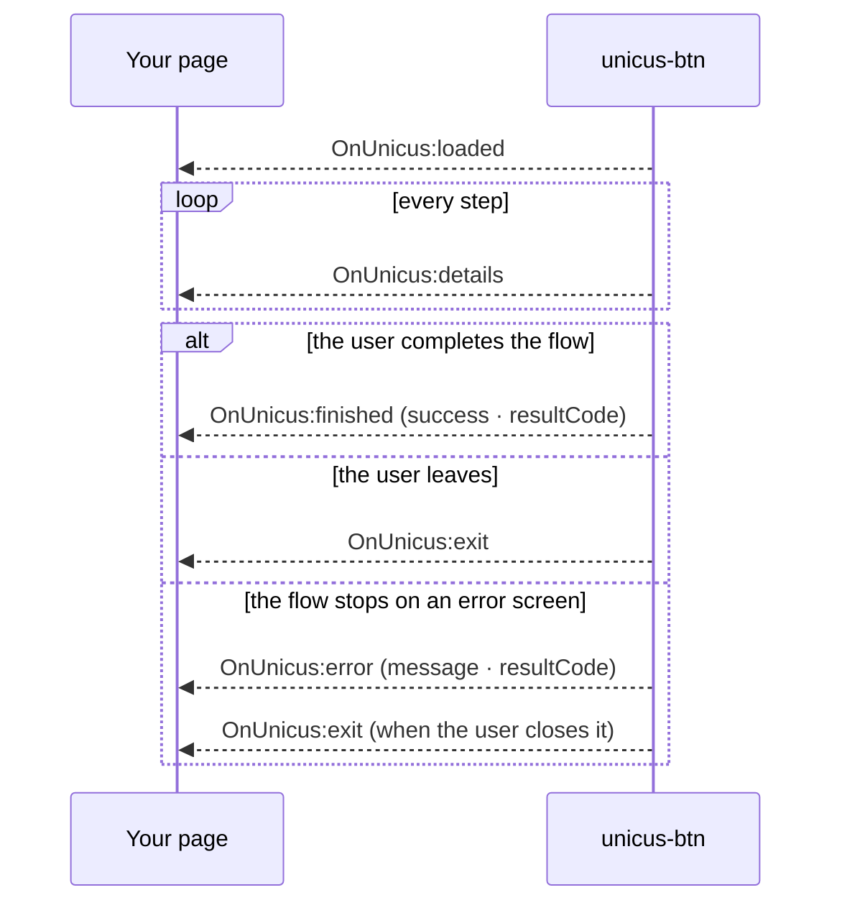

# Events

The `<unicus-btn>` element dispatches `CustomEvent`s. The data is in
`event.detail`. Events bubble and cross shadow roots, so a listener on the
element, on an ancestor or on `document` all work.

| Event | When | Typical use |
| --- | --- | --- |
| `OnUnicus:loaded` | The transaction was created: on mount, again after any change of `customerid`, `clientid`, `transactiontype` or `data-flow-id`, and on the first click after a `finished` / `exit` / button `error`. | Store the `tid`; enable UI that depends on it. |
| `OnUnicus:details` | A step started, completed, was retried, failed or was skipped, or the server answered a camera upload. Fires many times. | Progress indicators, analytics. Never treat it as the final result. |
| `OnUnicus:finished` | The flow reached a final state (success, review or failure) and the user closed the result screen. | Continue your process; confirm server side. |
| `OnUnicus:exit` | The user closed the verification before a final state. | Offer to try again. |
| `OnUnicus:error` | The transaction could not be created, the verification did not load, or the flow stopped on an error screen (configuration, session or network problem). | Show a recoverable error; log `message` and `resultCode`. |

Every event is a `CustomEvent` with `bubbles: true` and `composed: true`.
`OnUnicus:loaded` and the button's own `OnUnicus:error` are produced by the
button; the other events (and `OnUnicus:error` raised inside the flow) are
relayed from the Unicus web app, and only from the iframe the button created.
`OnUnicus:details`, `OnUnicus:finished` and `OnUnicus:exit` share one envelope:

| Field | Type | Description |
| --- | --- | --- |
| `status_error` | boolean | `false` (`true` in `OnUnicus:error`). |
| `message` | string | Human-readable label, for logs. |
| `transaction.exited` | boolean | `true` in `finished` and `exit`, `false` in `details`. |
| `transaction.transactionId` | string or null | The `tid` (`null` only in an `invalid_link` error). |
| `transaction.state` | object | Event-specific payload, described below. |




Browser events drive your user interface. The authoritative result of a
transaction is the one your backend receives through the
[webhook](webhooks.md) or by calling
[Get a transaction status](transaction-status.md) with the
`tid`. Page reloads, closed tabs and network conditions can prevent a browser
event from reaching your page.


## `OnUnicus:loaded`


```json
{
  "status_error": false,
  "loaded": true,
  "message": "Unicus SDK: loaded successfully",
  "link": "https://id.idunicus.com/#token=<TID>&process=enrollment&lang=es",
  "transaction": {
    "transactionId": "<TID>",
    "clientid": "123456789"
  }
}
```


`transaction.clientid` is the document number; it is an empty string for
`liveness`. `link` is the address of the verification for this transaction
(the button opens it in the iframe, adding the document number). The `process`
in it is `enrollment`, `verify` or `liveness`, as decided by Unicus. Do not
send it to the user: it carries the `tid`, and Unicus generates the links for
other devices inside the flow with one-time tokens.

## `OnUnicus:details`

Emitted on every step transition and after every camera upload.
`transaction.state` has one of two shapes; tell them apart with
`state.stepProgress === true` or the presence of `state.responseType`.

Which device produces them:

* **The flow runs in the iframe on a phone or tablet:** the events come from
  that device as the user goes through the steps.
* **The flow started on a computer and was handed off:** the steps completed
  on the computer before the hand-off produce no `details`. Once the user opens
  the link on the phone, the phone's events are relayed to the computer and
  emitted on your page (`message` is `Unicus SDK: User is active on
  transaction`; step-progress payloads relayed this way also carry `seq` and
  `sentAt`, which you can ignore).

**Step progress**, one per transition of a step. `consent` and `info` steps do
not produce it:


```json
{
  "status_error": false,
  "message": "Unicus SDK: step progress",
  "transaction": {
    "exited": false,
    "transactionId": "<TID>",
    "state": {
      "stepProgress": true,
      "flowId": "enrolamiento-por-defecto",
      "stepId": "document",
      "stepType": "document",
      "status": "completed",
      "resultCode": 2000
    }
  }
}
```


| Field | Type | Values |
| --- | --- | --- |
| `stepProgress` | boolean | Always `true`. |
| `flowId` | string | Id of the flow running the transaction. |
| `stepId` | string | Id of the step in the flow, as configured in the portal. |
| `stepType` | string | `liveness`, `document`, `face_match`, `signature`, `otp`, `form`, `age_check` |
| `status` | string | `started`, `completed`, `retry` (liveness attempt rejected, the user tries again), `failed`, `skipped` (optional step that failed or was not run) |
| `resultCode` | number | Present when the step ended or was retried. See [Result codes](result-codes.md). |

**Server step result**, produced by the Unicus API after each camera upload
(liveness and document). It is the same payload the previous SDK sent, with
internal fields (document data, OCR results, the biometric response) removed.
The full envelope is the one above with
`message: "Unicus SDK: User is active on transaction"`; only `state` is shown:


```json
{
  "state": {
    "responseType": "MATCH_3D_2D_ID_SCAN",
    "success": true,
    "resultCode": 2000,
    "isCompletelyDone": false,
    "matchLevel": 5
  }
}
```


| `responseType` | Step |
| --- | --- |
| `LIVENESS_3D` | Liveness check. |
| `NEW_ENROLLMENT` | Liveness plus face enrolment. |
| `MATCH_3D_3D` | Face verification against the enrolled face. |
| `MATCH_3D_2D_ID_SCAN` | Document capture and face match against the document photo. One payload per upload: front, back, user confirmation. `isCompletelyDone: true` on the last one. |
| `ID_SCAN_ONLY` | Document capture without face match. |
| `GENERIC`, `ERROR`, `ENROLLMENT_RETRY` | Other answers of the server to an upload; `success` and `resultCode` say what happened. |

Use only the fields your application needs; the payload can carry more
technical fields depending on the step.

## `OnUnicus:finished`


```json
{
  "status_error": false,
  "message": "Unicus SDK: User ended transaction",
  "transaction": {
    "exited": true,
    "transactionId": "<TID>",
    "state": {
      "exited": true,
      "success": true,
      "resultCode": 2000
    }
  }
}
```


`transaction.state`:

| Field | Type | Description |
| --- | --- | --- |
| `exited` | boolean | Always `true`. |
| `success` | boolean | `true` only for a successful result. |
| `resultCode` | number | Final result code of the flow. |

| `success` | `resultCode` | Meaning |
| --- | --- | --- |
| `true` | `2000` (`0` and `200` in legacy flows) | Identity verified; every required step passed. |
| `false` | `2013` | Flow completed but the transaction is **under manual review** in Unicus (for example a possible duplicate). Not a failure: wait for the webhook. |
| `false` | any other | Verification failed. The code says why; see [Result codes](result-codes.md). |

`finished` is emitted when the user leaves the result screen (its button or the
close button), whatever the result. It is also the event you receive when the
user cancels the camera on a required step (`resultCode` `2041`) or denies
camera access (`9996`): those end the flow with a failure and a result screen.
On a computer with hand-off, the result screen appears when the phone finishes
and Unicus confirms the result; if the phone stops on an error it cannot
recover from, the computer shows a failure and `finished` carries that code.

## `OnUnicus:exit`

Same envelope as `finished`; `transaction.state` is
`{ "exited": true, "success": false }`, without `resultCode`. The user closed
the verification with its close button before a final state, or closed an
error screen. The next click on the button creates a new transaction.

Closing never cancels the transaction: it stays open and the user can resume
it while it is valid; if nobody does, it expires in Unicus. On a computer, the
computer may only be mirroring the phone, so if the user already opened the
hand-off link the phone can still finish the transaction after `exit`. Rely on
your webhook for the outcome.

## `OnUnicus:error`


```json
{
  "status_error": true,
  "message": "Unicus SDK: verification not configured (NO_FLOW)",
  "resultCode": 2002
}
```


**Errors raised by the button** have the flat shape above:

| Field | Type | Description |
| --- | --- | --- |
| `status_error` | boolean | Always `true`. |
| `message` | string | `Unicus SDK: ` followed by the cause. |
| `resultCode` | number or absent | Unicus result code, when the API returned one. |

| `message` after `Unicus SDK: ` | `resultCode` | Cause and fix |
| --- | --- | --- |
| `[customerid] and [transactiontype] are required` | — | Missing attributes when the user clicked. |
| `[clientid] must look like "ID:123456"` | — | `clientid` without a number after `TYPE:` (not checked for `liveness`). |
| `verification not configured (…)` | `2002` | No flow assigned to the company and transaction type, or unknown `data-flow-id`. Assign a flow in the portal. The button stays in `no_flow`. |
| `user is currently blocked` | `2052` | The person is blocked in Unicus after repeated failures. Review in the portal or contact support. |
| `could not create the transaction (…)` | API code, when present | Unicus rejected the creation; the parenthesis carries the API reason. Check the Customer Token and environment. |
| `cannot reach the server (…)` | — | No answer within 30 seconds, a network, CORS or CSP problem, or an invalid answer. See [Compatibility and security](compatibility-and-security.md). |
| `the verification could not be loaded` | — | The verification did not open within 20 seconds (blocked by the page's CSP or a browser extension, or no network). The button removes the overlay and returns to *Retry*. |

All of them except `verification not configured` leave the button in the
`error` state (*Retry*). The cause is also written to the browser console.

**Errors raised inside the flow** (session expired, rate limit, step rejected
by the server…) are shown to the user on a Unicus screen and reported through
`OnUnicus:error`, once per error. They use the envelope of the other flow
events, plus `resultCode` copied to the top level:


```json
{
  "status_error": true,
  "message": "Unicus SDK: expired",
  "transaction": {
    "exited": false,
    "transactionId": "<TID>",
    "state": { "errorKey": "expired", "resultCode": 2051 }
  },
  "resultCode": 2051
}
```


| `errorKey` | `resultCode` | Meaning |
| --- | --- | --- |
| `invalid_link` | — | The verification was opened without a valid transaction. |
| `expired` | `2051`, or HTTP `401` | The transaction expired or was already completed. |
| `try_again` | `2054` | Unicus could not answer right now; the user can retry on the same screen. |
| `network` | — | No connection, or an unexpected answer. The user can retry. |
| `rate_limited` | HTTP `429` | Too many requests in a short time. The user can retry. |
| `session_mismatch` | HTTP `403` | The session does not belong to this transaction. |
| `flow_missing` | `2002` | No flow attached to the transaction. |
| `invalid_flow` | — | The flow has a configuration the web app does not recognise. |
| `step_rejected` | `2052` (or the code returned) | The server refused a step; the reason is shown to the user. |
| `facetec_init` | e.g. `9997` | The camera engine could not start. The user can retry. |

The button stays in `active`: the verification stays open so the user can read
the message or retry. `OnUnicus:exit` follows when they close it, unless a
retry succeeds and the flow continues.

## Recommended pattern


```js
const button = document.querySelector('unicus-btn');
let tid = null;

button.addEventListener('OnUnicus:loaded', ({ detail }) => {
  tid = detail.transaction.transactionId;
});

button.addEventListener('OnUnicus:details', ({ detail }) => {
  const s = detail.transaction.state;
  if (s.stepProgress) trackStep(s.stepId, s.status);          // your analytics
});

button.addEventListener('OnUnicus:finished', ({ detail }) => {
  const { success, resultCode } = detail.transaction.state;
  if (success || resultCode === 2013) {
    refreshFromBackend(tid);        // your backend confirms with Unicus
  } else {
    showRetry(resultCode);
  }
});

button.addEventListener('OnUnicus:exit', () => showRetry());
button.addEventListener('OnUnicus:error', ({ detail }) => showUnavailable(detail));
```

