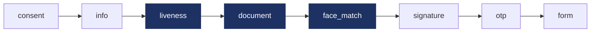
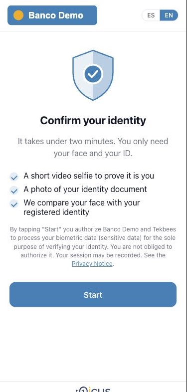
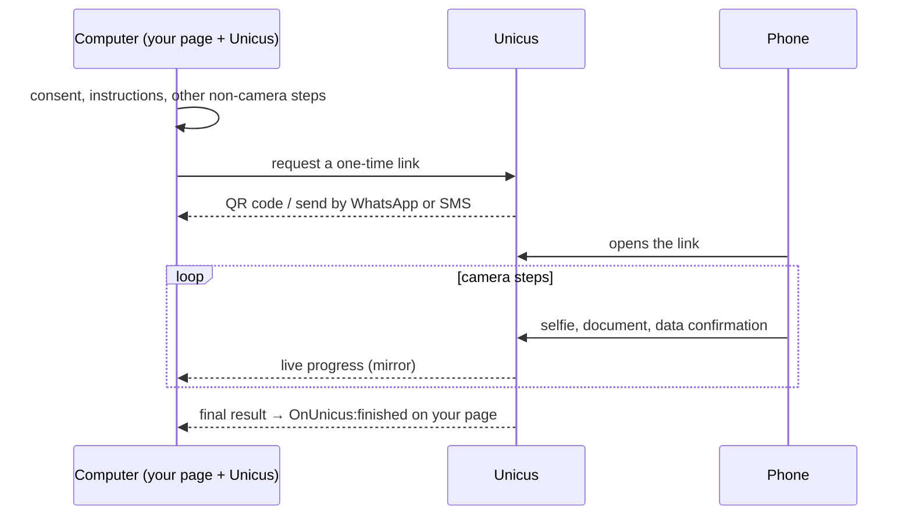
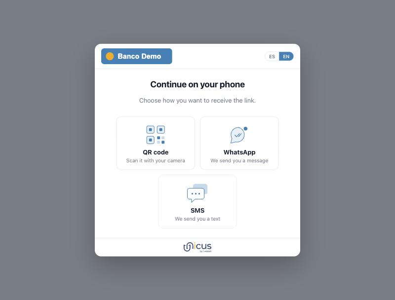

# Flows and hand-off

## Modular flows

*Example of a complete flow. Dark steps run in one camera session; the others
need no camera. Your flow can use any subset, in any order the portal allows.*

In Web SDK 5.0 the verification is a **flow**: an ordered list of steps that
your company composes in the administrative portal and assigns to a transaction
type. The web app runs the flow attached to each transaction, so a change in the
portal applies to the next transaction without touching your page.

| Step type | What the user does | Where it runs |
| --- | --- | --- |
| `consent` | Reads what will be captured and why, and accepts. Always first; added automatically if the flow does not include it. | Any device |
| `info` | Reads instructions (good light, document at hand). | Any device |
| `liveness` | Video selfie. Proves a live person is present and captures the face. | Phone or tablet camera |
| `document` | Photographs the front and back of the document and confirms the data read by OCR. Server-side validations configured per flow: document classifier, id number match, official registry lookup. | Phone or tablet camera |
| `face_match` | The face from the selfie is compared against the document photo, or against the face enrolled earlier. | Server, inside the camera session |
| `signature` | Draws an electronic signature on screen after reading the document shown. | Any device |
| `otp` | Receives a one-time code by SMS, WhatsApp or email and types it. | Any device |
| `form` | Fills a data form defined in the portal (fields, types, validation rules). | Any device |
| `age_check` | No screen: Unicus checks the age estimated from the liveness selfie against a threshold (8, 13, 16, 18, 21, 25 or 30). Placed right after the camera session that captures the liveness. | Server |

<figure><figcaption>
Consent: what will be captured and why.
</figcaption></figure> <figure><figcaption>
Preparation before the camera opens.
</figcaption></figure>

Screens use the logo and colours of your company; the examples show a sample
company.

Consecutive camera steps (`liveness`, `document`, `face_match`) run in one
camera session, so the user opens the camera once. On a computer, the steps
that come before the first camera step are completed there; from the first
camera step on, the rest of the flow (including later non-camera steps such as
`signature`, `otp` or `form`) runs on the phone.

### Rules the integrator can rely on

* The order of steps is enforced by Unicus. A step cannot be skipped or
  submitted out of order.
* Progress is server-side. If the verification tab on the phone is reloaded,
  the flow resumes at the first incomplete step. Reopening an already used
  hand-off link does not: the user requests a new one from the computer, and
  the new link resumes at the first incomplete step.
* Reloading **your** page while the verification is open closes it; the
  button on the reloaded page creates a new transaction.
* A transaction ends with `success` only when every required step passed. A
  step configured as optional can fail without failing the transaction.
* `OnUnicus:details` reports steps by their `stepId`, so your page can show
  progress for the steps that exist in your flow instead of a fixed list.
  `consent` and `info` steps are not reported, and steps completed on the
  computer before a hand-off are not reported either (see
  [Events](events.md)).

### Flow variants

`data-flow-id="<slug>"` runs a specific flow published in the portal instead of
the default assignment for the transaction type. Use it for product-specific
flows (for example a lighter flow for returning customers) or for A/B tests.

## Hand-off to the phone

Camera steps run on a phone or tablet. When the flow is opened on a desktop
or laptop computer, it always hands the camera steps off, even if the computer
has a webcam. Phones and tablets are recognised by their browser, not by the
size of the window. When the flow reaches its first camera step, the web app
offers the hand-off channels enabled for your company:

| Channel | What happens |
| --- | --- |
| QR code | The user scans it with the phone camera. Always available. |
| WhatsApp | The user types the phone number; Unicus sends a template message with the link. Enabled per company. |
| SMS | The user types the phone number; Unicus sends a text message with the link. Enabled per company. |

When the QR code is the only channel of your company, the computer goes
straight to the QR code. Each WhatsApp or SMS message carries a new link; the
QR code keeps its link while it is valid. If a message does not arrive, the
user can send it again after a few seconds; Unicus limits how many messages
one transaction and one phone number can receive, and says so on the screen
when the limit is reached (the user can still use the QR code).

<figure><figcaption>
The channels enabled for the company, offered on the computer.
</figcaption></figure>

The computer screen then becomes a **mirror**: it shows each step the phone
completes (front of the document, face match, back, data confirmation…) in real
time and finally the result. The customer page keeps receiving `OnUnicus:*`
events from the computer, so your integration does not change: the result
screen appears on the computer when the phone finishes and Unicus confirms the
result, and `finished` is emitted when the user closes it. Besides the live
updates, the computer checks the transaction with Unicus regularly, so
the result still arrives if a live update is lost.


If the phone finishes but the computer tab was closed (or the user closed the
verification on the computer, which emits `exit`), the result is still
recorded in Unicus. Closing the computer side never cancels the transaction.
Your webhook or `query-transaction` has the result.


### One-time links

Links for the phone never contain the transaction id. They carry a **one-time
hand-off token** in the URL fragment (`https://id.idunicus.com/#h=…`):

* The fragment is never sent to any server, not in the request, not in the
  `Referer`, not in access logs.
* The link works once. Opening it a second time shows "the link expired or was
  already used".
* The link expires if it is not used; the transaction has its own expiry.
* If Unicus cannot open the link at that moment, the phone shows "try again"
  with a **Retry** button. The same link stays valid: no new QR code or message
  is needed.
* The phone removes the token from the address bar as soon as it is read.

Links that reach the user are generated by Unicus inside the flow. Your page
does not build verification links.

## Running everything on the phone

When the button is pressed on a phone or tablet, the whole flow runs there, in
the same iframe. No hand-off screen is shown.

## Timing and data usage

* On the device that runs the camera, the biometric engine is downloaded
  while the user reads the consent and instruction screens and is cached by
  the browser for later transactions on the same device, so a first visit on a
  slow connection takes longer than the following ones. When the browser has
  data saving enabled or reports a 2G connection, the download waits until the
  camera step starts. Flows without camera steps never download it.
* A complete enrolment (selfie plus two document sides) uploads about 1.5 MB.
* A transaction left open expires in Unicus; reopening the link after expiry
  shows "the session expired".
