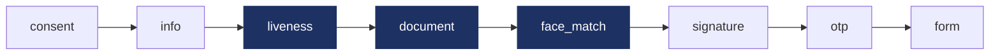
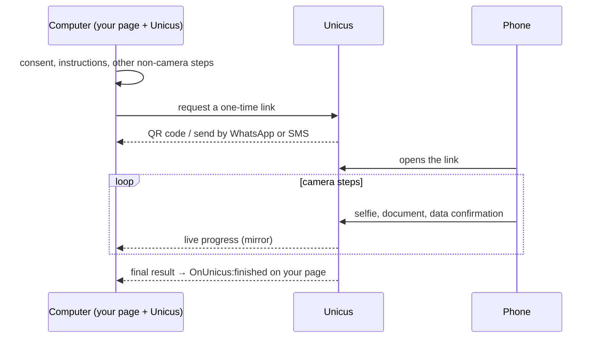

# Flows and hand-off

## Modular flows

*Example of a complete flow. Dark steps run in one camera session; the others
need no camera. Your flow can use any subset, in any order the portal allows.*

In Web SDK 5.0 the verification is a **flow**: an ordered list of steps that
your company composes in the administrative portal and assigns to a transaction
type. The web app runs the flow attached to each transaction, so a change in the
portal applies to the next transaction without touching your page.

| Step type | What the user does | Where it runs |
| --- | --- | --- |
| `consent` | Reads what will be captured and why, and accepts. Always first; added automatically if the flow does not include it. | Any device |
| `info` | Reads instructions (good light, document at hand). | Any device |
| `liveness` | Video selfie. Proves a live person is present and captures the face. | Phone or laptop camera |
| `document` | Photographs the front and back of the document and confirms the data read by OCR. Server-side validations configured per flow: document classifier, id number match, official registry lookup. | Phone or laptop camera |
| `face_match` | The face from the selfie is compared against the document photo, or against the face enrolled earlier. | Server, inside the camera session |
| `signature` | Draws an electronic signature on screen after reading the document shown. | Any device |
| `otp` | Receives a one-time code by SMS, WhatsApp or email and types it. | Any device |
| `form` | Fills a data form defined in the portal (fields, types, validation rules). | Any device |
| `age_check` | No screen: Unicus checks the estimated age against a threshold. | Server |

Consecutive camera steps (`liveness`, `document`, `face_match`) run in one
camera session, so the user opens the camera once. Steps that need no camera
can be completed on the computer before handing off to the phone.

### Rules the integrator can rely on

* The order of steps is enforced by Unicus. A step cannot be skipped or
  submitted out of order.
* Progress is server-side. If the user reloads the page or reopens the link,
  the flow resumes at the first incomplete step.
* A transaction ends with `success` only when every required step passed. A
  step configured as optional can fail without failing the transaction.
* `OnUnicus:details` reports every step by its `stepId`, so your page can show
  progress for the steps that exist in your flow instead of a fixed list.

### Flow variants

`data-flow-id="<slug>"` runs a specific flow published in the portal instead of
the default assignment for the transaction type. Use it for product-specific
flows (for example a lighter flow for returning customers) or for A/B tests.

## Hand-off to the phone

Document capture needs a phone camera. When the flow is opened from a device
without a usable camera (a desktop or laptop), the web app offers the hand-off
channels enabled for your company:

| Channel | What happens |
| --- | --- |
| QR code | The user scans it with the phone camera. |
| WhatsApp | The user types the phone number; Unicus sends a template message with the link. |
| SMS | The user types the phone number; Unicus sends a text message with the link. |

The computer screen then becomes a **mirror**: it shows each step the phone
completes (front of the document, face match, back, data confirmation…) in real
time and finally the result. The customer page keeps receiving `OnUnicus:*`
events from the computer, so your integration does not change: `finished`
arrives on the computer when the phone finishes.


If the phone finishes but the computer tab was closed, the result is still
recorded in Unicus. Your webhook or `query-transaction` has it.


### One-time links

Links for the phone never contain the transaction id. They carry a **one-time
hand-off token** in the URL fragment (`https://id.idunicus.com/#h=…`):

* The fragment is never sent to any server, not in the request, not in the
  `Referer`, not in access logs.
* The link works once. Opening it a second time shows "the link expired or was
  already used".
* The link expires after 24 hours; a transaction has its own, shorter life.
* If Unicus cannot open the link at that moment, the phone shows "try again"
  with a **Retry** button. The same link stays valid: no new QR code or message
  is needed.
* The phone removes the token from the address bar as soon as it is read.

Links that reach the user are generated by Unicus inside the flow. Your page
does not build verification links.

## Running everything on the phone

When the button is pressed on a phone, the whole flow runs there, in the same
iframe. No hand-off screen is shown.

## Timing and data usage

* The biometric engine is downloaded while the user reads the consent and
  instruction screens and is cached by the browser for later transactions on
  the same device, so a first visit on a slow connection takes longer than the
  following ones.
* A complete enrolment (selfie plus two document sides) uploads about 1.5 MB.
* A transaction left open expires in Unicus; reopening the link after expiry
  shows "the session expired".
