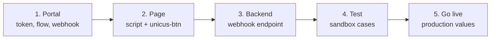
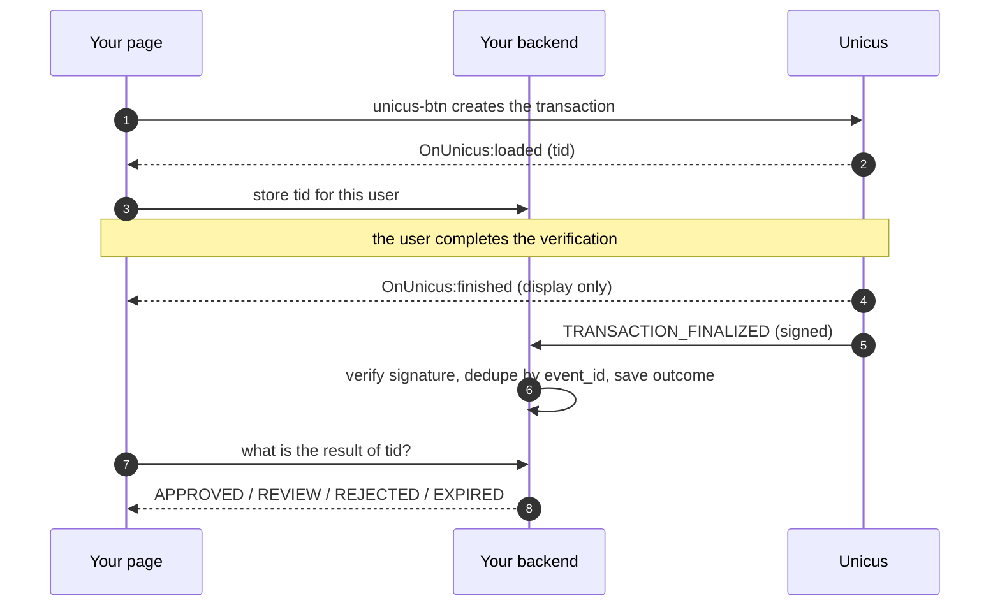

# Integration checklist

A typical integration takes a day: a few lines in your page and one endpoint in
your backend. Follow the steps in order.

## 1. In the administrative portal (sandbox first)

- [ ] Ask Tekbees for a **sandbox** company and the sandbox script URL.
- [ ] Copy the [Customer Token](customer-token.md) (Company → Settings).
- [ ] Create a **flow** and assign it to the transaction type you will use
      (`enrollment-verify` or `liveness`). Without it the button shows
      "Verification not configured" (`2002`). See
      [Flows and hand-off](flows-and-handoff.md).
- [ ] Review the branding (logo and colours) and the hand-off channels (QR,
      WhatsApp, SMS).
- [ ] Register your **webhook URL** and **generate the signing secret**. Store
      the secret in your backend's secret manager. See [Webhooks](webhooks.md).
- [ ] If your backend will call the server endpoints (`query-transaction`,
      `init-api-transaction`, `query-id`, `delete-transaction`), generate a
      company **API key**: they all require it, and the Customer Token does not
      open them. Server side only. See
      [Server API and API keys](server-api.md).

## 2. In your page

- [ ] Load the script once, with `defer`.
- [ ] Render `<unicus-btn>` with `customerid`, `transactiontype` and, for
      enrollment / verification, `clientid` (`<type>:<number>`). See
      [Quick start](quick-start.md) and [Button reference](button-reference.md).
- [ ] On `OnUnicus:loaded`, send the `tid` to your backend and store it with
      your user or case. It is the key that joins the page, the webhook and
      `query-transaction`.
- [ ] On `OnUnicus:finished`, show a waiting or result screen, but **do not
      grant access from the browser event**: ask your backend, which decides
      with the webhook. See [Events](events.md).
- [ ] Handle `OnUnicus:exit` (the user closed the verification) and
      `OnUnicus:error` (show a message; `2002` means the flow is not configured).
- [ ] If your site sends a Content-Security-Policy or Permissions-Policy, allow
      the Unicus domains and the camera. See
      [Compatibility and security](compatibility-and-security.md).

## 3. In your backend

- [ ] Endpoint that receives `POST` JSON over `https` and answers `2xx` within
      30 seconds.
- [ ] Verify `X-Unicus-Signature` over the raw body and reject timestamps older
      than 5 minutes.
- [ ] Deduplicate by `meta.event_id` (deliveries are at least once and retried
      for about 22 hours).
- [ ] Decide by `data.outcome`: `APPROVED` → continue; `REVIEW` → pending until
      `TRANSACTION_REVIEW_RESOLVED`; `REJECTED`, `EXPIRED`, `CANCELLED` → not
      verified.
- [ ] Match the webhook with your user by `data.tid` (the `tid` your page
      stored). If you need it, compare `data.document.idNumberOCR` with the
      document you expected.
- [ ] Optional: a reconciliation job that calls
      [Get a transaction status](transaction-status.md) (with your API key) for
      transactions that have no webhook after some hours (for example while
      your endpoint was down).
- [ ] Do not log the webhook body: it carries personal data.

## 4. Test in the sandbox

| # | Case | Expected |
| --- | --- | --- |
| 1 | Complete the flow with a valid document, on a computer and handing off to a phone. | `OnUnicus:finished` with `success: true`; webhook `APPROVED`, `result_code` `2000`. |
| 2 | Complete it directly on a phone. | Same as 1. |
| 3 | Fail a capture (cover the document, use a photo of a screen) and then finish correctly. | The failed attempts appear in `data.attempts`; outcome `APPROVED`. |
| 4 | Fail a capture and close the page. | After 20 minutes, webhook `REJECTED` with `last_failure`. |
| 5 | Open the verification and abandon it without failing anything. | After 20 minutes, webhook `EXPIRED` (`6003`). |
| 6 | Cancel the camera inside the verification. | `OnUnicus:finished` with `success: false` and `resultCode` `2041`; webhook `CANCELLED`. |
| 7 | Deny the camera permission. | A result screen explains how to allow it; `OnUnicus:finished` with `resultCode` `9996`. |
| 7b | On a computer, close the verification window before finishing. | `OnUnicus:exit`. The transaction stays open (the user can still finish on the phone); if nobody does, the webhook arrives after 20 minutes. On a phone, closing does not cancel either: reopening resumes the flow. |
| 8 | Remove the flow assignment of the transaction type. | `OnUnicus:error` with `2002` and the button shows "Verification not configured". |
| 9 | Make your endpoint answer `500` once. | The same `event_id` arrives again; you process it once. |
| 10 | Send a request with a wrong signature to your endpoint. | Your endpoint rejects it (`401`). |

## 5. Go live

- [ ] Replace the sandbox values with the **production** ones: script URL,
      Customer Token, webhook URL and secret, API key (each environment has its
      own).
- [ ] Assign the flow(s) in the production company.
- [ ] Run case 1 once in production with a real document.
- [ ] Monitor your webhook endpoint (non-`2xx` answers, signature failures).
- [ ] Keep [Errors and troubleshooting](errors-and-troubleshooting.md) and the
      [Support](support.md) contact at hand.
