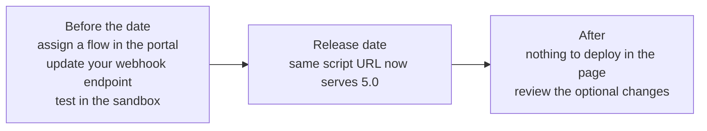

# Migration from Web SDK 4.x


**Coming soon.** Web SDK 5.0 is not yet available in production. Tekbees will
announce the release date. On that date Web SDK 4.x stops working and every
integration runs 5.0, including pages that still load the current script URL.
Until then, ask Tekbees for access to the sandbox environment to prepare.


## What happens on the release date

Web SDK 5.0 replaces 4.x for every customer on the same date. There is no
period in which both versions run side by side.

* The script URL your page already loads
  (`https://unicusbtn.idunicus.com/sdkButton.js`) starts serving Web SDK 5.0.
  **You do not have to edit your page.**
* Attributes, events and the `transactionId` property are unchanged, so your
  existing code keeps working.
* Web SDK 4.x stops working. A page cannot stay on 4.x.



## Before the release date (required)


**Assign a flow to each transaction type you use.** In 4.x the process was
fixed; in 5.0 it is a flow composed in the administrative portal. A company
without a flow on the release date gets a button that shows "Verification not
configured" and does not open.


1. Create the flow(s) that reproduce what your users do today (for example
   consent → liveness → document → face match) and assign them to the
   transaction types you use (`enrollment-verify`, `liveness`).
2. Review the company branding: logo and hex colours. The 5.0 screens apply
   them everywhere, including the camera screens.
3. Enable the hand-off channels you want (QR, WhatsApp, SMS).
4. Test your page in the sandbox environment with the sandbox script URL
   provided by Tekbees. See the checklist in
   [Compatibility and security](compatibility-and-security.md).

## In your backend (required)


**Update your webhook endpoint.** 4.x sent one webhook per step
(`LIVENESS_FACEMAP`, `FRONT_DOCUMENT`, `BACK_DOCUMENT`, `MATCH_DOCUMENT`,
`VERIFY_LIVENESS`). 5.0 sends **one** webhook per transaction,
`TRANSACTION_FINALIZED`, with the final outcome, plus
`TRANSACTION_REVIEW_RESOLVED` when a transaction under review is decided. Code
that waits for `MATCH_DOCUMENT` to mark a person as verified never fires again.


| 4.x | 5.0 |
| --- | --- |
| Several webhooks per transaction, one per step, identified by `data.process`. | One `TRANSACTION_FINALIZED` per transaction, identified by `meta.event` and deduplicated by `meta.event_id`. |
| Success when `MATCH_DOCUMENT` (or `VERIFY_LIVENESS`) arrived with `success: true`. | Success when `data.outcome` is `APPROVED`. `REVIEW` is pending; `REJECTED`, `EXPIRED`, `CANCELLED` are final failures. |
| An abandoned transaction sent nothing. | An abandoned transaction ends after 20 minutes of inactivity (24 hours if the link was never opened) and sends `EXPIRED` or `REJECTED`. |
| Document data in `MATCH_DOCUMENT` (`idName`, `idNumberOCR`, `docFront`…). | The same document fields in `data.document`; images only if enabled for your company, otherwise through `query-transaction`. |
| Unsigned. | Signed with HMAC-SHA256 once you generate a secret in the portal. |

Steps:

1. Accept `TRANSACTION_FINALIZED` and `TRANSACTION_REVIEW_RESOLVED` on your
   endpoint and decide by `data.outcome` (see [Webhooks](webhooks.md)).
2. Deduplicate by `meta.event_id`: deliveries are retried for about 22 hours.
3. Generate a webhook secret in the portal and verify the signature.
4. Test it in the sandbox with a completed, a failed and an abandoned
   transaction.

Transactions created before the release date are closed without sending the
new webhook.

## In the page (optional)

Nothing has to change. Two things are available if you want them:

* **Pin the major version.** New integrations, and existing ones that prefer
  an explicit version, can load the script from the versioned path. Both URLs
  serve the same script.


```html
<script src="https://unicusbtn.idunicus.com/v5/sdkButton.js" defer></script>
```


* **Use what is new.** The table lists what changed and what, if anything, to
  do about it.

| 4.x behaviour | 5.0 behaviour | Action |
| --- | --- | --- |
| Button label fixed. | `label` attribute. | None unless you want another text. |
| Colours from the transaction response. | Same, plus remembered in the browser and overridable with `color` / `textcolor` or CSS variables. | None. |
| `OnUnicus:details` carried only biometric step results. | Also carries `stepProgress` payloads for every step of the flow (consent, signature, OTP, form…). | If your code reads `state.path`, it still arrives in biometric payloads (also as `responseType`). Add handling for `state.stepProgress` if you show progress. |
| `OnUnicus:finished` state `{ exited, success }`. | Adds `resultCode`. `2013` means under review. | Treat `success: false` with `resultCode: 2013` as pending. |
| `OnUnicus:error` message only. | Adds `resultCode` and the `2002` *not configured* case. Errors inside the verification are reported too. | Show a different message for `2002` if you want. |
| Flow fixed. | Flow configured in the portal. | **Required before the release date** (see above). |
| Hand-off by QR only. | QR, WhatsApp, SMS (per company). | Enable the channels you want in the portal. |
| Screen texts fixed. | Titles, descriptions, consent, instructions and form labels per flow, in Spanish and English. | Fill them in the flow editor; empty fields use the Unicus defaults. |

## CSP

Add `https://id.idunicus.com` to `frame-src` if your 4.x policy pointed at a
different flow domain, and keep `connect-src` for the API. Do it before the
release date: a policy that blocks the new domain leaves the verification
unable to open.
