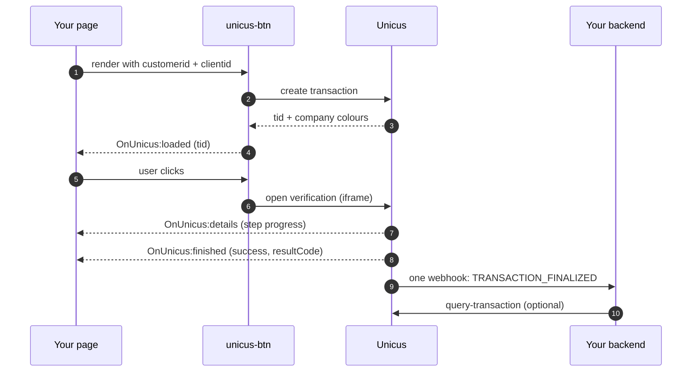

# Overview


**Coming soon.** Web SDK 5.0 is not yet available in production. Tekbees will
announce the release date. On that date Web SDK 4.x stops working and every
integration runs 5.0, including pages that still load the current script URL.
Until then, ask Tekbees for access to the sandbox environment to prepare.


Unicus Web SDK 5.0 is the new web integration of the Unicus identity
verification platform. From the customer page it is still one script and one
HTML element: `<unicus-btn>`. Everything else — transaction creation, the
verification screens, the camera, the hand-off to the user's phone and the
result — is handled by Unicus.


Web SDK 5.0 keeps the public contract of the previous button: the same
attributes (`customerid`, `transactiontype`, `clientid`, `language`), the same
`OnUnicus:*` browser events and the same `transactionId` property. An existing
integration does not have to edit its page: on the release date the script URL
it already loads serves 5.0. What it must do first is assign a flow in the
portal. See [Migration from Web SDK 4.x](migration-from-v4.md).


## What is new

| Area | Web SDK 4.x | Web SDK 5.0 |
| --- | --- | --- |
| Flow | Fixed: face, then document. | **Modular.** Your company composes the flow in the Unicus administrative portal: consent, instructions, liveness, document, face match, electronic signature, OTP, data form, age check. The web app runs whatever flow is assigned to the transaction type. |
| Weight | Several megabytes before the camera opened. | A few kilobytes of application code; the biometric engine is downloaded once in the background while the user reads the first screens and cached for later transactions. Designed for low-bandwidth mobile networks. |
| Desktop users | Hand-off by QR code. | Hand-off by QR code, WhatsApp or SMS (channels enabled per company). The desktop page mirrors the phone's progress step by step and shows the final result. |
| Hand-off links | Transaction id in the URL. | One-time hand-off tokens in the URL fragment. The transaction id never travels in a link, a Referer, or a server log. |
| Button | Fixed label, loading state. | Brand colours applied automatically, custom label, two sizes, visible loading / ready / verifying / error states, one click opens the flow even while the transaction is still being created. |
| Errors | Generic messages. | Result codes in the `details`, `finished` and `error` events, and rejection reasons on the user's screen (see [Result codes](result-codes.md)). |
| Texts | Fixed. | Step titles, descriptions, consent, instructions, signature agreement and form labels configured per flow in Spanish and English; button label per page (see [Texts and languages](texts-and-languages.md)). |
| Security | Transaction id visible in links. | Short-lived sessions bound to one transaction, one-time links, origin-checked messaging between your page and Unicus, strict camera permissions. |

## How it works

1. The customer page loads `sdkButton.js` and renders `<unicus-btn>` with the
   company's **Customer Token** and the user's document.
2. The button creates the transaction in Unicus as soon as it is rendered and
   emits `OnUnicus:loaded` with the transaction id (`tid`).
3. When the user clicks, the button opens the Unicus web app in a full-screen
   iframe. The web app fetches the session: company branding and the **flow**
   assigned to the transaction.
4. The web app runs the flow. On a phone or tablet the whole flow runs there.
   On a desktop computer the steps before the first camera step run locally
   and the rest is handed off to the user's phone; the desktop mirrors the
   progress and shows the final result.
5. Steps report progress to the customer page through `OnUnicus:details`.
   The end of the flow produces `OnUnicus:finished` (or `OnUnicus:exit` if the
   user closed the verification before a final state).
6. Your backend receives the authoritative result through your
   [webhook](webhooks.md) or by calling
   [Get a transaction status](transaction-status.md). Unicus sends **one**
   webhook per transaction, `TRANSACTION_FINALIZED`, when the transaction
   reaches its final state; there are no per-step webhooks. If that final state
   is a manual review, a second webhook, `TRANSACTION_REVIEW_RESOLVED`, arrives
   when the review is decided.

The customer application never calls `/start-process-transaction`,
`/get-restart-session` or `/process-request` directly and never creates the
iframe manually.

## What you need from Unicus

| Value | Where it goes | Description |
| --- | --- | --- |
| [Customer Token](customer-token.md) | `customerid` attribute | Public token of your company, generated in the administrative portal (Company → Settings). It is safe to render in HTML: it identifies the company, it does not authorise anything by itself. One token per environment. |
| Script URL | `<script src>` | `https://unicusbtn.idunicus.com/v5/sdkButton.js` in production. Tekbees provides the sandbox URL. |
| Flow | Administrative portal | At least one flow assigned to the transaction type you use. Without it the button shows "Verification not configured" (result code `2002`). |

For enrollment and verification you also need the user's document type and
document number (`clientid` attribute).

## Reading order

1. [Quick start](quick-start.md): script, element, events, full example.
2. [Integration checklist](integration-checklist.md): every step, front end and
   back end, and the tests to run before going live.
3. [Button reference](button-reference.md): attributes, states, appearance,
   lifecycle.
4. [Events](events.md): payload of every event and how to react.
5. [Flows and hand-off](flows-and-handoff.md): what the user sees for each step
   type and how the phone hand-off works.
6. [Texts and languages](texts-and-languages.md): what wording you control.
7. [Result codes](result-codes.md) and
   [Errors and troubleshooting](errors-and-troubleshooting.md).
8. [Webhooks](webhooks.md) and
   [Get a transaction status](transaction-status.md): the authoritative result
   for your backend.
9. [Compatibility and security](compatibility-and-security.md) before going
   live.
