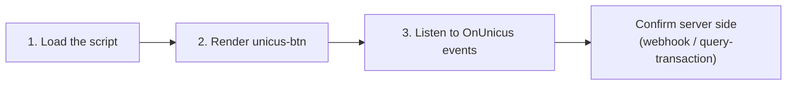

# Quick start


[Versión en español](es/quick-start.md)



**Coming soon.** Web SDK 5.0 is not yet available in production. Tekbees will
announce the release date. On that date Web SDK 4.x stops working and every
integration runs 5.0, including pages that still load the current script URL.
Until then, ask Tekbees for access to the sandbox environment to prepare.




## 1. Load the script

Add the script once per page, with `defer`. It is lightweight and registers the
`<unicus-btn>` element.


```html
<script src="https://unicusbtn.idunicus.com/v5/sdkButton.js" defer></script>
```


The `/v5/` path receives compatible updates automatically (bug fixes, new
optional attributes). A breaking change will be published under a new path.

## 2. Render the button


```html
<unicus-btn
  id="unicus-verification"
  customerid="<CUSTOMER_TOKEN>"
  transactiontype="enrollment-verify"
  clientid="ID:123456789">
</unicus-btn>
```


<figure><figcaption><p>The button on a page, in the company colour: default, and large with a custom label and square corners.</p></figcaption></figure>

* `customerid`: your company's Customer Token (Company → Settings in the
  administrative portal).
* `transactiontype`: `enrollment-verify` enrols the person if Unicus does not
  know them yet and verifies them if it does. `liveness` runs a liveness-only
  flow and needs no `clientid`.
* `clientid`: document type and number separated by `:` (`ID`, `FD`, `PP`,
  `DL`). Required for `enrollment-verify`; without a number after the `:` the
  button goes to *Retry* and emits `OnUnicus:error`.

The button creates the transaction as soon as it is in the page. On the first
visit it is painted neutral until Unicus answers with your company colours;
the colours are then remembered in the browser (`localStorage`), so later
visits show the brand colour from the first paint. One click opens the verification; if the user clicks
while the transaction is still being created, the flow opens as soon as it is
ready.

To avoid a layout jump while the script loads, reserve the button's space in
your stylesheet:


```css
unicus-btn:not(:defined) { display: inline-block; min-width: 200px; height: 48px; }
```


## 3. Listen to the events


```html
<script>
  const button = document.querySelector('#unicus-verification');

  button.addEventListener('OnUnicus:loaded', ({ detail }) => {
    // Transaction created. Keep the id to correlate the webhook later.
    console.log('tid', detail.transaction.transactionId);
  });

  button.addEventListener('OnUnicus:details', ({ detail }) => {
    // Progress only (step started, completed, retried, failed). Never the final result.
    console.log('step', detail.transaction.state);
  });

  button.addEventListener('OnUnicus:finished', ({ detail }) => {
    const { success, resultCode } = detail.transaction.state;
    if (success) {
      // Continue your process. Confirm with your webhook or query-transaction.
    } else if (resultCode === 2013) {
      // Completed, pending manual review in Unicus.
    } else {
      // Verification failed; show a retry option.
    }
  });

  button.addEventListener('OnUnicus:exit', () => {
    // The user closed the verification before a final state.
  });

  button.addEventListener('OnUnicus:error', ({ detail }) => {
    // The transaction could not be created, or the flow stopped on an error screen
    // (in that case the verification stays open and OnUnicus:exit follows).
    console.error(detail.message, detail.resultCode);
  });
</script>
```


Events bubble, so you can also listen on `document`:
`document.addEventListener('OnUnicus:finished', handler)`.

## Full HTML example


```html
<!doctype html>
<html lang="es">
  <head>
    <meta charset="utf-8" />
    <meta name="viewport" content="width=device-width, initial-scale=1" />
    <script src="https://unicusbtn.idunicus.com/v5/sdkButton.js" defer></script>
  </head>
  <body>
    <h1>Verify your identity</h1>

    <unicus-btn
      id="unicus-verification"
      customerid="<CUSTOMER_TOKEN>"
      transactiontype="enrollment-verify"
      clientid="ID:123456789"
      language="es">
    </unicus-btn>

    <p id="status"></p>

    <script>
      const button = document.querySelector('#unicus-verification');
      const status = document.querySelector('#status');
      let tid = null;

      button.addEventListener('OnUnicus:loaded', ({ detail }) => {
        tid = detail.transaction.transactionId;
      });

      button.addEventListener('OnUnicus:finished', async ({ detail }) => {
        const { success, resultCode } = detail.transaction.state;
        status.textContent = success
          ? 'Identity verified.'
          : resultCode === 2013
            ? 'Verification under review.'
            : 'We could not verify your identity. Please try again.';
        // Authoritative result: ask your backend, which queries Unicus with the tid.
        await fetch('/api/verification/' + tid + '/refresh', { method: 'POST' });
      });

      button.addEventListener('OnUnicus:error', ({ detail }) => {
        status.textContent = 'Verification is not available right now.';
        console.error('Unicus', detail);
      });
    </script>
  </body>
</html>
```


## Rendering the button from JavaScript

The element can be created dynamically. Set the attributes before appending it
to the DOM so the transaction is created once.


```js
const button = document.createElement('unicus-btn');
button.setAttribute('customerid', customerToken);
button.setAttribute('transactiontype', 'enrollment-verify');
button.setAttribute('clientid', `ID:${documentNumber}`);
button.addEventListener('OnUnicus:finished', onFinished);
container.appendChild(button);
```


Changing `customerid`, `clientid`, `transactiontype` or `data-flow-id` on a
rendered button discards the current transaction and creates a new one.

## Starting over

You do not need to create the transaction yourself to let the user try again:

* After `OnUnicus:finished` or `OnUnicus:exit`, the next click (or
  `button.open()`) creates a **new** transaction, emits `OnUnicus:loaded` with
  the new `tid` and opens the flow.
* After `OnUnicus:error` from the button (state `error`, label *Retry*), a
  click or `button.open()` retries the creation.
* A button whose state is `no_flow` does not open. Fix the flow assignment in
  the portal, then reload the page or render a new element.

Reloading your page while the verification is open closes it: no
`finished` or `exit` reaches the reloaded page and the new page load creates a
new transaction. Use your webhook or
[Get a transaction status](transaction-status.md) with the previous `tid` to
know how that transaction ended.

## Framework notes

### Single-page applications

* Keep the element mounted while the verification is open. Removing it from
  the DOM (route change, conditional rendering, a list re-keyed) closes the
  verification **without** `OnUnicus:finished` or `OnUnicus:exit`; the next
  click on a re-mounted button creates a new transaction.
* Do not change `customerid`, `clientid`, `transactiontype` or `data-flow-id`
  while the verification is open: each change creates a new transaction.
* Re-rendering with the same attribute values does nothing: the transaction is
  kept.
* Attach listeners to the element (or to `document`) and remove them when the
  component unmounts.

### React


```jsx
import { useEffect, useRef } from 'react';

export function UnicusButton({ customerToken, documentNumber, onFinished }) {
  const ref = useRef(null);

  useEffect(() => {
    const el = ref.current;
    if (!el) return;
    const handler = (event) => onFinished(event.detail.transaction.state);
    el.addEventListener('OnUnicus:finished', handler);
    return () => el.removeEventListener('OnUnicus:finished', handler);
  }, [onFinished]);

  return (
    <unicus-btn
      ref={ref}
      customerid={customerToken}
      transactiontype="enrollment-verify"
      clientid={`ID:${documentNumber}`}
    />
  );
}
```


With TypeScript, declare the element once:


```ts
declare module 'react' {
  namespace JSX {
    interface IntrinsicElements {
      'unicus-btn': React.DetailedHTMLProps<React.HTMLAttributes<HTMLElement>, HTMLElement> & {
        customerid: string;
        transactiontype: 'enrollment-verify' | 'liveness';
        clientid?: string;
        language?: 'es' | 'en';
        label?: string;
        size?: 'lg';
        radius?: string;
        'data-flow-id'?: string;
        disabled?: boolean;
      };
    }
  }
}
```


### Vue 3

Tell the compiler that `unicus-btn` is a custom element:


```js
// vite.config.js
import vue from '@vitejs/plugin-vue';

export default {
  plugins: [
    vue({ template: { compilerOptions: { isCustomElement: (tag) => tag === 'unicus-btn' } } }),
  ],
};
```


### Angular

Add `CUSTOM_ELEMENTS_SCHEMA` to the module or standalone component that renders
the button, and attach listeners with `@ViewChild` + `addEventListener`.
