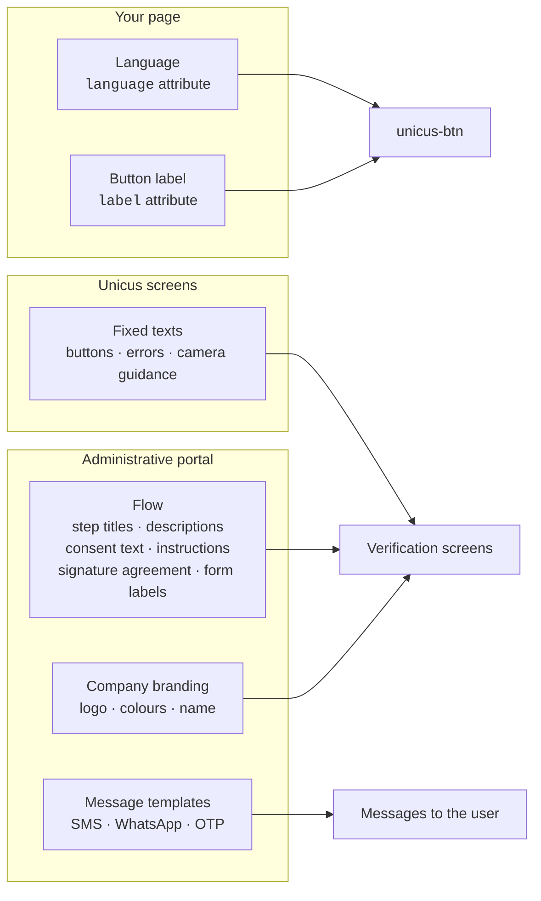

# Texts and languages


[Versión en español](es/texts-and-languages.md)


Nothing in the customer page controls the wording of the verification screens.
Texts live with the flow in the administrative portal, so the same page can
serve different products, companies or campaigns with their own copy.

## Where each text comes from

| Text | Where to change it | Languages |
| --- | --- | --- |
| Button label | `label` attribute of `<unicus-btn>` (default "Validar identidad" / "Verify identity"). | Per page. |
| Company name, logo, colours | Portal → Company → Settings. | — |
| Step title and description | Portal → flow editor, on each step. Shown as the screen heading, in the desktop mirror and in the progress list. | Spanish and English fields; a single value is used for both. |
| Consent text and privacy notice link | Flow editor, `consent` step. When the consent text is left empty, the Unicus default text is shown with your company name in it; when the privacy link is left empty (or is not an `https://` address), the Unicus privacy notice is linked. The list of what will be captured is generated from the steps of the flow. | Spanish and English. |
| Instructions before the camera | Flow editor, `info` step (bulleted items). | Spanish and English. |
| Agreement shown with the electronic signature | Flow editor, `signature` step: agreement text and an optional document URL to display. | Spanish and English. |
| Form field labels and option labels | Flow editor, `form` step. | Spanish and English. |
| OTP, SMS and WhatsApp messages | Unicus templates per company; WhatsApp uses an approved template. Request changes through Tekbees support. | Per message language. |
| Fixed interface texts (buttons, camera guidance, error screens, result screens) | Maintained by Unicus in Spanish and English. | — |

A text left empty in the flow falls back to the Unicus default for that step.

## How the language is chosen

1. The `language` attribute of the button, when present (`es`, `en`, or a
   regional variant such as `en-US`). Any other value means Spanish.
2. Otherwise the browser language, when it is one of the supported ones.
3. Otherwise Spanish.

The same language is used for the button label and for the verification
screens.

The user can switch between Spanish and English with the selector in the top
bar of the step screens, the hand-off options and the error screens; the choice applies to the screen
texts and the flow texts, and travels with the link when the flow continues on
the phone. The camera guidance takes the language active when the camera
opens. Messages sent to the phone (SMS, WhatsApp, OTP) use the language active
at the moment of sending. The selector does not change the label of the button
on your page.


Flow texts accept either one value or one value per language. When only one
value is provided it is shown as is in both languages (a text filled only in
Spanish is shown in Spanish to English users too), so it is worth filling both
when your users mix languages.


## Example

A flow for a credit application could define:

| Step | Title (es / en) | Description (es / en) |
| --- | --- | --- |
| consent | Confirma tu identidad / Confirm your identity | Te tomará menos de dos minutos / It takes less than two minutes |
| document | Tu cédula / Your ID | Frente y reverso, sin reflejos / Front and back, no glare |
| form | Datos de contacto / Contact details | Para enviarte la respuesta / So we can send you the answer |

The same titles appear on the phone screens and in the progress list on the
computer while the user completes the steps on the phone.
